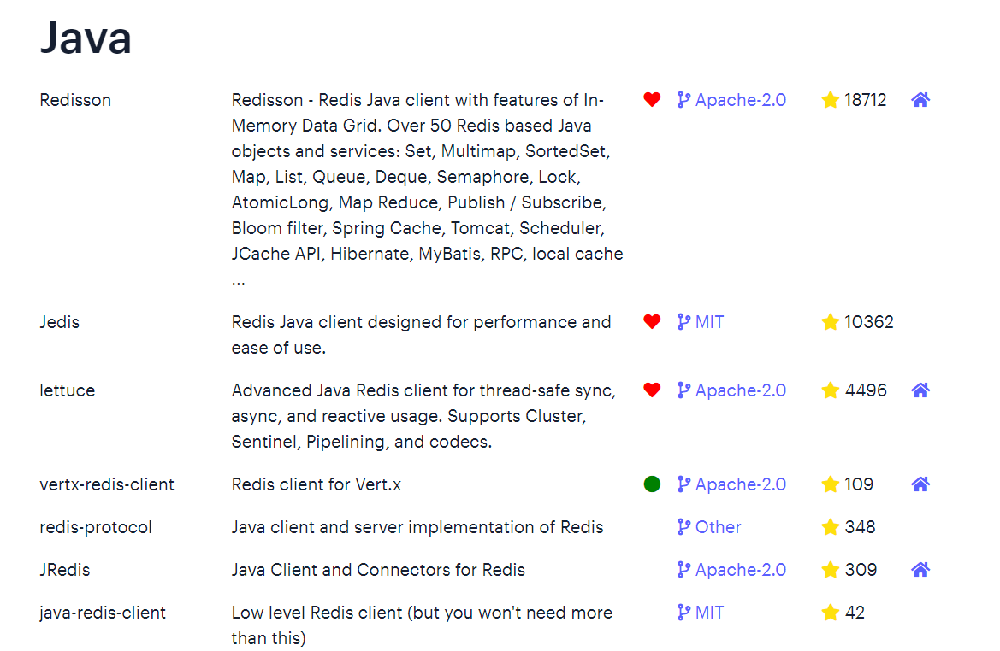

# 目录

[[toc]]

## Redis的Java客户端

在Redis官网中提供了各种语言的客户端，地址：https://redis.io/docs/clients/


其中Java客户端也包含很多：



标记为*的就是推荐使用的java客户端，包括：

- `Jedis`和`Lettuce`：这两个主要是提供了`Redis`命令对应的`API`，方便我们操作`Redis`
- `Redisson`：是在`Redis`基础上实现了分布式的可伸缩的`java`数据结构，例如`Map`、`Queue`等，而且支持跨进程的同步机制：`Lock`、`Semaphore`等待，比较适合用来实现特殊的功能需求。


## Jedis客户端

Jedis的官网地址： https://github.com/redis/jedis

### 引入依赖

```xml
<!--jedis-->
<dependency>
    <groupId>redis.clients</groupId>
    <artifactId>jedis</artifactId>
    <version>3.7.0</version>
</dependency>
<!--单元测试-->
<dependency>
    <groupId>org.junit.jupiter</groupId>
    <artifactId>junit-jupiter</artifactId>
    <version>5.7.0</version>
    <scope>test</scope>
</dependency>
```


### 建立连接

新建一个单元测试类，内容如下：

```java
private Jedis jedis;

@BeforeEach
void setUp() {
    // 1.建立连接
    // jedis = new Jedis("192.168.150.101", 6379);
    jedis = JedisConnectionFactory.getJedis();
    // 2.设置密码
    jedis.auth("123321");
    // 3.选择库
    jedis.select(0);
}
```


### 测试

```java
@Test
void testString() {
    // 存入数据
    String result = jedis.set("name", "虎哥");
    System.out.println("result = " + result);
    // 获取数据
    String name = jedis.get("name");
    System.out.println("name = " + name);
}

@Test
void testHash() {
    // 插入hash数据
    jedis.hset("user:1", "name", "Jack");
    jedis.hset("user:1", "age", "21");

    // 获取
    Map<String, String> map = jedis.hgetAll("user:1");
    System.out.println(map);
}
```


### 释放资源

```java
@AfterEach
void tearDown() {
    if (jedis != null) {
        jedis.close();
    }
}
```


### 连接池

`Jedis`本身是线程不安全的，并且频繁的创建和销毁连接会有性能损耗，因此我们推荐大家使用`Jedis`连接池代替`Jedis`的直连方式。

```java
package com.heima.jedis.util;

import redis.clients.jedis.*;

public class JedisConnectionFactory {

    private static JedisPool jedisPool;

    static {
        // 配置连接池
        JedisPoolConfig poolConfig = new JedisPoolConfig();
        poolConfig.setMaxTotal(8);
        poolConfig.setMaxIdle(8);
        poolConfig.setMinIdle(0);
        poolConfig.setMaxWaitMillis(1000);
        // 创建连接池对象，参数：连接池配置、服务端ip、服务端端口、超时时间、密码
        jedisPool = new JedisPool(poolConfig, "192.168.150.101", 6379, 1000, "123321");
    }

    public static Jedis getJedis(){
        return jedisPool.getResource();
    }
}
```


## SpringDataRedis客户端

`SpringData`是`Spring`中数据操作的模块，包含对各种数据库的集成，其中对`Redis`的集成模块就叫做`SpringDataRedis`，官网地址：https://spring.io/projects/spring-data-redis

- 提供了对不同Redis客户端的整合（`Lettuce`和`Jedis`）
- 提供了`RedisTemplate`统一`API`来操作`Redis`
- 支持`Redis`的发布订阅模型
- 支持`Redis`哨兵和`Redis`集群
- 支持基于`Lettuce`的响应式编程
- 支持基于`JDK`、`JSON`、字符串、`Spring`对象的数据序列化及反序列化
- 支持基于`Redis`的`JDKCollection`实现


`SpringDataRedis`中提供了`RedisTemplate`工具类，其中封装了各种对`Redis`的操作。并且将不同数据类型的操作`API`封装到了不同的类型中：


### 引入依赖

SpringBoot已经提供了对SpringDataRedis的支持，使用非常简单。

```xml
	<dependencies>
        <!--redis依赖-->
        <dependency>
            <groupId>org.springframework.boot</groupId>
            <artifactId>spring-boot-starter-data-redis</artifactId>
        </dependency>
        <!--common-pool-->
        <dependency>
            <groupId>org.apache.commons</groupId>
            <artifactId>commons-pool2</artifactId>
        </dependency>
        <!--Jackson依赖-->
        <dependency>
            <groupId>com.fasterxml.jackson.core</groupId>
            <artifactId>jackson-databind</artifactId>
     </dependency>
```


### 配置Redis

```yaml
spring:
  redis:
    host: 192.168.150.101
    port: 6379
    password: 123321
    lettuce:
      pool:
        max-active: 8
        max-idle: 8
        min-idle: 0
        max-wait: 100ms
```


### 注入RedisTemplate

因为有了SpringBoot的自动装配，我们可以拿来就用：

```java
@SpringBootTest
class RedisStringTests {

    @Autowired
    private StringRedisTemplate stringRedisTemplate;
}
```


### 编写测试

```java
@SpringBootTest
class RedisStringTests {

    @Autowired
    private RedisTemplate edisTemplate;
    
    // JSON序列化工具,也可用其它的JSON序列化工具
	private static final ObjectMapper mapper = new ObjectMapper();

    @Test
    void testString() {
        // 创建对象
    	User user = new User("虎哥", 21);
    	// 手动序列化
    	String json = mapper.writeValueAsString(user);
    	// 写入数据
    	stringRedisTemplate.opsForValue().set("user:200", json);

    	// 获取数据
    	String jsonUser = stringRedisTemplate.opsForValue().get("user:200");
    	// 手动反序列化
    	User user1 = mapper.readValue(jsonUser, User.class);
    	System.out.println("user1 = " + user1);
    }
}
```
