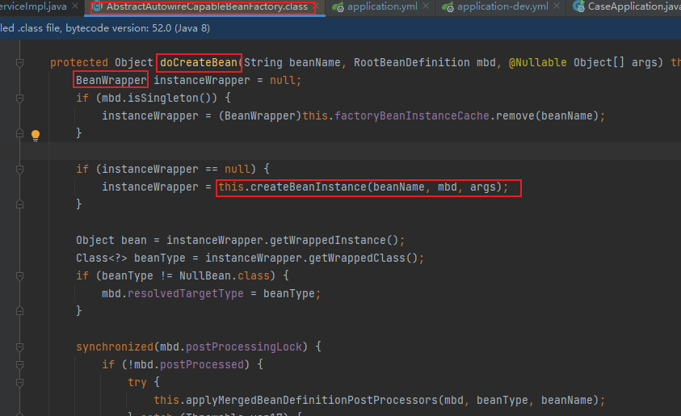
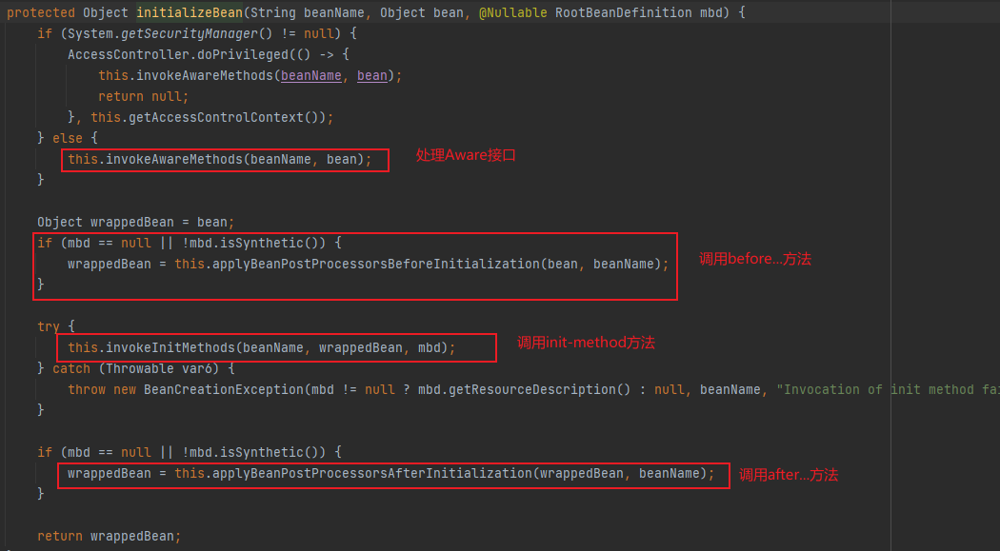
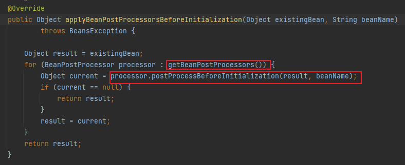
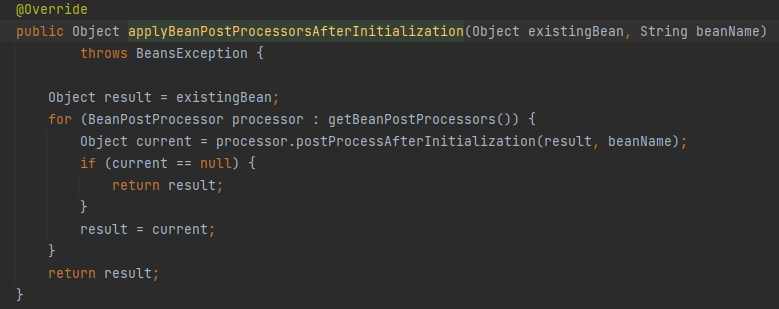

# 目录

[[toc]]

## Bean 生命周期
当我们向容器请求一个尚未初始化的`bean`时，或初始化`bean`的时候需要注入另一个尚未初始化的依赖时，就会开始`Bean`的生命周期
**实例化 -->   依赖注入  --> 初始化  --> 销毁**

### 实例化Bean

1. 首先会调用 **AbstractAutowireCapableBeanFactory** 类的 **doCreateBean** 方法创建`bean`
   1. 第一步 调用 **createBeanInstance** 方法利用反射创建`bean`实例
   2. 将创建好的`bean`放入 **BeanWrapper** 中
   3. 实例化后的对象会利用 **ObjectFactory** 暴露

### 依赖注入

1. 调用 **populateBean** 方法对使用到了注入属性的注解就会进行注入
2. 如果在注入的过程发现注入的对象还没生成，则会跑去生产要注入的对象

### 初始化bean

1. 调用 **initializeBean** 方法初始化`bean`
   
   ①首先调用的是 **invokeAwareMethods** 方法，该方法处理 `Aware` 接口
   
   - 如果这个`Bean`已经实现了 **BeanNameAware** 接口，会调用它实现的 **setBeanName(String beanId)** 方法，此处传 递的就是`Spring`配置文件中`Bean`的`id`值
   - 如果这个`Bean`已经实现了 **BeanFactoryAware** 接口，会调用它实现的 **setBeanFactory()** 方法，传递的是`Spring`工 厂自身。
   - 如果这个`Bean`已经实现了 **BeanClassLoaderAware **接口，会调用 s**etBeanClassLoader()** 方法，传入类加载器

​	②然后调用 **applyBeanPostProcessorsBeforeInitialization** 方法，处理 **BeanPostProcessor** 接口

- 如果有类实现了 **BeanPostProcessor** 接口，就会执行 **postProcessBeforeInitialization** 方法
- 如果多个类实现**BeanPostProcessor**接口，那么多个实现类都会执行**postProcessBeforeInitialization**方法，可以看到是`for`循环依次执行的，
- 还有一个注意的点就是如果加载`A`类到`spring`容器中，`A`类也重写了 **BeanPostProcessor** 接口的 **postProcessBeforeInitialization** 方法，这时要注意`A`类的**postProcessBeforeInitialization** 方法并不会得到执行，因为`A`类还未加载完成，还未完全放到`spring`的 **singletonObjects** 一级缓存中。

③然后执行 **invokeInitMethods** 方法
- 如果实现了 **InitializingBean** 接口，重写了 **afterPropertiesSet** 方法，则会调用**afterPropertiesSet** 方法
- 最后如果指定了 **init-method**，可以通过标签，或者`@Bean`注解的`initMethod`指定，则会调用指定的 **init-method** 方法

④最后会执行 **applyBeanPostProcessorsAfterInitialization** 方法
1. 跟之前的 **postProcessBeforeInitialization** 方法类似，也是循环遍历实现了**BeanPostProcessor** 的接口实现类，执行 **postProcessAfterInitialization** 方法

**至此 Bean初始化完成，可以正常使用**

（1）实例化Bean：  

- 对于`BeanFactory`容器，当客户向容器请求一个尚未初始化的`bean`时，或初始化`bean`的时候需要注入另一个尚未初始化的依赖时，容器就会调用`createBean`进行实例化  
- 对于`ApplicationContext`容器，当容器启动结束后，通过 获取`BeanDefinition`对象中的信息，实例化所有的`bean`。  

（2）依赖注入 
实例化后的对象被封装在`BeanWrapper`对象中，紧接着，`Spring`根据`BeanDefinition`中的信息 以及 通过 `BeanWrapper`提供的设置属性的接口完成依赖注入 
（3）初始化
（4）销毁
`DisposableBean`  接口
当`Bean`不再需要时，会经过清理阶段，如果`Bean`实现了`DisposableBean`这个接口，会调用其实现的`destroy()`方 法 
如果这个`Bean`配置了`destroy-method`属性，会自动调用其配置的销毁方法 

