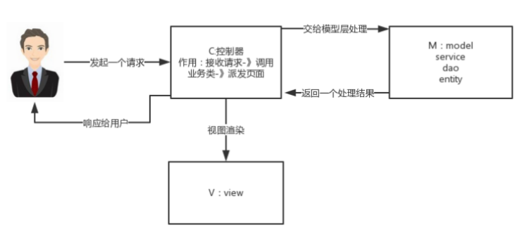
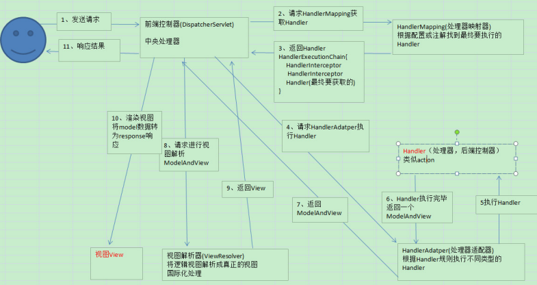

# 目录

[[toc]]

# MVC

`M-Model` 模型（完成业务逻辑：有javaBean构成，service+dao+entity） 
`V-View` 视图（做界面的展示 jsp，html……） 
`C-Controller` 控制器（接收请求—>调用模型—>根据结果派发页面)  

## 工作原理

1、 用户发送请求至前端控制器`DispatcherServlet`。 

2、 `DispatcherServlet`收到请求调用`HandlerMapping`处理器映射器。 

3、 处理器映射器找到具体的处理器(可以根据`xml`配置、注解进行查找)，生成处理器对象及处理器拦截器(如果有 则生成)一并返回给`DispatcherServlet`。 

4、 `DispatcherServlet`调用`HandlerAdapter`处理器适配器。 

5、 `HandlerAdapter`经过适配调用具体的处理器(`Controller`，也叫后端控制器)。 

6、 `Controller`执行完成返回`ModelAndView`。 

7、 `HandlerAdapter`将`controller`执行结果`ModelAndView`返回给`DispatcherServlet`。 

8、 `DispatcherServlet`将`ModelAndView`传给`ViewReslover`视图解析器。 

9、 `ViewReslover`解析后返回具体`View`。 

10、`DispatcherServlet`根据`View`进行渲染视图（即将模型数据填充至视图中)。 

11、 `DispatcherServlet`响应用户。  

## spring mvc 组件

 `Spring MVC`的核心组件： 

1. `DispatcherServlet`：中央控制器，把请求给转发到具体的控制类 
2. `Controller`：具体处理请求的控制器 
3. `HandlerMapping`：映射处理器，负责映射中央处理器转发给controller时的映射策略 
4. `ModelAndView`：服务层返回的数据和视图层的封装类 
5. `ViewResolver`：视图解析器，解析具体的视图 
6. `Interceptors` ：拦截器，负责拦截我们定义的请求然后做处理工作

## **常用注解**

-  @RequestMapping ：用于处理请求 url 映射的注解，可用于类或方法上。用于类上，则表示类中的所有响应请求的 方法都是以该地址作为父路径。  
-  @RequestBody ：注解实现接收http请求的json数据，将json转换为java对象。  
-  @ResponseBody ：注解实现将conreoller方法返回对象转化为json对象响应给客户。  

