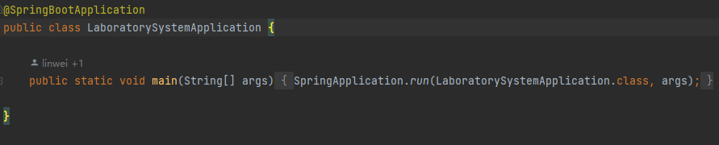
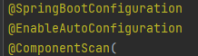
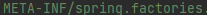
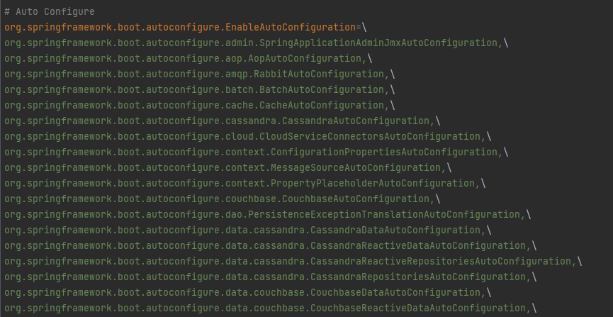

# 目录

[[toc]]

## SpringBoot自动配置原理

### 入口

自动配置入口为`@SpringBootApplication`注解

其中又包含了3个注解

- @SpringBootConfiguration：里面集成了 `@Configuration`注解，表明是个配置类
- @EnableAutoConfiguration：开启自动配置功能
- @ComponentScan：包扫描

### @EnableAutoConfiguration

在这个注解中通过`@Import`引入了`AutoConfigurationImportSelector.class`类

在这个类中会去加载`META-INF/spring.factories`文件

> 在pom.xml中引入的每个依赖都有此文件

在`spring.factories`文件中，写死了`SpringBoot`容器启动就要去加载的配置类

基本都以 `XXXAutoConfiguration` 命名

在对应的配置类中会通过`@EnableConfigurationProperties`开启自动配置功能，该注解会绑定一个类

在该类中会通过`@ConfigurationProperties`绑定配置文件前缀

并根据条件注解 `@Conditional`判断是否生效

生效的配置类就会在我们的容器中添加很多组件，而容器中有了这些组件，对应的功能也就有了

### 总结

1、会通过 `@SpringBootApplication`注解集成的`@EnableAutoConfiguration`注解开启自动配置功能

2、在 `@EnableAutoConfiguration`注解引入的`AutoConfigurationImportSelector.class`类中加载`META-INF/spring.factories`文件

3、文件中写死了`SpringBoot`容器启动就要去加载的配置类，都以 `XXXAutoConfiguration` 命名

4、在对应的配置类中通过`@EnableConfigurationProperties`开启自动配置功能

5、通过`@ConfigurationProperties`绑定配置文件前缀

6、根据条件注解 `@Conditional`判断是否生效

7、生效的配置类就会在我们的容器中添加很多组件，而容器中有了这些组件，对应的功能也就有了