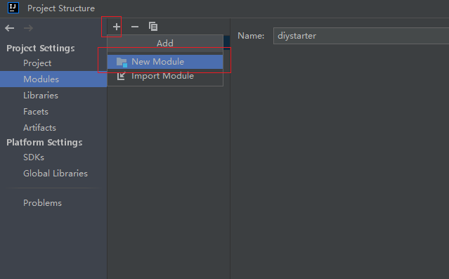
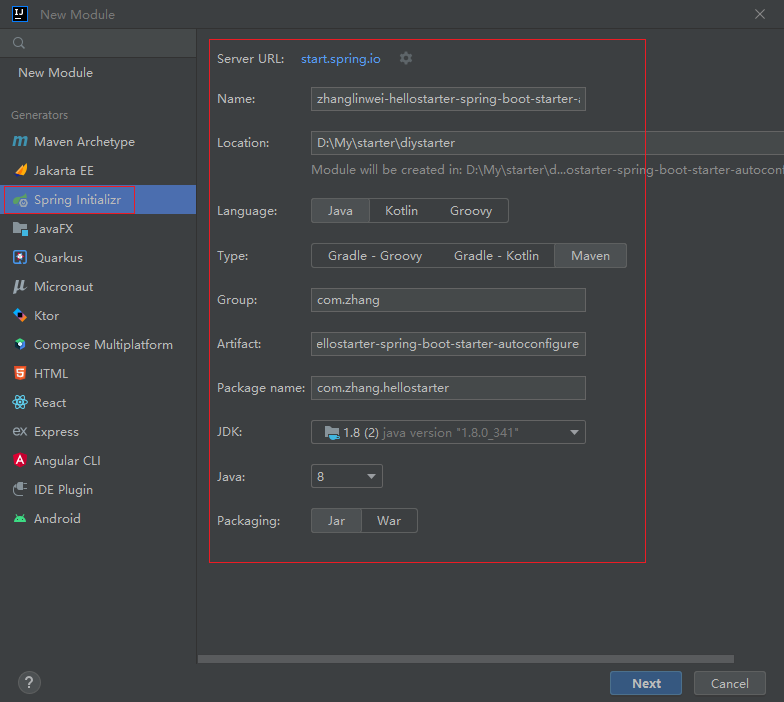
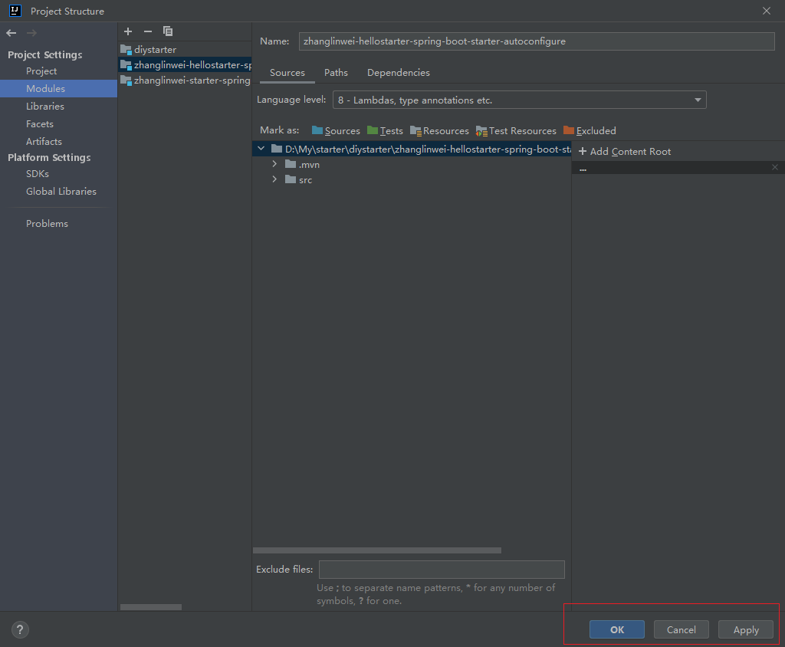
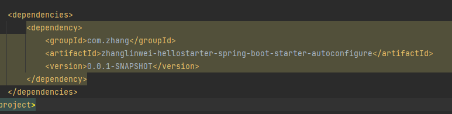
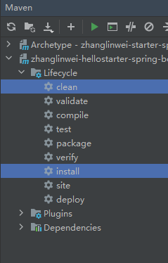
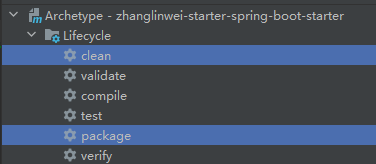
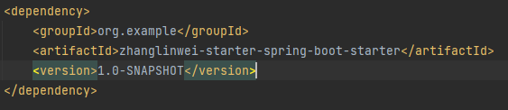

# 目录

[[toc]]

## 自定义Starter

### 创建一个空项目

### 给该项目添加两个模块

创建好之后，Apply -->  OK

### 在启动器项目中引入自动配置项目依赖

### 编写自动配置功能

在自动配置项目中，创建3个类

- HelloService：要自动配置的功能
- HelloProperties：`HelloService`绑定配置前缀
- HelloServiceAutoConfiguration：自动配置类

代码如下：

HelloService

~~~java
//默认不要放在容器中
public class HelloService {

    @Autowired
    HelloProperties helloProperties;

    public String sayHello (String userName) {
        return helloProperties.getPrefix() + "：" + userName + "》" + helloProperties.getSuffix();
    }

}
~~~

HelloProperties

~~~java
@ConfigurationProperties("zhang.hello") // 绑定前缀
public class HelloProperties {

    private String prefix;
    private String suffix;

    public String getPrefix() {
        return prefix;
    }

    public void setPrefix(String prefix) {
        this.prefix = prefix;
    }

    public String getSuffix() {
        return suffix;
    }

    public void setSuffix(String suffix) {
        this.suffix = suffix;
    }
}
~~~

HelloServiceAutoConfiguration

~~~java
@Configuration
@ConditionalOnMissingBean(HelloService.class) // 容器中不存在才放入
@EnableConfigurationProperties(HelloProperties.class) //开启配置绑定功能，还会默认放到容器中
public class HelloServiceAutoConfiguration {

    @Bean
    public HelloService helloService(){
        HelloService helloService = new HelloService();
        return helloService;
    }

}
~~~

### 编写 spring.factories 文件

在 `resources/META-INF` 下新建 `spring.factories` 文件

填写自动配置类的全路径

~~~properties
# Auto Configure
org.springframework.boot.autoconfigure.EnableAutoConfiguration=\
com.zhang.hellostarter.auto.HelloServiceAutoConfiguration
~~~

### 将无用文件删除

如：test、启动类、配置文件等

### Maven打包

将两个项目都打包

> 注意：先打包自动配置包，在打包场景启动器

## 测试

### 在其它项目中引入场景启动器依赖

### 编写Controller测试

~~~java
@RestController
public class HelloController {

    @Autowired
    private HelloService helloService;

    @GetMapping("hello")
    public String testStarter (String userName) {
        String str = helloService.sayHello("张林伟");
        return str;
    }

}
~~~

### 编写配置文件

~~~yaml
zhang:
  hello:
    prefix: nihao
    suffix: zhenshuai
~~~

### 结果

~~~
nihao：张林伟》zhenshuai
~~~

