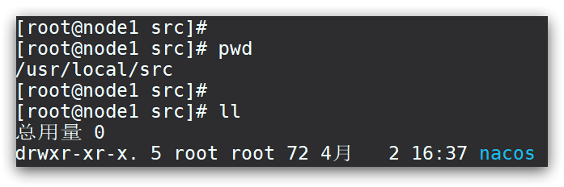

# 目录

[[toc]]


## Windows安装

开发阶段采用单机安装即可。

### 下载安装包

在`Nacos`的`GitHub`页面，提供有下载链接，可以下载编译好的`Nacos`服务端或者源代码：

GitHub主页：https://github.com/alibaba/nacos

GitHub的Release下载页：https://github.com/alibaba/nacos/releases

如图：


windows版本使用`nacos-server-x.x.x.zip`包即可。


### 解压

将这个包解压到任意非中文目录下，如图：


目录说明：

- bin：启动脚本
- conf：配置文件


### 端口配置

`Nacos`的默认端口是`8848`，如果你电脑上的其它进程占用了`8848`端口，请先尝试关闭该进程。

**如果无法关闭占用8848端口的进程**，也可以进入`nacos`的`conf`目录，修改配置文件中的端口：


修改其中的内容：


### 启动

启动非常简单，进入`bin`目录，结构如下：


然后执行命令即可：

- windows命令：

  ```
  startup.cmd -m standalone
  ```


执行后的效果如图：


### 访问

在浏览器输入地址：http://127.0.0.1:8848/nacos即可：


默认的账号和密码都是`nacos`，进入后：


## Linux安装

`Linux`或者`Mac`安装方式与`Windows`类似。

### 安装JDK

`Nacos`依赖于`JDK`运行，所以`Linux`上也需要安装`JDK`才行。

将`jdk`安装包上传到某个目录，例如：`/usr/local/`


然后解压缩：

```sh
tar -xvf jdk-8u144-linux-x64.tar.gz
```

然后重命名为`java`


配置环境变量：

```sh
export JAVA_HOME=/usr/local/java
export PATH=$PATH:$JAVA_HOME/bin
```

设置环境变量：

```sh
source /etc/profile
```


### 上传安装包

如图：


`linux`版本使用`nacos-server-x.x.x.tar.zip`包即可。

上传到`Linux`服务器的某个目录，例如`/usr/local/src`目录下：


### 解压

命令解压缩安装包：

```sh
tar -xvf nacos-server-1.4.1.tar.gz
```

然后删除安装包：

```sh
rm -rf nacos-server-1.4.1.tar.gz
```

目录中最终样式：



目录内部：


### 端口配置

与`windows`中类似


### 启动

在`nacos/bin`目录中，输入命令启动`Nacos`：

```sh
sh startup.sh -m standalone
```


