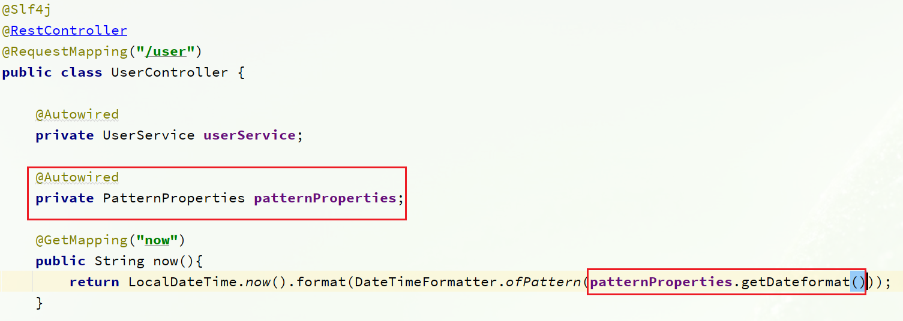

# Nacos

## 一、安装Nacos

### Windows安装

开发阶段采用单机安装即可。

#### 下载安装包

在`Nacos`的`GitHub`页面，提供有下载链接，可以下载编译好的`Nacos`服务端或者源代码：

GitHub主页：https://github.com/alibaba/nacos

GitHub的Release下载页：https://github.com/alibaba/nacos/releases

如图：


windows版本使用`nacos-server-x.x.x.zip`包即可。


#### 解压

将这个包解压到任意非中文目录下，如图：


目录说明：

- bin：启动脚本
- conf：配置文件


#### 端口配置

`Nacos`的默认端口是`8848`，如果你电脑上的其它进程占用了`8848`端口，请先尝试关闭该进程。

**如果无法关闭占用8848端口的进程**，也可以进入`nacos`的`conf`目录，修改配置文件中的端口：


修改其中的内容：


#### 启动

启动非常简单，进入`bin`目录，结构如下：


然后执行命令即可：

- windows命令：

  ```
  startup.cmd -m standalone
  ```


执行后的效果如图：


#### 访问

在浏览器输入地址：http://127.0.0.1:8848/nacos即可：


默认的账号和密码都是`nacos`，进入后：


### Linux安装

`Linux`或者`Mac`安装方式与`Windows`类似。

#### 安装JDK

`Nacos`依赖于`JDK`运行，所以`Linux`上也需要安装`JDK`才行。

将`jdk`安装包上传到某个目录，例如：`/usr/local/`


然后解压缩：

```sh
tar -xvf jdk-8u144-linux-x64.tar.gz
```

然后重命名为`java`


配置环境变量：

```sh
export JAVA_HOME=/usr/local/java
export PATH=$PATH:$JAVA_HOME/bin
```

设置环境变量：

```sh
source /etc/profile
```


#### 上传安装包

如图：


`linux`版本使用`nacos-server-x.x.x.tar.zip`包即可。

上传到`Linux`服务器的某个目录，例如`/usr/local/src`目录下：


#### 解压

命令解压缩安装包：

```sh
tar -xvf nacos-server-1.4.1.tar.gz
```

然后删除安装包：

```sh
rm -rf nacos-server-1.4.1.tar.gz
```

目录中最终样式：


目录内部：


#### 端口配置

与`windows`中类似


#### 启动

在`nacos/bin`目录中，输入命令启动`Nacos`：

```sh
sh startup.sh -m standalone
```


## 二、Nacos注册中心

国内公司一般都推崇阿里巴巴的技术，比如注册中心，SpringCloudAlibaba也推出了一个名为Nacos的注册中心。

### 服务注册到Nacos

`Nacos`是`SpringCloudAlibaba`的组件，而`SpringCloudAlibaba`也遵循`SpringCloud`中定义的服务注册、服务发现规范。因此使用`Nacos`和使用`Eureka`对于微服务来说，并没有太大区别。

主要差异在于：

- 依赖不同
- 服务地址不同


#### 1）引入依赖

父工程的`pom`文件中的`<dependencyManagement>`中引入`SpringCloudAlibaba`的依赖：

```xml
<dependency>
    <groupId>com.alibaba.cloud</groupId>
    <artifactId>spring-cloud-alibaba-dependencies</artifactId>
    <version>2.2.6.RELEASE</version>
    <type>pom</type>
    <scope>import</scope>
</dependency>
```

然后在user-service和order-service中的`pom`文件中引入`nacos-discovery`依赖：

```xml
<dependency>
    <groupId>com.alibaba.cloud</groupId>
    <artifactId>spring-cloud-starter-alibaba-nacos-discovery</artifactId>
</dependency>
```

#### 2）配置nacos地址

在user-service和order-service的`application.yml`中添加`nacos`地址：

```yaml
spring:
  cloud:
    nacos:
      server-addr: localhost:8848
```


#### 3）重启

重启微服务后，登录`nacos`管理页面，可以看到微服务信息：


### 服务分级存储模型

一个**服务**可以有多个**实例**，例如我们的user-service，可以有:

- 127.0.0.1:8081
- 127.0.0.1:8082
- 127.0.0.1:8083

假如这些实例分布于全国各地的不同机房，例如：

- 127.0.0.1:8081，在上海机房
- 127.0.0.1:8082，在上海机房
- 127.0.0.1:8083，在杭州机房

`Nacos`就将同一机房内的实例 划分为一个**集群**。

也就是说，user-service是服务，一个服务可以包含多个集群，如杭州、上海，每个集群下可以有多个实例，形成分级模型，如图：


微服务互相访问时，应该尽可能访问同集群实例，因为本地访问速度更快。当本集群内不可用时，才访问其它集群。例如：


杭州机房内的order-service应该优先访问同机房的user-service。


#### 给user-service配置集群


修改user-service的`application.yml`文件，添加集群配置：

```yaml
spring:
  cloud:
    nacos:
      server-addr: localhost:8848
      discovery:
        cluster-name: HZ # 集群名称
```

重启两个user-service实例后，我们可以在`nacos`控制台看到下面结果：


我们再次复制一个user-service启动配置，添加属性：

```sh
-Dserver.port=8083 -Dspring.cloud.nacos.discovery.cluster-name=SH
```

配置如图所示：


启动UserApplication3后再次查看`nacos`控制台：


#### 同集群优先的负载均衡

默认的`ZoneAvoidanceRule`并不能实现根据同集群优先来实现负载均衡。

因此`Nacos`中提供了一个`NacosRule`的实现，可以优先从同集群中挑选实例。

1）给order-service配置集群信息

修改order-service的`application.yml`文件，添加集群配置：

```yaml
spring:
  cloud:
    nacos:
      server-addr: localhost:8848
      discovery:
        cluster-name: HZ # 集群名称
```


2）修改负载均衡规则

修改order-service的`application.yml`文件，修改负载均衡规则：

```yaml
userservice:
  ribbon:
    NFLoadBalancerRuleClassName: com.alibaba.cloud.nacos.ribbon.NacosRule # 负载均衡规则 
```


### 权重配置

实际部署中会出现这样的场景：

服务器设备性能有差异，部分实例所在机器性能较好，另一些较差，我们希望性能好的机器承担更多的用户请求。

但默认情况下`NacosRule`是同集群内随机挑选，不会考虑机器的性能问题。


因此，`Nacos`提供了权重配置来控制访问频率，权重越大则访问频率越高。


在`nacos`控制台，找到user-service的实例列表，点击编辑，即可修改权重：


在弹出的编辑窗口，修改权重：


> **注意**：如果权重修改为0，则该实例永远不会被访问


### 环境隔离

`Nacos`提供了`namespace`来实现环境隔离功能。

- `nacos`中可以有多个`namespace`
- `namespace`下可以有`group`、`service`等
- 不同`namespace`之间相互隔离，例如不同`namespace`的服务互相不可见


#### 创建namespace

默认情况下，所有service、data、group都在同一个namespace，名为public：


我们可以点击页面新增按钮，添加一个namespace：


然后，填写表单：


就能在页面看到一个新的namespace：


#### 给微服务配置namespace

给微服务配置`namespace`只能通过修改配置来实现。

例如，修改order-service的`application.yml`文件：

```yaml
spring:
  cloud:
    nacos:
      server-addr: localhost:8848
      discovery:
        cluster-name: HZ
        namespace: 492a7d5d-237b-46a1-a99a-fa8e98e4b0f9 # 命名空间，填ID
```


重启order-service后，访问控制台，可以看到下面的结果：


此时访问order-service，因为`namespace`不同，会导致找不到userservice，控制台会报错：


### Nacos与Eureka的区别

`Nacos`的服务实例分为两种l类型：

- 临时实例：如果实例宕机超过一定时间，会从服务列表剔除，默认的类型。

- 非临时实例：如果实例宕机，不会从服务列表剔除，也可以叫永久实例。


配置一个服务实例为永久实例：

```yaml
spring:
  cloud:
    nacos:
      discovery:
        ephemeral: false # 设置为非临时实例
```


Nacos和Eureka整体结构类似，服务注册、服务拉取、心跳等待，但是也存在一些差异：


- Nacos与eureka的共同点
  - 都支持服务注册和服务拉取
  - 都支持服务提供者心跳方式做健康检测

- Nacos与Eureka的区别
  - Nacos支持服务端主动检测提供者状态：临时实例采用心跳模式，非临时实例采用主动检测模式
  - 临时实例心跳不正常会被剔除，非临时实例则不会被剔除
  - Nacos支持服务列表变更的消息推送模式，服务列表更新更及时
  - Nacos集群默认采用AP方式，当集群中存在非临时实例时，采用CP模式；Eureka采用AP方式


## 三、Nacos配置管理

`Nacos`除了可以做注册中心，同样可以做配置管理来使用。


### 统一配置管理

当微服务部署的实例越来越多，达到数十、数百时，逐个修改微服务配置就会让人抓狂，而且很容易出错。我们需要一种统一配置管理方案，可以集中管理所有实例的配置。


`Nacos`一方面可以将配置集中管理，另一方可以在配置变更时，及时通知微服务，实现配置的热更新。


#### 在nacos中添加配置文件

如何在`nacos`中管理配置呢？


然后在弹出的表单中，填写配置信息：


> 注意：项目的核心配置，需要热更新的配置才有放到`nacos`管理的必要。基本不会变更的一些配置还是保存在微服务本地比较好。


#### 从微服务拉取配置

微服务要拉取`nacos`中管理的配置，并且与本地的`application.yml`配置合并，才能完成项目启动。

但如果尚未读取`application.yml`，又如何得知`nacos`地址呢？

因此`spring`引入了一种新的配置文件：`bootstrap.yaml`文件，会在`application.yml`之前被读取，流程如下：


1）引入nacos-config依赖

首先，在user-service服务中，引入nacos-config的客户端依赖：

```xml
<!--nacos配置管理依赖-->
<dependency>
    <groupId>com.alibaba.cloud</groupId>
    <artifactId>spring-cloud-starter-alibaba-nacos-config</artifactId>
</dependency>
```

2）添加bootstrap.yaml

然后，在user-service中添加一个`bootstrap.yaml`文件，内容如下：

```yaml
spring:
  application:
    name: userservice # 服务名称
  profiles:
    active: dev #开发环境，这里是dev 
  cloud:
    nacos:
      server-addr: localhost:8848 # Nacos地址
      config:
        file-extension: yaml # 文件后缀名
```

这里会根据`spring.cloud.nacos.server-addr`获取`nacos`地址，再根据

`${spring.application.name}-${spring.profiles.active}.${spring.cloud.nacos.config.file-extension}`作为文件`id`，来读取配置。

本例中，就是去读取`userservice-dev.yaml`：


3）读取nacos配置

在user-service中的UserController中添加业务逻辑，读取pattern.dateformat配置：


完整代码：

```java
@Slf4j
@RestController
@RequestMapping("/user")
public class UserController {

    @Autowired
    private UserService userService;

    @Value("${pattern.dateformat}")
    private String dateformat;
    
    @GetMapping("now")
    public String now(){
        return LocalDateTime.now().format(DateTimeFormatter.ofPattern(dateformat));
    }
    // ...略
}
```


在页面访问，可以看到效果：


### 配置热更新

我们最终的目的，是修改`nacos`中的配置后，微服务中无需重启即可让配置生效，也就是**配置热更新**。


要实现配置热更新，可以使用两种方式：

#### 方式一

在`@Value`注入的变量所在类上添加注解`@RefreshScope`


#### 方式二

使用`@ConfigurationProperties`注解代替`@Value`注解。

在user-service服务中，添加一个类，读取`patterrn.dateformat`属性：

```java
package cn.itcast.user.config;

import lombok.Data;
import org.springframework.boot.context.properties.ConfigurationProperties;
import org.springframework.stereotype.Component;

@Component
@Data
@ConfigurationProperties(prefix = "pattern")
public class PatternProperties {
    private String dateformat;
}
```


在UserController中使用这个类代替`@Value`：




完整代码：

```java
@Slf4j
@RestController
@RequestMapping("/user")
public class UserController {

    @Autowired
    private UserService userService;

    @Autowired
    private PatternProperties patternProperties;

    @GetMapping("now")
    public String now(){
        return LocalDateTime.now().format(DateTimeFormatter.ofPattern(patternProperties.getDateformat()));
    }

    // 略
}
```


### 配置共享

其实微服务启动时，会去`nacos`读取多个配置文件，例如：

- `[spring.application.name]-[spring.profiles.active].yaml`，例如：userservice-dev.yaml

- `[spring.application.name].yaml`，例如：userservice.yaml

而`[spring.application.name].yaml`不包含环境，因此可以被多个环境共享。


下面我们通过案例来测试配置共享


#### 1）添加一个环境共享配置

我们在`nacos`中添加一个userservice.yaml文件：


#### 2）在user-service中读取共享配置

在user-service服务中，修改`PatternProperties`类，读取新添加的属性：


在user-service服务中，修改UserController，添加一个方法：


#### 3）运行两个UserApplication，使用不同的profile

修改UserApplication2这个启动项，改变其`profile`值：


这样，UserApplication(8081)使用的`profile`是`dev`，UserApplication2(8082)使用的`profile`是`test`。

启动UserApplication和UserApplication2

访问http://localhost:8081/user/prop，结果：


访问http://localhost:8082/user/prop，结果：


可以看出来，不管是`dev`，还是`test`环境，都读取到了`envSharedValue`这个属性的值。


#### 4）配置共享的优先级

当`nacos`、服务本地同时出现相同属性时，优先级有高低之分：


