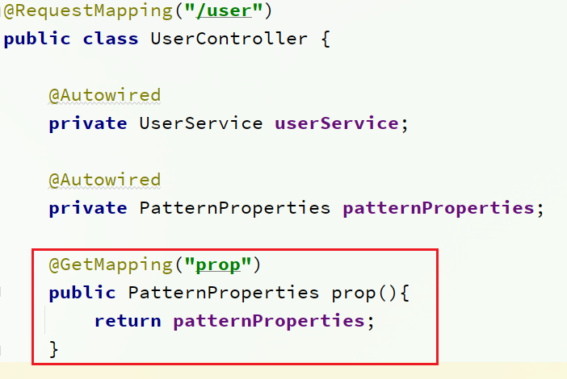

# 目录

[[toc]]

## Nacos配置管理

`Nacos`除了可以做注册中心，同样可以做配置管理来使用。


## 统一配置管理

当微服务部署的实例越来越多，达到数十、数百时，逐个修改微服务配置就会让人抓狂，而且很容易出错。我们需要一种统一配置管理方案，可以集中管理所有实例的配置。


`Nacos`一方面可以将配置集中管理，另一方可以在配置变更时，及时通知微服务，实现配置的热更新。


### 在nacos中添加配置文件

如何在`nacos`中管理配置呢？


然后在弹出的表单中，填写配置信息：


> 注意：项目的核心配置，需要热更新的配置才有放到`nacos`管理的必要。基本不会变更的一些配置还是保存在微服务本地比较好。


### 从微服务拉取配置

微服务要拉取`nacos`中管理的配置，并且与本地的`application.yml`配置合并，才能完成项目启动。

但如果尚未读取`application.yml`，又如何得知`nacos`地址呢？

因此`spring`引入了一种新的配置文件：`bootstrap.yaml`文件，会在`application.yml`之前被读取，流程如下：


1）引入nacos-config依赖

首先，在user-service服务中，引入nacos-config的客户端依赖：

```xml
<!--nacos配置管理依赖-->
<dependency>
    <groupId>com.alibaba.cloud</groupId>
    <artifactId>spring-cloud-starter-alibaba-nacos-config</artifactId>
</dependency>
```

2）添加bootstrap.yaml

然后，在user-service中添加一个`bootstrap.yaml`文件，内容如下：

```yaml
spring:
  application:
    name: userservice # 服务名称
  profiles:
    active: dev #开发环境，这里是dev 
  cloud:
    nacos:
      server-addr: localhost:8848 # Nacos地址
      config:
        file-extension: yaml # 文件后缀名
```

这里会根据`spring.cloud.nacos.server-addr`获取`nacos`地址，再根据

`${spring.application.name}-${spring.profiles.active}.${spring.cloud.nacos.config.file-extension}`作为文件`id`，来读取配置。

本例中，就是去读取`userservice-dev.yaml`：


3）读取nacos配置

在user-service中的UserController中添加业务逻辑，读取pattern.dateformat配置：


完整代码：

```java
@Slf4j
@RestController
@RequestMapping("/user")
public class UserController {

    @Autowired
    private UserService userService;

    @Value("${pattern.dateformat}")
    private String dateformat;
    
    @GetMapping("now")
    public String now(){
        return LocalDateTime.now().format(DateTimeFormatter.ofPattern(dateformat));
    }
    // ...略
}
```


在页面访问，可以看到效果：


## 配置热更新

我们最终的目的，是修改`nacos`中的配置后，微服务中无需重启即可让配置生效，也就是**配置热更新**。


要实现配置热更新，可以使用两种方式：

### 方式一

在`@Value`注入的变量所在类上添加注解`@RefreshScope`


### 方式二

使用`@ConfigurationProperties`注解代替`@Value`注解。

在user-service服务中，添加一个类，读取`patterrn.dateformat`属性：

```java
package cn.itcast.user.config;

import lombok.Data;
import org.springframework.boot.context.properties.ConfigurationProperties;
import org.springframework.stereotype.Component;

@Component
@Data
@ConfigurationProperties(prefix = "pattern")
public class PatternProperties {
    private String dateformat;
}
```


在UserController中使用这个类代替`@Value`：


完整代码：

```java
@Slf4j
@RestController
@RequestMapping("/user")
public class UserController {

    @Autowired
    private UserService userService;

    @Autowired
    private PatternProperties patternProperties;

    @GetMapping("now")
    public String now(){
        return LocalDateTime.now().format(DateTimeFormatter.ofPattern(patternProperties.getDateformat()));
    }

    // 略
}
```


## 配置共享

其实微服务启动时，会去`nacos`读取多个配置文件，例如：

- `[spring.application.name]-[spring.profiles.active].yaml`，例如：userservice-dev.yaml

- `[spring.application.name].yaml`，例如：userservice.yaml

而`[spring.application.name].yaml`不包含环境，因此可以被多个环境共享。


下面我们通过案例来测试配置共享


### 1）添加一个环境共享配置

我们在`nacos`中添加一个userservice.yaml文件：


### 2）在user-service中读取共享配置

在user-service服务中，修改`PatternProperties`类，读取新添加的属性：


在user-service服务中，修改UserController，添加一个方法：




### 3）运行两个UserApplication，使用不同的profile

修改UserApplication2这个启动项，改变其`profile`值：


这样，UserApplication(8081)使用的`profile`是`dev`，UserApplication2(8082)使用的`profile`是`test`。

启动UserApplication和UserApplication2

访问http://localhost:8081/user/prop，结果：


访问http://localhost:8082/user/prop，结果：


可以看出来，不管是`dev`，还是`test`环境，都读取到了`envSharedValue`这个属性的值。


### 4）配置共享的优先级

当`nacos`、服务本地同时出现相同属性时，优先级有高低之分：


