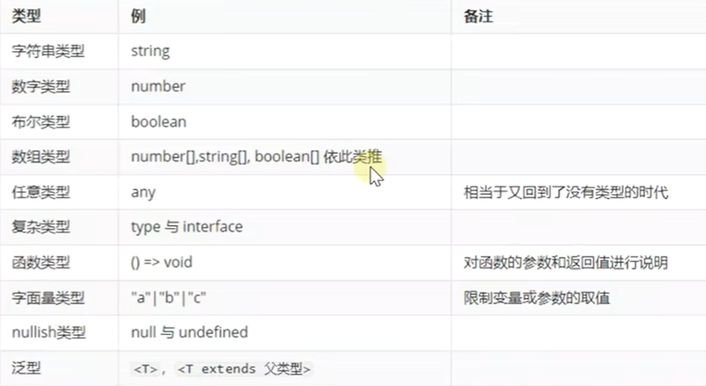
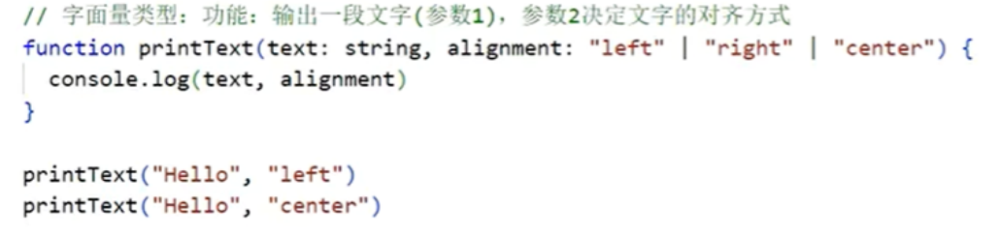
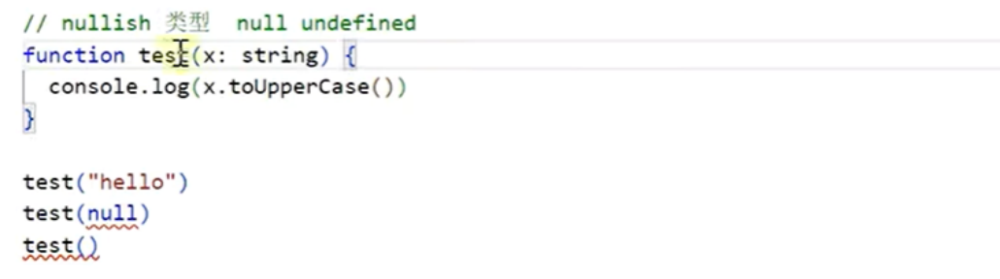
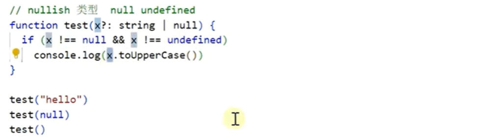
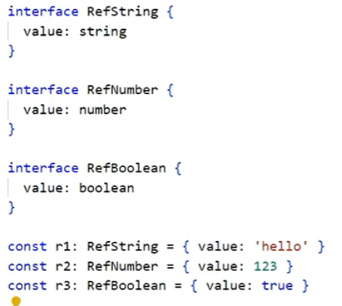
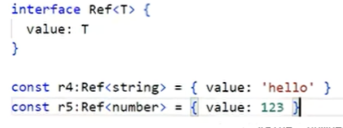
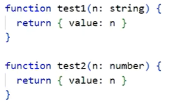
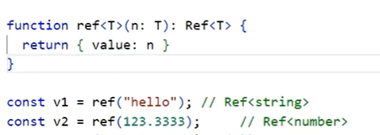

# 目录

[[toc]]

# TypeScript

TypeScript属于静态类型，在代码运行前，就对他的行为作出预测

TypeScript代码不能直接运行，需要通过编译器编译成JavaScript代码运行，最终运行的还是JavaScript代码

TypeScript只是在我们写代码时，做一个检查

例：

~~~JavaScript
//TypeScript	hello.ts
function test (obj:string) {
    console.log(obj.toUpperCase())
}

test("hello")//不会报错
test(123) //会报错
~~~

# TypeScript编译器

## 安装

```cmd
npm install -g sypescript
```

### 编译

```
tsc .\hello.ts
```

编译之后会生成一个同名的js文件,内容会进行类型的擦除，文件有错误的话是不能通过编译的

~~~JavaScript
//JavaScript	hello.js
function test (obj) {
    console.log(obj.toUpperCase());
}

test("hello");//不会报错
//test(123) //会报错
~~~

## TypeScript支持的类型

注意大小写



前5个为简单类型

### **可标注的位置**

标注变量、标注参数、标注返回值

~~~JavaScript
//标注变量，一般可以省略，可以根据后面的字面量推断出前面变量类型
let message:string = 'hello,world'
let message = 'hello,world'//省略写法

//标注参数
function greet(name:string){
    
}
const names = ['Alice','Bob','Eve']
const lowercaseNames = name.map((e:string) => e.toLowerCase())//这个e的类型也可以省略，name里的参数只有string
console.log(lowercaseNames)

//标注返回值
function add(a:number,b:number):number{//返回值类型也可以省略，因为a+b得到的肯定是数字类型
    return a+b
}
console.log(add(10,20))
~~~

## 复杂类型的定义

type、interface

~~~javascript
//必须跟指定的类型一样，多一个参数不行，少一个参数也不行
type Cat = {
    name: string,
    age: number
}

const cl: Cat = {name:'小白',age:1}
const c2: Cat = {name:'小黑'}//报错
const c3: Cat = {name:'小蓝', age:1, sex:'公'}//报错
//分割线
interface Cat = {
    name: string,
    age: number
}

const cl: Cat = {name:'小白',age:1}
const c2: Cat = {name:'小黑'}//报错
const c3: Cat = {name:'小蓝', age:1, sex:'公'}//报错

//分割线
//参数后面加上 ？ 表示可选，可以不传
interface Cat = {
    name: string,
    age?: number
}

const cl: Cat = {name:'小白',age:1}
const c2: Cat = {name:'小黑'}
const c3: Cat = {name:'小蓝', age:1, sex:'公'}//报错

//分割线
//当一个参数没有指定类型时，他传给一个指定类型的参数时，会采用鸭子类型，即他俩长得像就可以赋值
interface Cat = {
    name: string,
    age?: number
}

const cl: Cat = {name:'小白',age:1}
const c2: Cat = {name:'小黑'}
const c3 = {name:'小蓝', age:1, sex:'公'}

function test(cat:Cat){
    console.log(cat.name)
    console.log(cat.age)
    console.log(cat.sex)//报错
}

test(c1)
test(c2)
test(c3)
~~~


### 字面量类型

这样写我们的第二个参数在传递时就只能是给定的几个之一




### nullish类型

null、undefined不属于字符串类型



？表示可选，不传就是undefined



### 泛型

正常定义对象



使用泛型改进



正常定义函数



使用泛型进行改进


