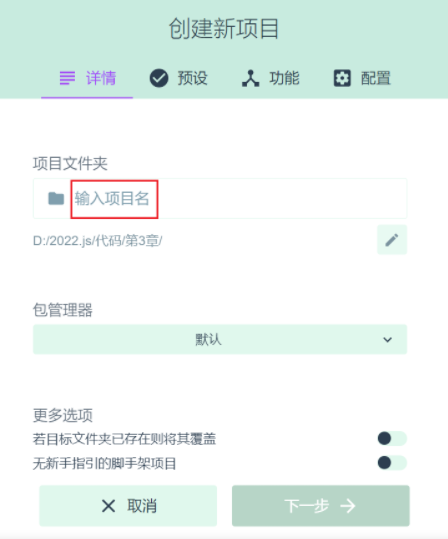
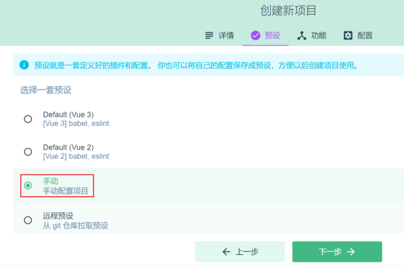
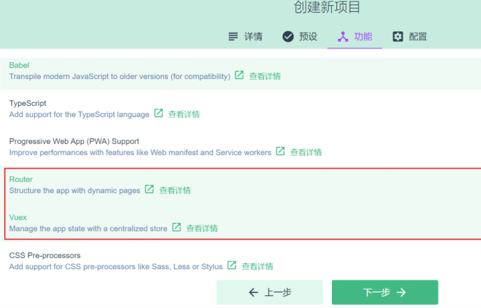
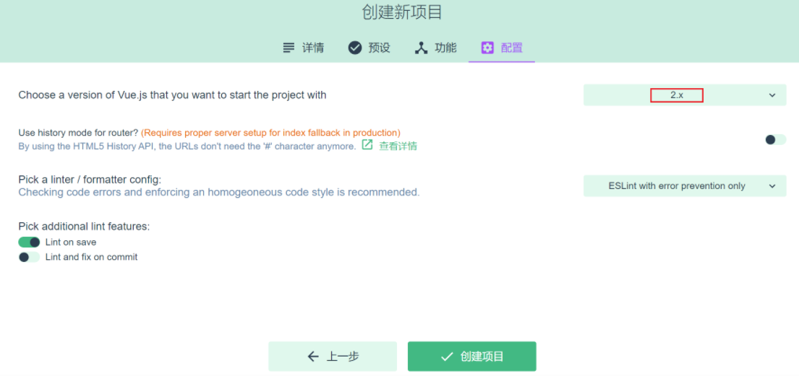
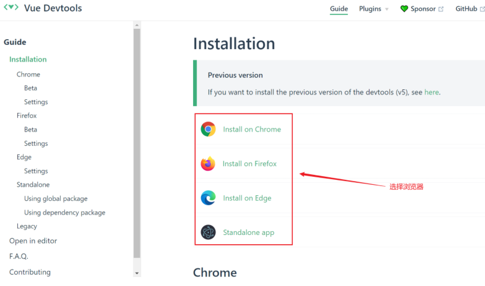
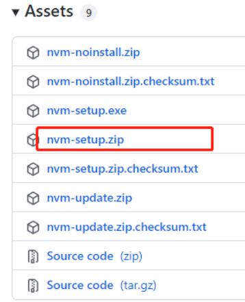
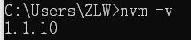
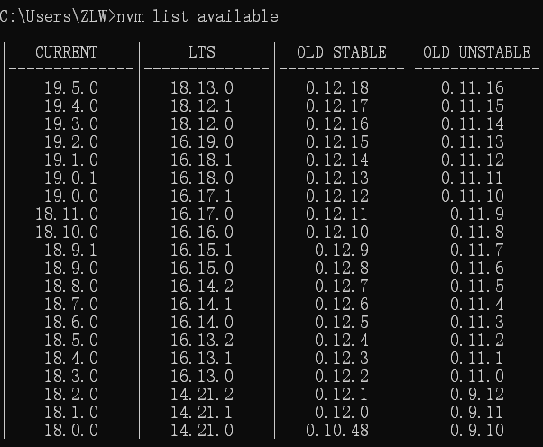

# 目录

[[toc]]

# 搭建环境

## 安装脚手架

```bash
npm install -g @vue/cli
```

- -g 参数表示全局安装，这样在任意目录都可以使用 vue 脚本创建项目
## 创建项目
```bash
vue ui
```
使用图形向导来创建 vue 项目，如下图，输入项目名



选择手动配置项目



添加 vue router 和 vuex



选择版本，创建项目



## 安装 devtools

- devtools 插件网址：[https://devtools.vuejs.org/guide/installation.html](https://devtools.vuejs.org/guide/installation.html)


## 安装NVM
1.先卸载 node.js

2.nvm 官网地址： [https://github.com/coreybutler/nvm-windows/releases](https://github.com/coreybutler/nvm-windows/releases) 打开网址我们可以看到安装包



3.解压后双击安装，无脑安装

**注意：在选择nvm和nodejs目录时，避免目录中出现空格和中文**

4.CMD 查看是否安装成功,有返回说明安装成功

```bash
nvm -v
```


5.配置国内镜像

```bash
nvm node_mirror http://npm.taobao.org/mirrors/node/

nvm npm_mirror htpps://npm.taobao.org/mirrors/npm/
```
6.查看可用版本
```bash
nvm list available
```


7.建议安装 LTS （长期支持版)

```bash
nvm install 18.12.1
```
8.安装完切换版本即可使用

```bash
nvm use 18.12.1
```
9.查看已安装的node版本

```bash
nvm list
```
10.检查npm镜像
```bash
npm get registry
# 如果返回的不是 https://registry.npm.taobao.org/,需要做如下设置
npm config ser registry https://registry.npm.taobao.org/
```
11.nvm自动配置环境变量，node不会，所以要配置node环境变量

## 运行项目
进入项目目录，执行
```bash
npm run serve
```
## 修改端口
前端服务器默认占用了 8080 端口，需要修改一下

- 文档地址：[DevServer | webpack](https://webpack.js.org/configuration/dev-server/#devserverport)
- 打开 vue.config.js 添加
```javascript
const { defineConfig } = require('@vue/cli-service')
module.exports = defineConfig({

  // ...

  devServer: {
    port: 7070
  }

})
```
## 添加代理
为了避免前后端服务器联调时， fetch、xhr 请求产生跨域问题，需要配置代理

- 文档地址同上
- 打开 vue.config.js 添加
```javascript
const { defineConfig } = require('@vue/cli-service')
module.exports = defineConfig({
    
  // ...
    
  devServer: {
    port: 7070,
    proxy: {
      '/api': {
        target: 'http://localhost:8080',
        changeOrigin: true
      }
    }
  }
    
})
```
