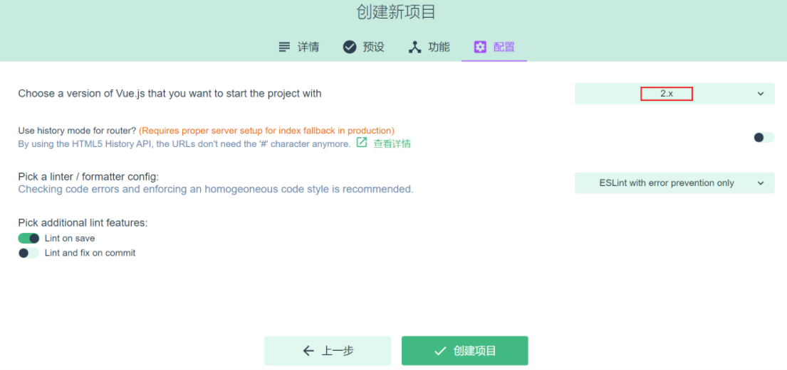
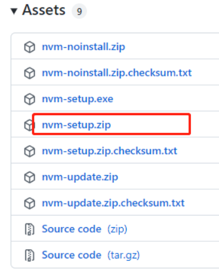
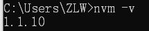
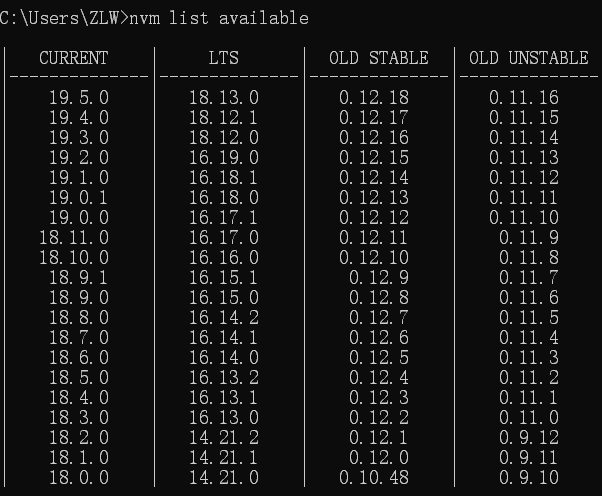
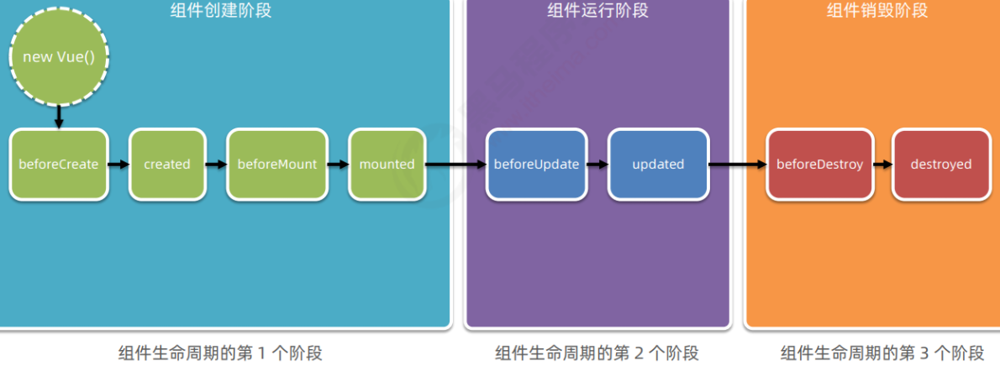

# Vue2

## 一、概述

### **vue 项目的运行流程**

在工程化的项目中，`vue` 要做的事情很单纯：

通过 `main.js` 把 `App.vue` 渲染到 `index.html` 的指定区域中。 

- ① `App.vue` 用来编写待渲染的模板结构 	
- ② `index.html` 中需要预留一个 `el` 区域 	
- ③ `main.js` 把 `App.vue` 渲染到了 `index.html` 所预留的区域中

### **Vue 项目结构**

 D:\2022.JS\代码\第3章\CLIENT\SRC

├─assets

├─components

├─router

├─store

└─views


- assets - 静态资源
- components - 可重用组件
- router - 路由
- store - 数据共享
- views - 视图组件

以后还会添加

- api - 跟后台交互，发送 fetch、xhr 请求，接收响应
- plugins - 插件

### **Vue组成**

`Vue` 的组件文件以 `.vue` 结尾，每个组件由三部分组成

```vue
<template></template>

<script></script>

<style></style>
```

- template 模板部分，由它生成 html 代码
- script 代码部分，控制模板的数据来源和行为
- style 样式部分，一般不咋关心

入口组件是 App.vue

来个 Hello, World 例子
```vue
<template>
  <h1>{{msg}}</h1>
</template>

<script>
export default {
  data() {
    return {
      msg: "Hello, Vue!"
    }
  }
}
</script>
```

- export default 导出组件对象，供 main.js 导入使用
- 这个对象有一个 data 方法，返回一个**对象**，给 template 提供数据
- `{{}}` 在 Vue 里称之为插值表达式，用来**绑定** data 方法返回的**对象**属性，**绑定**的含义是数据发生变化时，页面显示会同步变化

### 搭建环境

#### 安装脚手架

```bash
npm install -g @vue/cli
```

- -g 参数表示全局安装，这样在任意目录都可以使用 vue 脚本创建项目

#### 创建项目

```bash
vue ui
```

使用图形向导来创建 vue 项目，如下图，输入项目名


选择手动配置项目


添加 vue router 和 vuex


选择版本，创建项目



#### 安装 devtools

- devtools 插件网址：[https://devtools.vuejs.org/guide/installation.html](https://devtools.vuejs.org/guide/installation.html)


#### 安装NVM

1.先卸载 node.js

2.nvm 官网地址： [https://github.com/coreybutler/nvm-windows/releases](https://github.com/coreybutler/nvm-windows/releases) 打开网址我们可以看到安装包



3.解压后双击安装，无脑安装

**注意：在选择nvm和nodejs目录时，避免目录中出现空格和中文**

4.CMD 查看是否安装成功,有返回说明安装成功

```bash
nvm -v
```



5.配置国内镜像

```bash
nvm node_mirror http://npm.taobao.org/mirrors/node/

nvm npm_mirror htpps://npm.taobao.org/mirrors/npm/
```

6.查看可用版本

```bash
nvm list available
```



7.建议安装 LTS （长期支持版)

```bash
nvm install 18.12.1
```

8.安装完切换版本即可使用

```bash
nvm use 18.12.1
```

9.查看已安装的node版本

```bash
nvm list
```

10.检查npm镜像

```bash
npm get registry
# 如果返回的不是 https://registry.npm.taobao.org/,需要做如下设置
npm config set registry https://registry.npm.taobao.org/
```

11.nvm自动配置环境变量，node不会，所以要配置node环境变量

#### 运行项目

进入项目目录，执行

```bash
npm run serve
```

#### 修改端口

前端服务器默认占用了 8080 端口，需要修改一下

- 文档地址：[DevServer | webpack](https://webpack.js.org/configuration/dev-server/#devserverport)
- 打开 vue.config.js 添加

```javascript
const { defineConfig } = require('@vue/cli-service')
module.exports = defineConfig({

  // ...

  devServer: {
    port: 7070
  }

})
```

#### 添加代理

为了避免前后端服务器联调时， fetch、xhr 请求产生跨域问题，需要配置代理

- 文档地址同上
- 打开 vue.config.js 添加

```javascript
const { defineConfig } = require('@vue/cli-service')
module.exports = defineConfig({
    
  // ...
    
  devServer: {
    port: 7070,
    proxy: {
      '/api': {
        target: 'http://localhost:8080',
        changeOrigin: true
      }
    }
  }
    
})
```

## 二、Vue生命周期&生命周期函数

**生命周期（Life Cycle）：** 是指一个组件从创建 -> 运行 -> 销毁的整个阶段，强调的是一个时间段。

**生命周期函数：** 是由 vue 框架提供的内置函数，会伴随着组件的生命周期，自动按次序执行。




## 三、Vue基本语法

### {{ }} 文本插值

```vue
<template>
    <div>
        <h1>{{ name }}</h1>
        <h1>{{ age > 60 ? '老年' : '青年' }}</h1>
    </div>
</template>
<script>
export default {
    data () {
        return { 
          name: '张三',
          age: 70 
        };
    }
};
</script>
```

- {{ }} 里只能绑定一个属性，绑定多个属性需要用多个 {{}} 分别绑定
- template 内只能有一个根元素
- 插值内可以进行简单的表达式计算
- 只能渲染纯文本内容

### v-bind 属性绑定

```vue
<template>
    <div>
        <div><input type="text" v-bind:value="name"></div>
        <div><input type="date" v-bind:value="birthday"></div>
        <div><input type="text" :value="age"></div>
    </div>
</template>
<script>
export default {
  data () {
    return {
      name: '王五',
      birthday: '1995-05-01',
      age: 20 
    }
  }
}
</script>
```

- 简写方式：可以省略 v-bind 只保留冒号 ：

### v-on 事件绑定

```vue
<!-- 事件绑定 -->
<template>
    <div>
        <div><input type="button" value="点我执行m1" v-on:click="m1"></div>
        <div><input type="button" value="点我执行m2" @click="m2"></div>
      	<div><input type="button" value="点我执行m2" @paste="paste"></div>
        <div>{{count}}</div>
    </div>
</template>
<script>
export default {
  data () {
    return {
      count: 0
    }
  },
  methods: {
    // 监听粘贴事件
    paste(){
     console.log("粘贴事件触发了")
    },
    m1() {
     this.count ++;
     console.log("m1")
    },
    m2() {
     this.count --;
     console.log("m2")
    }
  }
}
</script>
```

- 简写方式：可以把 v-on: 替换为 @
- 在 methods 方法中的 this 代表的是 data 函数返回的数据对象

### v-model 双向绑定

```vue
<template>
    <div>
        <div>
            <label for="">请输入姓名</label>
            <input type="text" v-model="name">
        </div>
        <div>
            <label for="">请输入年龄</label>
            <input type="text" v-model="age">
        </div>
        <div>
            <label for="">请选择性别</label>
            男 <input type="radio" value="男" v-model="sex">
            女 <input type="radio" value="女" v-model="sex">
        </div>
        <div>
            <label for="">请选择爱好</label>
            游泳 <input type="checkbox" value="游泳" v-model="fav">
            打球 <input type="checkbox" value="打球" v-model="fav">
            健身 <input type="checkbox" value="健身" v-model="fav">
        </div>
    </div>
</template>
<script>
export default {
	data() {
        return {
            name: '', 
            age: null, 
            sex:'男' , 
            fav:['打球']
        }
    }
}
</script>
```

- v-model 实现双向绑定，即 
  - javascript 数据可以同步到表单标签
  - 反过来用户在表单标签输入的新值也会同步到 javascript 这边
- 双向绑定只适用于表单这种带【输入】功能的标签，其它标签的数据绑定，单向就足够了
- 复选框这种标签，双向绑定的 javascript 数据类型一般用数组
- 为了方便对用户输入的内容进行处理，vue 为 v-model 指令提供了 3 个修饰符，分别是：

| **修饰符** | **作用**                          | **示例**                         |
| ---------- | --------------------------------- | -------------------------------- |
| .number    | 自动将用户的输入值转为数值类型    | `<input v-model.number="name"/>` |
| .trim      | 自动过滤用户输入的收尾空白字符    | `<input v-model.trim="name"/>`   |
| .lazy      | 在 “change” 时而非 “input” 时更新 | `<input v-model.lazy="name"/>`   |

### v-for

用来辅助开发者基于一个数组来循环渲染一个列表结构。

v-for 指令需要使 用 item in items 形式的特殊语法，其中： items 是待循环的数组， item 是被循环的每一项

需要为每项提供一个唯一的 key 属性

```vue
<template>
  <div>
    <ul>
      <li v-for="item in list" :key="item.id">姓名是：{{ item.name }}</li>
    </ul>
  </div>
</template>

<script>
export default {
  data () {
    return {
      list: [//列表数据
	  	  {id:1, name:'wang'},
	  	  {id:2, name:'li'}
	    ]
    }
  }
}
</script>
```

key 的注意事项:

- key 的值只能是字符串或数字类型 
- key 的值必须具有唯一性（即：key 的值不能重复）
- 使用 v-for 指令时一定要指定 key 的值（既提升性能、又防止列表状态紊乱）
- v-if 和 v-for 不能用于同一个标签

### v-text

```vue
<!--将 username 对应的值，渲染到P标签 -->
<p v-text="username"></p>

<!--将 gender 对应的值，渲染到P标签，并会覆盖原来的‘性别’ -->
<p v-text="gender">性别</p>
```

- v-text指令会覆盖元素内默认的值
- 只能渲染纯文本内容

### v-html

v-text 指令和插值表达式只能渲染纯文本内容。

如果要把包含 HTML 标签的字符串渲染为页面的 HTML 元素， 则需要用到 v-html 这个指令：

```vue
<!-- 
	假设 data 中定义了 discription 的数据，数据值为包含 HTML 标签的字符串
	<h5 style="color: red;">学习 vue.js 课程</h5>
-->

<p v-html="discription"></p>
```

页面展示效果：


### v-if v-else-if v-else

```vue
<!-- v-if后面的表达式为true时，才会显示该标签 -->
<p v-if="discription === 10"></p>
<!-- v-else-if后面的表达式为true时，才会显示该标签 -->
<p v-else-if="discription1 === 10"></p>
<!-- v-else后面的表达式为true时，才会显示该标签 -->
<p v-else></p>
```

- v-if 可以单独使用，也可以配合 v-else-if、v-else 使用
- v-else-if、v-else 必须配合 v-if 使用，否则将不会被识别
- v-if 指令会动态地创建或移除 DOM 元素，从而控制元素在页面上的显示与隐藏
- v-if 有更高的切换开销，因此如果需要非常频繁地切换，则使用 v-show 较好
- v-if 和 v-for 不能用于同一个标签

### v-show

```vue
<!-- v-show后面的表达式为true时，才会显示该标签 -->
<p v-if="discription === 10"></p>
```

- v-show 指令会动态为元素添加或移除 style="display: none;" 样式，从而控制元素的显示与隐藏；
- v-show 有更高的初始渲染开销，因此如果在运行时条件很少改变，则使用 v-if 较好

### 事件修饰符

当绑定事件方法后，不传任何参数，默认会传递 event 事件对象

```vue
<template>
  <div>
    <aty-textarea v-model="value" @keyup.enter="enter">
    </aty-textarea>
  </div>
</template>

<script>
export default {
  methods: {
    // 实现输入框内，按下回车自动缩进两字符（4个空格）
    enter (event) {
      if (!this.isAutoEnterIndent) {
        return
      }
      // 获取光标当前位置（输入框内）
      const cursorPosition = event.target.selectionEnd
      // 截取光标前内容
      const prefix = this.value.substring(0, cursorPosition)
      // 截取光标后内容
      const suffix = this.value.substring(cursorPosition, this.value.length)
      // 拼接 4个空格 
      this.value = prefix + '   ' + suffix
    }
  } 
}
</script>
```

vue 提供了事件修饰符的概念，来辅助程序员更方便的对事件的触发进行控制，常用的 5 个事件修饰符如下：

| **事件修饰符** | **说明**                                           |
| -------------- | -------------------------------------------------- |
| **.prevent**   | **阻止默认行为（例如：阻止a连接跳转等）**          |
| **.stop**      | **阻止事件冒泡行为**                               |
| .capture       | 以捕获模式出发当前的事件处理函数                   |
| .once          | 绑定的时间只触发一次                               |
| .self          | 只有在event.target是当前元素自身时触发时间处理函数 |

```vue
<!-- 点击时不会跳转到百度，而是会执行绑定的onLinkClick事件 -->
<a href="https://www.baidu.com" @click.prevent="onLinkClick">百度首页</a>
```

### 按键修饰符

在监听键盘事件时，我们经常需要判断详细的按键。此时，可以为键盘相关的事件添加按键修饰符

例如：

```vue
<!-- 只有 按下并抬起 enter 键才会调用 submit 方法 -->
<input @keyup.enter="submit">

<!-- 只有 按下并抬起 esc 键才会调用 submit 方法 -->
<input @keyup.esc="submit">

<!-- 在 按下 enter 键时就会调用 submit 方法 -->
<input @keydown.esc="submit">

<!-- 在 按下 esc 键时就会调用 submit 方法 -->
<input @keydown.esc="submit">
```

### 计算属性

计算属性指的是通过一系列运算之后，最终得到一个属性值。 

这个动态计算出来的属性值可以被模板结构或 methods 方法使用。示例代码如下：

```vue
<!-- 计算属性 -->
<template>
    <div>
        <h2>{{fullName}}</h2
        <h2>{{fullName}}</h2>
        <h2>{{fullName}}</h2>
    </div>
</template>
<script>
export default {
    data() {
        return {
            firstName: '三', lastName: '张'
        }
    },
    computed: {
        fullName() {
            console.log('进入了 fullName')
            return this.lastName + this.firstName;
        }
    }
}
</script>
```

- 普通方法调用必须加 `()`，没有缓存功能
- 计算属性使用时就把它当属性来用，不加 ()，有缓存功能：
  - 一次计算后，会将结果缓存，下次再计算时，只要数据没有变化，不会重新计算，直接返回缓存结果

**重点来了！！！**

如果`v-model`绑定的这个计算属性`fullName`在表单上被修改了，那么`set`的`value`参数就是被修改的值，就可以写个`set`方法拿到这个值去用 

~~~vue
<!-- 简写形式 -->
<script>
export default {
  computed:{
    fullName(){
      return this.firstName+ '-' + this.lastName
    }
  }
}
</script>
<!-- 非简写形式 -->
<script>
export default {
  computed:{
    fullName:{
      get() {
        return this.firstName + '-' + this.lastName
      },
      set(value){
	    const arr = value.split('-')
	    this.firstName = arr[0]
	    this.lastName = arr[1]
       }
     }
  }
}
</script>
~~~


### watch 监听器

watch 侦听器允许开发者监视数据的变化，从而针对数据的变化做特定的操作

```vue
<template>
  <div>
    <button @click="changeUsername">a</button>
  </div>
</template>

<script>
export default {
  data(){
    return {
      username:'wo'
    }
  },
  methods:{
    changeUsername(){
      this.username = 'aaaaaaaaaaaaa'
    }
  },
  watch:{
    //newVal是变化后的新值，oldVal是变化之前的值
    username(newVal,oldVal){
      console.log(newVal,oldVal)//输出aaaaaaaaaaaaa,wo
    }
  }
}
</script>
```

#### 加载完立即调用 immediate

默认情况下，组件在初次加载完毕后不会调用 watch 侦听器。如果想让 watch 侦听器立即被调用，则需要使 用 immediate 选项。

```vue
<script>
export default {
  watch: {
	  username: {
		  // handler 是固定写法，表示当 username 的值变化时，自动调用 handler 处理函数
		  handler(newVal) {
			  if (newVal === '') return
			  this.username = newVal
			  console.log(newVal)
		  },
		  // 表示页面初次渲染好之后，就立即触发当前的 watch 侦听器
		  immediate: true
	  }
  }
}
</script>
```

#### 监听对象属性 deep属性

如果 watch 侦听的是一个对象，如果对象中的属性值发生了变化，则无法被监听到。此时需要使用 deep 选 项

```vue
<script>
export default {
  watch: {
	  username: {
		  // handler 是固定写法，表示当 username 的值变化时，自动调用 handler 处理函数
		  handler(newVal) {
			  if (newVal === '') return
			  this.username = newVal
			  console.log(newVal)
		  },
		  deep: true  
	  }
  }
}
</script>
```

#### 监听对象中单个属性的变化

如果只想监听对象中单个属性的变化，则可以按照如下的方式定义 watch 侦听器：

```vue
<script>
export default {
  data(){
	  return {
		  info:{
        username:'admin'
      }
	  }
  },
  methods:{
	  changeUsername(){
		  this.username = 'aaaaaaaaaaaaa'
	  }
  },
  watch:{
	  'info.username':{
      handler(newVal){
        console.log(newVal)
      }
	  }
  }
}
</script>
```

## 四、ref和slot

### ref引用

每个 `vue` 的组件实例上，都包含一个 `$refs` 对象，里面存储着对应的 `DOM` 元素或组件的引用

默认情况下， 组件的 `$refs` 指向一个空对象

#### ref引用DOM元素

如果想要使用 `ref` 引用页面上的 `DOM` 元素，则可以按照如下的方式进行操作：

```vue
<template>
  <div>
    //使用 ref 属性，为对应的 DOM 添加引用名称
    <h3 ref="myh3">MyRef组件</h3>
    <button @click="getRef">获取 $refs 引用</button>
  </div>
</template>

<script>
export default {
  methods:{
    getRef(){
      //通过 this.$ref.引用的名称 可以获取到DOM元素的引用
      console.log(this.$ref.myh3)
      //操作 DOM 元素，把文本颜色改为红色
      this.$ref.myh3.style.color='red'
    }
  }
}
</script>
```

#### ref引用组件

如果想要使用 `ref` 引用页面上的组件实例（VC），则可以按照如下的方式进行操作

```vue
<template>
  <div>
    //使用 ref 属性，为对应的 "组件" 添加引用名称
    <my-counter ref="counterRef"></my-counter>
    <button @click="getRef">获取 $refs 引用</button>
  </div>
</template>

<script>
export default {
  methods:{
    getRef(){
      <!-- 通过 this.$ref.引用的名称 可以引用组件的实例 -->
      console.log(this.$ref.counterRef)
      <!--  引用到组件的实例之后，就可以调用组件上的 methods 方法 -->
      this.$ref.myh3.counterRef.add()
    }
  }
}
</script>
```

### this.$nextTick(cb) 方法

组件的 `$nextTick(cb)` 方法，会把 `cb` 回调推迟到下一个 `DOM` 更新周期之后执行。

通俗的理解是：

- 等组件的 `DOM` 更新完成之后，再执行 `cb` 回调函数。
- 从而能保证 `cb` 回调函数可以操作到最新的 `DOM` 元素

```vue
<template>
  <div>
    <input v-if="inputVisible" type="text" ref="ipt">
    <button v-else @click="showInput">展示input输入框</button>
  </div>
</template>

<script>
export default {
  methods:{
	  showInput(){
		  this.inputVisible = true
      <!-- 把对 input 文本框的操作，推迟到下次 DOM 更新之后。否则页面上根本不存在文本框元素 -->
		  this.$nextTick(() => {
			  this.$ref.ipt.focus()
		  })
    }
  }
}
</script>
```

### 插槽

插槽（Slot）是 `vue` 为组件的封装者提供的能力。

允许开发者在封装组件时，把不确定的、希望由用户指定的部分定义为插槽。

可以把插槽认为是组件封装期间，为用户预留的内容的占位符

#### 基础用法

```vue
<template>
	<p>这是 MyCom1 组件的第一个 p 标签</p>
	<!-- 通过 slot 标签，为用户预留内容占位符（插槽） -->
	<slot></slot>
	<p>这是 MyCom1 组件的第二个 p 标签</p>
</template>

<!-- 使用组件时 -->
<my-com-1>
	<!-- 在使用 MyCom1 组件时，为插槽指定具体的内容 -->
    <p>~~~~~用户自定义的内容~~~~~</p>
</my-com-1>
```

- 如果在封装组件时没有预留任何 插槽，则用户提供的任何自定义内容都会被丢弃

```vue
<template>
	<p>这是 MyCom1 组件的第一个 p 标签</p>
	<p>这是 MyCom1 组件的第二个 p 标签</p>
</template>

<!-- 使用组件时 -->
<my-com-1>
	<!-- 自定义的内容会被丢弃 -->
    <p>~~~~~用户自定义的内容~~~~~</p>
</my-com-1>
```

- 封装组件时，可以为预留的插槽提供后备内容（默认内容）。
- 如果组件的使用者没有为插槽提供任何内容，则后备内容会生效

```vue
<template>
	<p>这是 MyCom1 组件的第一个 p 标签</p>
	<!-- 通过 slot 标签，为用户预留内容占位符（插槽） -->
	<slot>这是后背内容</slot>
	<p>这是 MyCom1 组件的第二个 p 标签</p>
</template>

<!-- 使用组件时 -->
<my-com-1>
	<!-- 没有为插槽提供任何 内容，则后备内容会生效 -->
</my-com-1>
```

#### 具名插槽

如果在封装组件时需要预留多个插槽节点，则需要为每个 插槽指定具体的 `name` 名称。

这种带有具体 名称的插槽叫做“具名插槽”

```vue
<div class="container">
    <header>
        <!--我们希望把页头放在这里 -->
    	<slot name="header"></slot>
    </header>
    <main>
        <!--我们希望把主要内容放在这里 -->
    	<slot></slot>
    </main>
    <footer>
        <!--我们希望把页脚放在这里 -->
    	<slot name="footer"></slot>
    </footer>
</div>

<!-- 使用时 -->
<!-- 
	在向具名插槽提供内容的时候，我们可以在一个 <template> 元素上使用 v-slot 指令，并以 v-slot 的参数的
	形式提供其名称 
-->
<my-com-2>
	<template v-slot:header>
    	<h1>滕王阁</h1>
    </template>
    
    <template #default>
    	<h1>黄鹤楼</h1>
    </template>
    
    <template #footer>
    	<h1>铁浮图</h1>
    </template>
</my-com-2>
```

- 没有指定 `name` 名称的插槽， 会有隐含的名称叫做 “`default`”。
- v-slot:header 可简写为 #header

#### 作用域插槽

在封装组件的过程中，可以为预留的 插槽绑定 `props` 数据，这种带有 `props` 数据的 叫做“作用 域插槽”

```vue
<tbody>
	<!-- 这是一个作用域插槽 -->
    <slot v-for="item in list" :user="item"></slot>
</tbody>

<!-- 使用时 -->
<my-com-3>
    <!-- 接收作用域插槽提供的数据 -->
	<template #default="scope">
		<!-- 使用作用域插槽的数据 -->
    	<p>{{ scope }}</p>
    </template>
</my-com-3>

<!-- 解构插槽 Prop -->
<!-- 作用域插槽对外提供的数据对象，可以使用解构赋值简化数据的接收过程 -->
<my-com-3>
    <!-- 接收作用域插槽提供的数据 -->
	<template #default="{user}">
		<p>{{ user.id }}</p>
    	<p>{{ user.name }}</p>
		<p>{{ user.age }}</p>
    </template>
</my-com-3>
```

## 五、Vue组件

**私有子组件**

在组件 A 的 `components` 节点下，注册了组件 F。 则组件 F 只能用在组件 A 中；不能被用在组件 C 中。

**全局组件**

在 vue 项目的 main.js 入口文件中，通过 `Vue.component()` 方法，可以注册全局组件。

示例代码如下：

```javascript
//导入需要全局注册的组件
import Count from '@/components/Count.vue'
//参数1：字符串格式，表示组件的注册名称，参数2：需要被全局注册的组件
Vue.component('MyCount',Count)
```

### 使用Vue组件

- 使用 import 语法导入需要的组件
- 使用 components 节点注册组件
- 以标签形式使用刚才注册的组件


###  组件的props

`props` 是组件的自定义属性，在封装通用组件的时候，合理地使用 `props` 可以极大的提高组件的复用性！ 

```javascript
//基本语法
export default {
  //组件的自定义属性
  props:['自定义属性A','自定义属性B','自定义属性...'],

  //组件的私有数据
  data() {
    return {

    }
  }
}

//- - - - - - - - - - - - - - - - - - - - - - - - - - - - - - 
//- 组件中封装的自定义属性是只读的，程序员不能直接修改 props 的值。否则会直接报错
//- 要想修改 props 的值，可以把 props 的值转存到 data 中，因为 data 中的数据都是可读可写的
export default {
  props:['init'],
  data() {
    return {
      count: this.init //把 init 的值转存到 count
    }
  }
}

//- - - - - - - - - - - - - - - - - - - - - - - - - - - - - - 
//- 在声明自定义属性时，可以通过 default 来定义属性的默认值。
export default {
  props:{
    init:{
      default:1 //默认值为 1
    }
  }
}

//- - - - - - - - - - - - - - - - - - - - - - - - - - - - - - 
//- 在声明自定义属性时，可以通过 type 来定义属性的值类型
export default {
  props:{
    init:{
      default:1, //默认值为 1
      type: Number //通过 type 来定义属性的值类型
    }
  }
}

//- - - - - - - - - - - - - - - - - - - - - - - - - - - - - - 
//- 在声明自定义属性时，可以通过 required 选项，将属性设置为必填项，强制用户必须传递属性的值
export default {
  props:{
    init:{
      type: Number, //通过 type 来定义属性的值类型
      required: true
    }
  },
}
```

- 组件中封装的自定义属性是只读的，程序员不能直接修改 props 的值。否则会直接报错
- 要想修改 props 的值，可以把 props 的值转存到 data 中，因为 data 中的数据都是可读可写的！
- 在声明自定义属性时，可以通过 default 来定义属性的默认值。
- 在声明自定义属性时，可以通过 type 来定义属性的值类型，如果传递过来的值不符合此类型，则会报错
- 在声明自定义属性时，可以通过 required 选项，将属性设置为必填项，强制用户必须传递属性的值

### 组件之间的数据共享

组件之间的关系：

- ​	父子关系
- ​	兄弟关系


- 父组件向子组件共享数据使用自定义`props`属性
- 子组件向父组件共享数据使用自定义事件
- 兄弟组件之间共享数据使用 `EventBus`，或使用 `VueX` 全局共享

#### 父 --->子共享数据

父组件向子组件共享数据需要使用自定义属性。

```vue
<!--父组件-->
<template>
  <div>
    <Son :msg="message" :user="userinfo"></Son>
  </div>
</template>

<script>
export default {
  data(){
	  return {
		  message:'hello vue',
		  userinfo:{
			  name: 'zs',
			  age: 20
		  }
	  }
  }
}
</script>

<!--子组件-->
<template>
	<div>
    <h5>Son 组件</h5>
    <p>父组件传递过来的msg：{{ msg }}</p>
    <p>父组件传递过来的user：{{ user }}</p>
  </div>
</template>

<script>
export default {
  props:['msg','user']
}
</script>
```

####  子 --->父共享数据

子组件向父组件共享数据使用自定义事件。

```vue
<!--父组件-->
<template>
  <div>
    <Son @numchange="getNewCount"></Son>
  </div>
</template>

<script>
export default {
	data(){
		return{
			countFromSon: 0
		}
	},
	method:{
		getNewCount(val){
			this.countFromSon = val
		}
	}
}
</script>

<!--子组件-->
<template>
  <div>
    <button @click="add()"></button>
  </div>
</template>

<script>
export default {
	data(){
		return{
			count: 0
		}
	},
	method:{
		add(){
			this.count += 7
			//修改数据时，通过 $emit() 触发自定义事件
			this.$emit('numchange',this.count)
		}
	}
}
</script>
```

#### 兄弟之间的数据共享


- 创建 eventBus.js 模块，并向外共享一个 Vue 的实例对象
- 在数据发送方，调用 bus.$emit('事件名称', 要发送的数据) 方法触发自定义事件
- 在数据接收方，调用 bus.$on('事件名称', 事件处理函数) 方法注册一个自定义事件

### 动态组件

动态组件指的是动态切换组件的显示与隐藏

vue 提供了一个内置的 组件，专门用来实现动态组件的渲染。

#### 动态组件渲染

```vue
<template>
  <div>
    <!-- 通过 is 属性，动态指定要渲染的组件 -->
    <component :is="comName"></component>
    <!-- 点击按钮，动态切换组件的名称 -->
    <button @click="comName = 'Left'">展示 Left 组件</button>
    <button @click="comName = 'Right'">展示 Right 组件</button>
  </div>
</template>

<script>
export default {
  data(){
    return{
      comName:'Left' //要渲染的组件名称
    }
  }
}
</script>  
```

### 保持组件状态 keep-alive

默认情况下，切换动态组件时无法保持组件的状态。此时可以使用 vue 内置的 组件保持动态组 件的状态。

```vue
<template>
  <div>
    <keep-alive>
      <component :is="comName"></component>
    </keep-alive>
  </div>
</template>
```

**keep-alive 对应的生命周期函数**


**keep-alive 的 include 属性**

`include` 属性用来指定：只有名称匹配的组件会被缓存。多个组件名之间使用英文的逗号分隔

```vue
<template>
  <div>
    <keep-alive include="MyLeft,MyRight">
	    <component :is="comName"></component>
    </keep-alive>
  </div>
</template>
```

## 六、Vue指令

### 自定义指令

vue 官方提供了 `v-text`、`v-for`、`v-model`、`v-if` 等常用的指令。

除此之外 `vue` 还允许开发者自定义指令

vue 中的自定义指令分为两类，分别是： 

- 私有自定义指令 
- 全局自定义指令

可以在 directives 节点下声明私有自定义指令。

全局共享的自定义指令需要通过“Vue.directive()”进行声明

### 私有自定义指令

可以在 `directives` 节点下声明私有自定义指令。

```vue
<template>
  <div>
    <!-- 基本使用 -->
    <h1 v-color>App 组件</h1>
  </div>
</template>

<script>
export default {
  directives: {
	  color: {
	  	// 为绑定到的 HTML 元素设置红色的文字
      // bind 函数只调用 1 次：当指令第一次绑定到元素时调用，当 DOM 更新时 bind 函数不会被触发
		  bind(el) {
			  //形参中的 el 是绑定了此指令的、原生的 DOM 对象
			  el.style.color = 'red'
		  }
	  }
  }
}
</script>

//- - - - - - - - - - - - - - - - - - - - - - - - - - - - 
<template>
  <div>
    <!-- 为自定义指令动态绑定参数值 -->
    <h1 v-color="color">App 组件</h1>
  </div>
</template>

<script>
export default {
  data(){
    return {
        color: 'blue'
    }
  },
  directives: {
	  color: {
		  // 在声明自定义指令时，可以通过形参中的第二个参数，来接收指令的参数值
		  bind(el,binding) {
			  // 通过 binding 对象的 value 属性，获取动态的参数值
			  el.style.color = binding.value
		  }
	  }
  }  
}
</script>
  

//- - - - - - - - - - - - - - - - - - - - - - - - - - - - 
// bind 函数和 update 函数
<script>
export default {
  directives: {
	  color: {
		  // bind 函数只调用 1 次：当指令第一次绑定到元素时调用，当 DOM 更新时 bind 函数不会被触发
		  bind(el,binding) {
			  // 通过 binding 对象的 value 属性，获取动态的参数值
			  el.style.color = binding.value
		  },
      // update 函数会在每次 DOM 更新时被调用
      update(el,binding) {
			  el.style.color = binding.value
		  }
	  }
  }  
}
</script>

//- - - - - - - - - - - - - - - - - - - - - - - - - - - - 
// 函数简写
<script>
export default {
  //如果 bind 和 update 函数中的逻辑完全相同，则对象格式的自定义指令可以简写成函数格式
  directives: {
	  color(el,binding) {
		  el.style.color = binding.value
	  }
  }  
}
</script>
```

- 在使用自定义指令时，需要加上 v- 前缀
- 在声明自定义指令时，可以通过形参中的第二个参数，来接收指令的参数值
- bind 函数只调用 1 次：当指令第一次绑定到元素时调用，当 DOM 更新时 bind 函数不会被触发
- update 函 数会在每次 DOM 更新时被调用

### 全局自定义指令

全局共享的自定义指令需要通过“`Vue.directive()`”进行声明

```javascript
//参数1：字符串，表示全局自定义指令的名字
//参数2：对象，用来接收指令的参数值
Vue.directive('color',function(el,binding){
	el.style.color = binding.value
})
```


## 七、Vue过滤器

过滤器仅在 vue 2.x 和 1.x 中受支持，在 vue 3.x 的版本中剔除了过滤器相关的功能。 

在企业级项目开发中： 

- 如果使用的是 2.x 版本的 vue，则依然可以使用过滤器相关的功能 
- 如果项目已经升级到了 3.x 版本的 vue，官方建议使用计算属性或方法代替被剔除的过滤器功能

具体的迁移指南，请参考 vue 3.x 的官方文档给出的说明： [https://v3.vuejs.org/guide/migration/filters.html#migration-strategy](https://v3.vuejs.org/guide/migration/filters.html#migration-strategy)

### 使用

过滤器（Filters）是 `vue` 为开发者提供的功能，常用于文本的格式化。

过滤器可以用在两个地方：

- 插值表达式
- v-bind 属性绑定

过滤器应该被添加在 `JavaScript` 表达式的尾部，由“管道符”进行调用

```vue
<!-- 通过 “管道符” 调用 capitalize 过滤器，对 message 的值进行格式化 -->
<p>{{ message | capitalize }}</p>

<!-- 通过 “管道符” 调用 formatId 过滤器，对 rawId 的值进行格式化 -->
<div v-bind:id="rawId | formatId"></div>

<!-- 串联调用过滤器 -->
<!-- 把 message 交给 filterA 进行处理，将处理结果交给 filterB继续处理 -->
{{ message | filterA | filterB }}

<!-- 过滤器传参 -->
<p>{{ message | filterA(arg1,arg2) }}</p>
<!-- 第一个参数永远是 “管道符” 前面待处理的值，从第二个参数开始，才是调用过滤器时传递过来的 arg1 和 arg2 参数 -->
Vue.filter('filterA',(msg,arg1,arg2) => {
	//过滤器代码逻辑
})
 
```

### 定义过滤器

在创建 `vue` 实例期间，可以在 `filters` 节点中定义过滤器，示例代码如下：

```vue
<script>
export default {
  data () {
    return {
      message: 'hello vue.js',
      info: 'title info'
    }
  },
  filters: {
    capitalize(str){ //str字符串转换成大写的过滤器
      return str.toUpperCase()
    }
  }
}
```

在 filters 节点下定义的过滤器，称为“私有过滤器”，因为它只能在当前 vm 实例所控制的 el 区域内使用

```javascript
//全局过滤器
//第一个参数：全局过滤器的名字
//第二个参数：全局过滤器要处理的参数
Vue.filter('capitalize',(str) => {
    return str.toUpperCase()
})
```


## 八、Vue-Router

`vue` 属于单页面应用，所谓的路由，就是根据浏览器路径不同，用不同的**视图组件**替换这个页面内容展示

### 使用

#### 安装路由

在 `vue2` 的项目中，安装 `vue-router` 的命令如下

```bash
npm install vue-router@3.5.2 -S
```

在 src 源代码目录下，新建 router/index.js 路由模块，并初始化如下的代码

```javascript
//1.导入 Vue 和 VueRouter 的包
import Vue from 'vue'
import VueRouter from 'vue-router'

//2.调用 Vue.use() 函数，把 VueRouter 安装为 Vue 的插件
Vue.use(VueRouter)

//3.创建路由的实例对象
const router = new VueRouter()

//4.向外共享路由的实例对象
export default router
```

在 src/main.js 入口文件中，导入并挂载路由模块

```javascript
import Vue from 'vue'
import App from './App.vue'

//1.导入路由模块
import router from '@/router'

new Vue({
  render:h => h(App),
  //2.挂载路由模块
  router:router
}).$mount('#app')
```

声明路由链接和占位符

在 `src/App.vue` 组件中，使用 `vue-router` 提供的和声明路由链接和占位符

```vue
<template>
  <div class="app-container">
    <h1>App 组件</h1>
    <!-- 定义路由链接 -->
    <!-- to 要去的路由地址 -->
    <router-link to="/home">首页</router-link>
    <router-link to="/movie">电影</router-link>
    <router-link to="/about">关于</router-link>

    <hr />

    <!-- 定义路由的占位符 -->
    <!-- 切换路由后在该位置显示页面 -->
    <router-view></router-view>
  </div>
</template>
```

#### 配置路由

在新建的路由 `js` 文件中配置路由地址与组件的映射关系

```javascript
import Vue from 'vue'
import VueRouter from 'vue-router'

Vue.use(VueRouter)

//path表示路径，component表示对应跳转的组件
const routes = [
  {
    path:'/',
    component: () => import('@/views/example14/ContainerView.vue')//动态导入，建议使用
  },
  {
    path:'/login',
    component: LoginView//静态导入。不建议使用
  },
  {
    path:'/404',
    component: NotFoundView
  }
]

const router = new VueRouter({
  routes
})

export default router
```

- 最重要的就是建立了【路径】与【视图组件】之间的映射关系
- 本例中映射了 3 个路径与对应的视图组件
- 静态导入是将所有组件的 `js` 代码打包到一起，如果组件非常多，打包后的 `js` 文件会很大，影响页面加载速度
- 动态导入是将组件的 `js` 代码放入独立的文件，用到时才加载

**在 main.js 中采用我们的路由 js**

```js
import Vue from 'vue'
import e14 from './views/Example14View.vue'
import router from './router/example14'  // 修改这里
import store from './store'
import Element from 'element-ui'
import 'element-ui/lib/theme-chalk/index.css'

Vue.config.productionTip = false

Vue.use(Element)
new Vue({
  router,
  store,
  render: h => h(e14)
}).$mount('#app')
```

根组件内容为：

```vue
<template>
    <div class="all">
        <router-view></router-view>
    </div>
</template>
```

- 其中 `<router-view>` 起到占位作用，改变路径后，这个路径对应的视图组件就会占据 `</router-view>` 的位置，替换掉它之前的内容

#### 嵌套路由


组件内再要切换内容，就需要用到嵌套路由（子路由)，下面的例子是在【ContainerView 组件】内定义了 3 个子路由

```js
const routes = [
  {
    path:'/',
    component: () => import('@/views/example14/ContainerView.vue'),
    redirect: '/c/p1',//重定向
    children: [
      { 
        path:'c/p1',
        component: () => import('@/views/example14/container/P1View.vue')
      },
      { 
        path:'c/p2',
        component: () => import('@/views/example14/container/P2View.vue')
      },
      { 
        path:'c/p3',
        component: () => import('@/views/example14/container/P3View.vue')
      }
    ]
  },
  {
    path:'/login',
    component: () => import('@/views/example14/LoginView.vue')
  },
  {
    path:'/404',
    component: () => import('@/views/example14/NotFoundView.vue')
  },
  {
    path:'*',
    redirect: '/404'
  }
]
```

子路由变化，切换的是【ContainerView 组件】中 <router-view></router-view> 部分的内容

```vue
<template>
    <div class="container">
        <router-view></router-view>
    </div>
</template>
```

- redirect 可以用来重定向（跳转）到一个新的地址
- path 的取值为 * 表示匹配不到其它 path 时，就会匹配它

### 路由跳转

#### 标签式

```vue
<template>
  <div>
    <el-aside width="200px">
      <!-- to 要跳转去的路由路径 -->
      <router-link to="/c1/p1">P1</router-link>
      <router-link to="/c1/p2">P2</router-link>
      <router-link to="/c1/p3">P3</router-link>
    </el-aside>
  </div>
</template>
```

#### 编程式

```vue
<template>
  <div>
    <el-header>
      <el-button type="primary" icon="el-icon-edit" 
               circle size="mini" @click="jump('/c1/p1')"></el-button>
      <el-button type="success" icon="el-icon-check" 
               circle size="mini" @click="jump('/c1/p2')"></el-button>
      <el-button type="warning" icon="el-icon-star-off" 
               circle size="mini" @click="jump('/c1/p3')"></el-button>
    </el-header>
  </div>
</template>

<script>
export default {
  methods : {
    jump(url) {
      this.$router.push(url);// 跳转到指定 hash 地址，并增加一条历史记录
      // this.$router.replace(url)
    }
  }
}
</script>
```

- 其中 this.$router 是拿到路由对象
- push 方法根据 url 进行跳转
- this.$router.push('url');//跳转到指定 hash 地址，并增加一条历史记录
- this.$router.replace('url') 跳转到指定的 hash 地址，并替换掉当前的历史记录
- this.$router.go(数值 n) 实现导航历史前进、后退

```vue
this.$router.go(-1) // 回退到之前的组件页面

// 在实际开发中，一般只会前进和后退一层页面。因此 vue-router 提供了如下两个便捷方法
this.$router.back(-1) // 在历史记录中，后退到上一个页面
this.$router.forward(-1) // 在历史记录中，前进到下一个页面
```

#### 导航菜单

```vue
<template>
<!-- 侧边栏 -->
 <el-scrollbar wrap-class="scrollbar-wrapper">
  <el-menu
    router
    :default-active="activeMenu"
    :unique-opened="false"
    :collapse-transition="false"
    mode="vertical"
    background-color="#304156"
    text-color="#bfcbd9"
    active-text-color="#409EFF"
  >
    <!-- 循环路由对象 -->
    <div v-for="item in route" :key="item.path">
      <!-- 若 hidden=true 则不显示 -->
      <div v-if="!item.hidden">
        <!-- 嵌套路由 -->
        <el-submenu v-if="childrenLength(item)" :index="item.path">
          <!-- 标题 -->
          <template slot="title">
            <!-- <i class="el-icon-location"></i> -->
            <svg-icon :svgName="item.meta.icon"></svg-icon>
            <span>{{ item.meta.title }}</span>
          </template>
          <!-- 子路由 -->
          <div v-for="ele in item.children" :key="ele.path">
            <el-menu-item :index="resolvePath(item.path, ele.path)">{{ ele.meta.title }}</el-menu-item>
          </div>
        </el-submenu>
        <!-- 路由链接 -->
        <el-menu-item v-else :index="resolveOneChildrenPath(item)">
          <svg-icon :svgName="item.meta.icon"></svg-icon>
          {{ childrenName(item) }}
        </el-menu-item>
      </div>
    </div>
  </el-menu>
  </el-scrollbar>
</template>

<script>
import SvgIcon from '@/components/svg/SvgIcon.vue'
export default {
  name: 'side-bar',
  components: {SvgIcon},
  data() {
    return {
      route: this.$router.options.routes // 获得全部路由信息
    }
  },
  created() {
  },
  computed: {
    activeMenu() {
      return this.$route.path
    },
  },
  methods: {
    // 判断 children 的长度，如果为1则显示路由链接，如果大于1则显示嵌套路由
    childrenLength(item) {
      if (item.children == null || item.children.length === 1) {
        return false
      }
      return true
    },
    // 解析 children 长度 >1 的path
    resolvePath(parentPath, childrenPath) {
      let routePath = parentPath + '/' + childrenPath
      return routePath
    },
    // 解析 children 长度为 1 的path
    resolveOneChildrenPath(item) {
      let itemPath = item.path
      if (item.children != null) {
        let childrenPath = item.children[0].path
        let routePath = itemPath + '/' + childrenPath
        return routePath
      }
      return itemPath
    },
    // 获得 children 的 title 
    childrenName(item) {
      if (item.children != null) {
        let childrenName = item.children[0].meta.title
        return childrenName
      }
      return item.meta.title
    },
    key() {
      return this.$route.path
    }
  },
}
</script>
```

- 图标和菜单项文字建议用 <span slot='title'></span> 包裹起来
- el-menu 标签上加上 router 属性，表示结合导航菜单与路由对象，此时，就可以利用菜单项的 index 属性来路由跳转

### 路由守卫(导航守卫)

导航守卫可以控制路由的访问权限

常见用法：

​		全局前置守卫


#### **全局前置守卫**

每次发生路由的导航跳转时，都会触发全局前置守卫。因此，在全局前置守卫中，程序员可以对每个路由进行 访问权限的控制

```javascript
//创建路由实例对象
const router = new VueRouter({...})

//调用路由实例对象的 beforeEach 方法，即可声明 "全局前置守卫"
//每次发生路由导航跳转的时候，都会自动出发 fn 这个 回调函数
router.beforeEach(fn)

//fn 这个回调函数可以接收3个形参
router.beforeEach((to,from,next) => {
  //to 是将要访问的路由的信息对象
  //from 是将要来开的路由的信息对象
  //next 是一个函数，调用 next() 表示放行，运行这次路由导航
})
```

**next 函数的 3 种调用方式**


- 当前用户拥有后台主页的访问权限，直接放行：next() 
- 当前用户没有后台主页的访问权限，强制其跳转到登录页面：next('/login') 
- 当前用户没有后台主页的访问权限，不允许跳转到后台主页：next(false)

**使用案例**

控制后台主页的访问权限

```javascript
router.beforeEach((to, from, next) => {
  const token = localStorage.getItem('token')
  if (token && to.path !== '/login') {
  // 有token 但不是去 login页面 通过
    next()
  } else if (token && to.path === '/login') {
   // 有token 但是去 login页面 不通过 重定向到首页
    next('/dashboard/dashboard')
  } else if (!token && to.path !== '/login') {
   // 没有token 但不是去 login页面 不通过（未登录不给进入）
    next('/login')
  } else {
  // 剩下最后一种 没有token 但是去 login页面 通过
    next()
  }
})
```


## 九、Vuex

vuex 可以在多个组件之间共享数据，并且共享的数据是【响应式】的，即数据的变更能及时渲染到模板

- 与之对比 localStorage 与 sessionStorage 也能共享数据，但缺点是数据并非【响应式】

首先需要定义 `state` 与 `mutations` 他们一个用来读取共享数据，一个用来修改共享数据

### 入门

**src/store/index.js**

```javascript
import Vue from 'vue'
import Vuex from 'vuex'

Vue.use(Vuex)

/*
  读取数据，走 state, getters
  修改数据，走 mutations, actions
  */
export default new Vuex.Store({
  state: {
    name: '',
    age: 18
  },
  getters: {
  },
  mutations: {
    updateName(state, name) {
      state.name = name;
    }
  },
  actions: {
  },
  modules: {
  }
})
```

**修改共享数据**

```vue
<template>
  <div class="p">
    <el-input placeholder="请修改用户姓名" 
      size="mini" v-model="name"></el-input>
    <el-button type="primary" size="mini" @click="update()">修改</el-button>
  </div>
</template>
<script>
export default {
  data () {
    return {
      name:''
    }
  },
  methods: {
    update(){
      this.$store.commit('updateName', this.name);
    }
  }
}
</script>
```

- mutations 方法不能直接调用，只能通过 store.commit(mutation方法名, 参数) 来间接调用

**读取共享数据**

```vue
<template>
  <div class="container">
    <el-container>
      <el-header>
        <div class="t">
          欢迎您：{{ $store.state.name }}, {{ $store.state.age }}
        </div>
      </el-header>
      <el-container>
        <el-aside width="200px">
        </el-aside>
        <el-main>
          <router-view></router-view>
        </el-main>
      </el-container>
    </el-container>
  </div>
</template>
```

### mapState

每次去写 `$store.state.name` 这样的代码显得非常繁琐，可以用 `vuex` 帮我们生成计算属性

```vue
<template>
  <div class="container">
    <el-container>
      <el-header>
        <div class="t">欢迎您：{{ name }}, {{ age }}</div>
      </el-header>
      <el-container>
        <el-aside width="200px">
        </el-aside>
        <el-main>
          <router-view></router-view>
        </el-main>
      </el-container>
    </el-container>
  </div>
</template>
<script>
  // 引入 mapState
  import { mapState } from 'vuex'
  export default {
    computed: {
      ...mapState(['name', 'age'])
    }
  }
</script>
```

- `mapState` 返回的是一个对象，对象内包含了 name() 和 age() 的这两个方法作为计算属性
- 此对象配合 ... 展开运算符，填充入 computed 即可使用

### mapMutations

```vue
<template>
    <div class="p">
        <el-input placeholder="请修改用户姓名" 
            size="mini" v-model="name"></el-input>
        <el-button type="primary" size="mini" @click="updateName(name)">修改</el-button>
    </div>
</template>
<script>
import {mapMutations} from 'vuex'
export default {
  data () {
    return {
      name:''
    }
  },
  methods: {
    ...mapMutations(['updateName']),
    testMapMutations () {
      this.updateName(this.name)
    }
  }
}
</script>
```

- 类似的，调用 `mutation` 修改共享数据也可以简化
- mapMutations 返回的对象中包含的方法，就会调用 `store.commit()` 来执行 `mutation` 方法
- 注意参数传递略有不同

### actions

`mutations` 方法内不能包括修改不能立刻生效的代码，否则会造成 `Vuex` 调试工具工作不准确，必须把这些代码写在 `actions` 方法中

```javascript
import Vue from 'vue'
import Vuex from 'vuex'

Vue.use(Vuex)

/*
  读取数据，走 state, getters
  修改数据，走 mutations, actions
  */
import axios from '@/util/myaxios'
export default new Vuex.Store({
  state: {
    name: '',
    age: 18
  },
  getters: {
  },
  mutations: {
    updateName(state, name) {
      state.name = name;
    },
    // 错误的用法，如果在mutations方法中包含了异步操作，会造成开发工具不准确
    /* async updateServerName(state) {
  const resp = await axios.get('/api/user');
  const {name, age} = resp.data.data;
  state.name = name;
  state.age = age;
  } */
    updateServerName(state, user) {
      const { name, age } = user;
      state.name = name;
      state.age = age;
    }
  },
  actions: {
    async updateServerName(context) {
      const resp = await axios.get('/api/user');
      context.commit('updateServerName', resp.data.data)
    }
  },
  modules: {
  }
})
```

- 首先应当调用 `actions` 的 `updateServerName` 获取数据
- 然后再由它间接调用 `mutations` 的 `updateServerName` 更新共享数据

页面使用 actions 的方法可以这么写

```vue
<template>
  <div class="p">
    <el-button type="primary" size="mini"
      @click="updateServerName()">从服务器获取数据,存入store</el-button>
  </div>
</template>
<script>
  import { mapActions } from 'vuex'
  export default {
    methods: {
      ...mapActions(['updateServerName'])
    }
  }
</script>

```

- `mapActions` 会生成调用 `actions` 中方法的代码
- 调用 `actions` 的代码内部等价于，它返回的是 `Promise` 对象，可以用同步或异步方式接收结果

```vue
this.$store.dispatch('action名称', 参数)
```

## 十、Axios

`axios` 它的底层是用了 XMLHttpRequest（xhr）方式发送请求和接收响应，`xhr` 相对于之前讲过的 fetch api 来说，功能更强大，但由于是比较老的 api，不支持 Promise，axios 对 xhr 进行了封装，使之支持 Promise，并提供了对请求、响应的统一拦截功能

**安装**

```bash
npm install axios -S
```

**导入**

```javascript
import axios from 'axios'
```

- axios 默认导出一个对象，这里的 import 导入的就是它默认导出的对象

**方法**

| **请求**                           | **备注** |
| ---------------------------------- | -------- |
| axios.get(url[, config])           | ⭐️        |
| axios.delete(url[, config])        |          |
| axios.head(url[, config])          |          |
| axios.options(url[, config])       |          |
| axios.post(url[, data[, config]])  | ⭐️        |
| axios.put(url[, data[, config]])   |          |
| axios.patch(url[, data[, config]]) |          |

- config - 选项对象、例如查询参数、请求头...
- data - 请求体数据、最常见的是 json 格式数据
- get、head 请求无法携带请求体，这应当是浏览器的限制所致（xhr、fetch api 均有限制）
- options、delete 请求可以通过 config 中的 data 携带请求体

```vue
<template>
    <div>
        <input type="button" value="获取远程数据" @click="sendReq()">
    </div>
</template>
<script>
import axios from 'axios'
export default {
   methods: {
        async sendReq() {
            // 1. 演示 get, post
            // const resp = await axios.post('/api/a2');

            // 2. 发送请求头
            // const resp = await axios.post('/api/a3',{},{
            //     headers:{
            //         Authorization:'abc'
            //     }
            // });

            // 3. 发送请求时携带查询参数 ?name=xxx&age=xxx
            // const name = encodeURIComponent('&&&');
            // const age = 18;
            // const resp = await axios.post(`/api/a4?name=${name}&age=${age}`);

            // 不想自己拼串、处理特殊字符、就用下面的办法
            // const resp = await axios.post('/api/a4', {}, {
            //     params: {
            //         name:'&&&&',
            //         age: 20
            //     }
            // });

            // 4. 用请求体发数据，格式为 urlencoded
            // const params = new URLSearchParams();
            // params.append("name", "张三");
            // params.append("age", 24)

            // const resp = await axios.post('/api/a4', params);

            // 5. 用请求体发数据，格式为 multipart
            // const params = new FormData();
            // params.append("name", "李四");
            // params.append("age", 30);
            // const resp = await axios.post('/api/a5', params);

            // 6. 用请求体发数据，格式为 json
            const resp = await axios.post('/api/a5json', {
                name: '王五',
                age: 50
            });

            console.log(resp);
        }
    }
}
</script>

 
```

**创建实例**

```vue
const _axios = axios.create(config);
```

- axios 对象可以直接使用，但使用的是默认的设置
- 用 axios.create 创建的对象，可以覆盖默认设置，config 见下面说明

**常见的 config 项有** 

| **名称**        | **含义**                                                   |
| --------------- | ---------------------------------------------------------- |
| baseURL         | 将自动加在 url 前面                                        |
| headers         | 请求头，类型为简单对象                                     |
| params          | 跟在 URL 后的请求参数，类型为简单对象或 URLSearchParams    |
| data            | 请求体，类型有简单对象、FormData、URLSearchParams、File 等 |
| withCredentials | 跨域时是否携带 Cookie 等凭证，默认为 false                 |
| responseType    | 响应类型，默认为 json                                      |

```js
const _axios = axios.create({
    baseURL: 'http://localhost:8080',
    withCredentials: true
});
await _axios.post('/api/a6set')
await _axios.post('/api/a6get')
```

- 生产环境希望 xhr 请求不走代理，可以用 baseURL 统一修改
- 希望跨域请求携带 cookie，需要配置 withCredentials: true，服务器也要配置 allowCredentials = true，否则浏览器获取跨域返回的 cookie 时会报错

**响应格式**

| **名称** | **含义**   |
| -------- | ---------- |
| data     | 响应体数据 |
| status   | 状态码     |
| headers  | 响应头     |

- 200 表示响应成功
- 400 请求数据不正确 age=abc
- 401 身份验证没通过
- 403 没有权限
- 404 资源不存在
- 405 不支持请求方式 post
- 500 服务器内部错误 出现异常没有捕获

### 请求拦截器

```js
_axios.interceptors.request.use(
  function(config) {
    // 比如在这里添加统一的 headers
    return config;
  },
  function(error) {
    return Promise.reject(error);
  }
);
```

### 响应拦截器

```js
_axios.interceptors.response.use(
  function(response) {
    // 2xx 范围内走这里
    return response;
  },
  function(error) {
    // 超出 2xx, 比如 4xx, 5xx 走这里
    return Promise.reject(error);
  }
);
```
