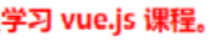

# 目录

[[toc]]

# Vue基本语法

## {{ }} 文本插值
```vue
<template>
    <div>
        <h1>{{ name }}</h1>
        <h1>{{ age > 60 ? '老年' : '青年' }}</h1>
    </div>
</template>
<script>
const options = {
    data: function () {
        return { name: '张三', age: 70 };
    }
};
export default options;
</script>
```

- {{ }} 里只能绑定一个属性，绑定多个属性需要用多个 {{}} 分别绑定
- template 内只能有一个根元素
- 插值内可以进行简单的表达式计算
- 只能渲染纯文本内容
## v-bind 属性绑定
```vue
<template>
    <div>
        <div><input type="text" v-bind:value="name"></div>
        <div><input type="date" v-bind:value="birthday"></div>
        <div><input type="text" :value="age"></div>
    </div>
</template>
<script>
const options = {
    data: function () {
        return { name: '王五', birthday: '1995-05-01', age: 20 };
    }
};
export default options;
</script>
```

- 简写方式：可以省略 v-bind 只保留冒号 ：
## v-on 事件绑定
```vue
<!-- 事件绑定 -->
<template>
    <div>
        <div><input type="button" value="点我执行m1" v-on:click="m1"></div>
        <div><input type="button" value="点我执行m2" @click="m2"></div>
      	<div><input type="button" value="点我执行m2" @paste="paste"></div>
        <div>{{count}}</div>
    </div>
</template>
<script>
const options = {
    data: function () {
        return { count: 0 };
    },
    methods: {
      // 监听粘贴事件
      paste(){
        console.log("粘贴事件触发了")
      },
        m1() {
            this.count ++;
            console.log("m1")
        },
        m2() {
            this.count --;
            console.log("m2")
        }
    }
};
export default options;
</script>
```

- 简写方式：可以把 v-on: 替换为 @
- 在 methods 方法中的 this 代表的是 data 函数返回的数据对象
## v-model 双向绑定
```vue
<template>
    <div>
        <div>
            <label for="">请输入姓名</label>
            <input type="text" v-model="name">
        </div>
        <div>
            <label for="">请输入年龄</label>
            <input type="text" v-model="age">
        </div>
        <div>
            <label for="">请选择性别</label>
            男 <input type="radio" value="男" v-model="sex">
            女 <input type="radio" value="女" v-model="sex">
        </div>
        <div>
            <label for="">请选择爱好</label>
            游泳 <input type="checkbox" value="游泳" v-model="fav">
            打球 <input type="checkbox" value="打球" v-model="fav">
            健身 <input type="checkbox" value="健身" v-model="fav">
        </div>
    </div>
</template>
<script>
const options = {
    data: function () {
        return { name: '', age: null, sex:'男' , fav:['打球']};
    },
    methods: {
    }
};
export default options;
</script>
```

- v-model 实现双向绑定，即 
   - javascript 数据可以同步到表单标签
   - 反过来用户在表单标签输入的新值也会同步到 javascript 这边
- 双向绑定只适用于表单这种带【输入】功能的标签，其它标签的数据绑定，单向就足够了
- 复选框这种标签，双向绑定的 javascript 数据类型一般用数组
- 为了方便对用户输入的内容进行处理，vue 为 v-model 指令提供了 3 个修饰符，分别是：

| **修饰符** | **作用** | **示例** |
| --- | --- | --- |
| .number | 自动将用户的输入值转为数值类型 | `<input v-model.number="name"/>` |
| .trim | 自动过滤用户输入的收尾空白字符 | `<input v-model.trim="name"/>` |
| .lazy | 在 “change” 时而非 “input” 时更新 | `<input v-model.lazy="name"/>` |

## v-for
用来辅助开发者基于一个数组来循环渲染一个列表结构。

v-for 指令需要使 用 item in items 形式的特殊语法，其中： items 是待循环的数组， item 是被循环的每一项

需要为每项提供一个唯一的 key 属性

```vue
data:{
	list: [//列表数据
		{id:1, name:'wang'},
		{id:2, name:'li'}
	]
}
<!-- 分割线 -->
<ul>
    <li v-for="item in list" :key="item.id">姓名是：{{ item.name }}</li>
</ul>
```
key 的注意事项:

- key 的值只能是字符串或数字类型 
- key 的值必须具有唯一性（即：key 的值不能重复）
- 使用 v-for 指令时一定要指定 key 的值（既提升性能、又防止列表状态紊乱）
- v-if 和 v-for 不能用于同一个标签
## v-text
```vue
<!--将 username 对应的值，渲染到P标签 -->
<p v-text="username"></p>

<!--将 gender 对应的值，渲染到P标签，并会覆盖原来的‘性别’ -->
<p v-text="gender">性别</p>
```

- v-text指令会覆盖元素内默认的值
- 只能渲染纯文本内容
## v-html
v-text 指令和插值表达式只能渲染纯文本内容。

如果要把包含 HTML 标签的字符串渲染为页面的 HTML 元素， 则需要用到 v-html 这个指令：

```vue
<!-- 
	假设 data 中定义了 discription 的数据，数据值为包含 HTML 标签的字符串
	<h5 style="color: red;">学习 vue.js 课程</h5>
-->

<p v-html="discription"></p>
```
页面展示效果：



## v-if v-else-if v-else
```vue
<!-- v-if后面的表达式为true时，才会显示该标签 -->
<p v-if="discription === 10"></p>
<!-- v-else-if后面的表达式为true时，才会显示该标签 -->
<p v-else-if="discription1 === 10"></p>
<!-- v-else后面的表达式为true时，才会显示该标签 -->
<p v-else></p>
```

- v-if 可以单独使用，也可以配合 v-else-if、v-else 使用
- v-else-if、v-else 必须配合 v-if 使用，否则将不会被识别
- v-if 指令会动态地创建或移除 DOM 元素，从而控制元素在页面上的显示与隐藏
- v-if 有更高的切换开销，因此如果需要非常频繁地切换，则使用 v-show 较好
- v-if 和 v-for 不能用于同一个标签
## v-show
```vue
<!-- v-show后面的表达式为true时，才会显示该标签 -->
<p v-if="discription === 10"></p>
```

- v-show 指令会动态为元素添加或移除 style="display: none;" 样式，从而控制元素的显示与隐藏；
- v-show 有更高的初始渲染开销，因此如果在运行时条件很少改变，则使用 v-if 较好
## 事件修饰符
当绑定事件方法后，不传任何参数，默认会传递 event 事件对象
```vue
<aty-textarea v-model="value" @keyup.enter="enter">
</aty-textarea>

// 实现输入框内，按下回车自动缩进两字符（4个空格）
enter (event) {
  if (!this.isAutoEnterIndent) {
      return
  }
  // 获取光标当前位置（输入框内）
  const cursorPosition = event.target.selectionEnd
  // 截取光标前内容
  const prefix = this.value.substring(0, cursorPosition)
  // 截取光标后内容
  const suffix = this.value.substring(cursorPosition, this.value.length)
  // 拼接 4个空格 
  this.value = prefix + '   ' + suffix
}
```
vue 提供了事件修饰符的概念，来辅助程序员更方便的对事件的触发进行控制，常用的 5 个事件修饰符如下：

| **事件修饰符** | **说明** |
| --- | --- |
| **.prevent** | **阻止默认行为（例如：阻止a连接跳转等）** |
| **.stop** | **阻止事件冒泡行为** |
| .capture | 以捕获模式出发当前的事件处理函数 |
| .once | 绑定的时间只触发一次 |
| .self | 只有在event.target是当前元素自身时触发时间处理函数 |

```vue
<!-- 点击时不会跳转到百度，而是会执行绑定的onLinkClick事件 -->
<a href="https://www.baidu.com" @click.prevent="onLinkClick">百度首页</a>
```
## 按键修饰符
在监听键盘事件时，我们经常需要判断详细的按键。此时，可以为键盘相关的事件添加按键修饰符

例如：

```vue
<!-- 只有 按下并抬起 enter 键才会调用 submit 方法 -->
<input @keyup.enter="submit">

<!-- 只有 按下并抬起 esc 键才会调用 submit 方法 -->
<input @keyup.esc="submit">

<!-- 在 按下 enter 键时就会调用 submit 方法 -->
<input @keydown.esc="submit">

<!-- 在 按下 esc 键时就会调用 submit 方法 -->
<input @keydown.esc="submit">
```
## 计算属性
计算属性指的是通过一系列运算之后，最终得到一个属性值。 

这个动态计算出来的属性值可以被模板结构或 methods 方法使用。示例代码如下：

```vue
<!-- 计算属性 -->
<template>
    <div>
        <h2>{{fullName}}</h2
        <h2>{{fullName}}</h2>
        <h2>{{fullName}}</h2>
    </div>
</template>
<script>
const options = {
    data: function () {
        return { firstName: '三', lastName: '张' };
    },
    /* methods: {
        fullName() {
            console.log('进入了 fullName')
            return this.lastName + this.firstName;
        }
    },*/
    computed: {
        fullName() {
            console.log('进入了 fullName')
            return this.lastName + this.firstName;
        }
    }
};
export default options;
```

- 普通方法调用必须加 ()，没有缓存功能
- 计算属性使用时就把它当属性来用，不加 ()，有缓存功能：
   - 一次计算后，会将结果缓存，下次再计算时，只要数据没有变化，不会重新计算，直接返回缓存结果
## watch 监听器
watch 侦听器允许开发者监视数据的变化，从而针对数据的变化做特定的操作
```vue
<button @click="changeUsername">a</button>

data(){
    return {
      username:'wo'
    }
  },
  methods:{
    changeUsername(){
      this.username = 'aaaaaaaaaaaaa'
    }
  },
  watch:{
    //newVal是变化后的新值，oldVal是变化之前的值
    username(newVal,oldVal){
      console.log(newVal,oldVal)//输出aaaaaaaaaaaaa,wo
    }
  }
```
### 加载完立即调用 immediate
默认情况下，组件在初次加载完毕后不会调用 watch 侦听器。如果想让 watch 侦听器立即被调用，则需要使 用 immediate 选项。
```vue
watch: {
	username: {
		// handler 是固定写法，表示当 username 的值变化时，自动调用 handler 处理函数
		handler(newVal) {
			if (newVal === '') return
			this.username = newVal
			console.log(newVal)
		},
		// 表示页面初次渲染好之后，就立即触发当前的 watch 侦听器
		immediate: true
	}
}
```
### 监听对象属性 deep属性
如果 watch 侦听的是一个对象，如果对象中的属性值发生了变化，则无法被监听到。此时需要使用 deep 选 项
```vue
watch: {
	username: {
		// handler 是固定写法，表示当 username 的值变化时，自动调用 handler 处理函数
		handler(newVal) {
			if (newVal === '') return
			this.username = newVal
			console.log(newVal)
		},
		deep: true
        
	}
}
```
### 监听对象中单个属性的变化
如果只想监听对象中单个属性的变化，则可以按照如下的方式定义 watch 侦听器：
```vue
data(){
	return {
		info:{
            username:'admin'
        }
	}
},
methods:{
	changeUsername(){
		this.username = 'aaaaaaaaaaaaa'
	}
},
watch:{
	'info.username':{
        handler(newVal){
            console.log(newVal)
        }
	}
}
```
