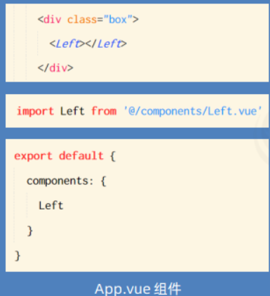
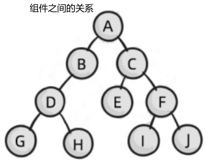

# 目录

[[toc]]

# Vue组件

**私有子组件**

在组件 A 的 `components` 节点下，注册了组件 F。 则组件 F 只能用在组件 A 中；不能被用在组件 C 中。

**全局组件**

在 vue 项目的 main.js 入口文件中，通过 `Vue.component()` 方法，可以注册全局组件。

示例代码如下：

```vue
//导入需要全局注册的组件
import Count from '@/components/Count.vue'

//参数1：字符串格式，表示组件的注册名称，参数2：需要被全局注册的组件
Vue.component('MyCount',Count)
```
## 使用Vue组件

- 使用 import 语法导入需要的组件
- 使用 components 节点注册组件
- 以标签形式使用刚才注册的组件



##  组件的props

`props` 是组件的自定义属性，在封装通用组件的时候，合理地使用 `props` 可以极大的提高组件的复用性！ 

```javascript
//基本语法
export default {
  //组件的自定义属性
  props:['自定义属性A','自定义属性B','自定义属性...'],

  //组件的私有数据
  data() {
    return {

    }
  }
}

//- - - - - - - - - - - - - - - - - - - - - - - - - - - - - - 
//- 组件中封装的自定义属性是只读的，程序员不能直接修改 props 的值。否则会直接报错
//- 要想修改 props 的值，可以把 props 的值转存到 data 中，因为 data 中的数据都是可读可写的
export default {
  props:['init'],
  data() {
    return {
      count: this.init //把 init 的值转存到 count
    }
  }
}

//- - - - - - - - - - - - - - - - - - - - - - - - - - - - - - 
//- 在声明自定义属性时，可以通过 default 来定义属性的默认值。
export default {
  props:{
    init:{
      default:1 //默认值为 1
    }
  }
}

//- - - - - - - - - - - - - - - - - - - - - - - - - - - - - - 
//- 在声明自定义属性时，可以通过 type 来定义属性的值类型
export default {
  props:{
    init:{
      default:1, //默认值为 1
      type: Number //通过 type 来定义属性的值类型
    }
  }
}

//- - - - - - - - - - - - - - - - - - - - - - - - - - - - - - 
//- 在声明自定义属性时，可以通过 required 选项，将属性设置为必填项，强制用户必须传递属性的值
export default {
  props:{
    init:{
      type: Number, //通过 type 来定义属性的值类型
      required: true
    }
  },
}
```

- 组件中封装的自定义属性是只读的，程序员不能直接修改 props 的值。否则会直接报错
- 要想修改 props 的值，可以把 props 的值转存到 data 中，因为 data 中的数据都是可读可写的！
- 在声明自定义属性时，可以通过 default 来定义属性的默认值。
- 在声明自定义属性时，可以通过 type 来定义属性的值类型，如果传递过来的值不符合此类型，则会报错
- 在声明自定义属性时，可以通过 required 选项，将属性设置为必填项，强制用户必须传递属性的值
## 组件之间的数据共享
组件之间的关系：

- ​	父子关系
- ​	兄弟关系



- 父组件向子组件共享数据使用自定义`props`属性
- 子组件向父组件共享数据使用自定义事件
- 兄弟组件之间共享数据使用 `EventBus`，或使用 `VueX` 全局共享
### 父 --->子共享数据
父组件向子组件共享数据需要使用自定义属性。
```javascript
<!--父组件-->
<Son :msg="message" :user="userinfo"></Son>

data(){
	return {
		message:'hello vue',
		userinfo:{
			name: 'zs',
			age: 20
		}
	}
}

<!--子组件-->
<template>
	<div>
        <h5>Son 组件</h5>
        <p>父组件传递过来的msg：{{ msg }}</p>
        <p>父组件传递过来的user：{{ user }}</p>
    </div>
</template>

props:['msg','user']

```
###  子 --->父共享数据
子组件向父组件共享数据使用自定义事件。
```javascript
<!--父组件-->
<Son @numchange="getNewCount"></Son>

export default {
	data(){
		return{
			countFromSon: 0
		}
	},
	method:{
		getNewCount(val){
			this.countFromSon = val
		}
	}
}

<!--子组件-->
<button @click="add()"></button>

export default {
	data(){
		return{
			count: 0
		}
	},
	method:{
		add(){
			this.count += 7
			//修改数据时，通过 $emit() 触发自定义事件
			this.$emit('numchange',this.count)
		}
	}
}
```
### 兄弟之间的数据共享


- 创建 eventBus.js 模块，并向外共享一个 Vue 的实例对象
- 在数据发送方，调用 bus.$emit('事件名称', 要发送的数据) 方法触发自定义事件
- 在数据接收方，调用 bus.$on('事件名称', 事件处理函数) 方法注册一个自定义事件
## 动态组件
动态组件指的是动态切换组件的显示与隐藏

vue 提供了一个内置的 组件，专门用来实现动态组件的渲染。

### 动态组件渲染
```vue
<!-- 通过 is 属性，动态指定要渲染的组件 -->
<component :is="comName"></component>

<!-- 点击按钮，动态切换组件的名称 -->
  <button @click="comName = 'Left'">展示 Left 组件</button>
    <button @click="comName = 'Right'">展示 Right 组件</button>

    <!--  -->
    data(){
    return{
      comName:'Left' //要渲染的组件名称
    }
  }
```
### 保持组件状态 keep-alive
默认情况下，切换动态组件时无法保持组件的状态。此时可以使用 vue 内置的 组件保持动态组 件的状态。
```vue
<keep-alive>
  <component :is="comName"></component>
</keep-alive>
```
**keep-alive 对应的生命周期函数**


**keep-alive 的 include 属性**

`include` 属性用来指定：只有名称匹配的组件会被缓存。多个组件名之间使用英文的逗号分隔

```vue
<keep-alive include="MyLeft,MyRight">
	<component :is="comName"></component>
</keep-alive>
```
