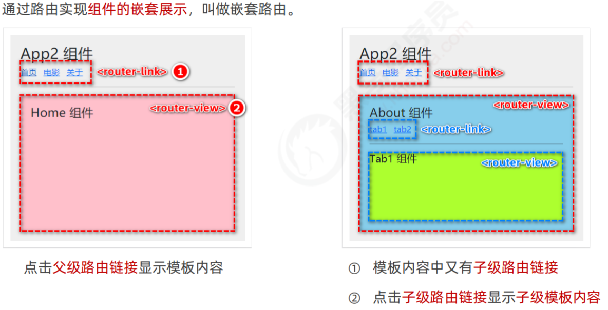
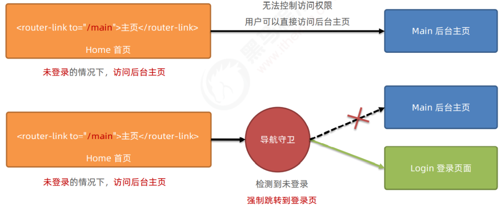

# 目录

[[toc]]

# Vue-Router

`vue` 属于单页面应用，所谓的路由，就是根据浏览器路径不同，用不同的**视图组件**替换这个页面内容展示

## 安装路由
在 `vue2` 的项目中，安装 `vue-router` 的命令如下
```bash
npm install vue-router@3.5.2 -S
```
在 src 源代码目录下，新建 router/index.js 路由模块，并初始化如下的代码
```javascript
//1.导入 Vue 和 VueRouter 的包
import Vue from 'vue'
import VueRouter from 'vue-router'

//2.调用 Vue.use() 函数，把 VueRouter 安装为 Vue 的插件
Vue.use(VueRouter)

//3.创建路由的实例对象
const router = new VueRouter()

//4.向外共享路由的实例对象
export default router
```
在 src/main.js 入口文件中，导入并挂载路由模块
```javascript
import Vue from 'vue'
import App from './App.vue'

//1.导入路由模块
import router from '@/router'

new Vue({
  render:h => h(App),
  //2.挂载路由模块
  router:router
}).$mount('#app')
```
声明路由链接和占位符

在 `src/App.vue` 组件中，使用 `vue-router` 提供的和声明路由链接和占位符

```vue
<template>
  <div class="app-container">
    <h1>App 组件</h1>
    <!-- 定义路由链接 -->
    <!-- to 要去的路由地址 -->
    <router-link to="/home">首页</router-link>
    <router-link to="/movie">电影</router-link>
    <router-link to="/about">关于</router-link>

    <hr />

    <!-- 定义路由的占位符 -->
    <!-- 切换路由后在该位置显示页面 -->
    <router-view></router-view>
  </div>
</template>
```
## 配置路由
在新建的路由 `js` 文件中配置路由地址与组件的映射关系
```javascript
import Vue from 'vue'
import VueRouter from 'vue-router'

Vue.use(VueRouter)

//path表示路径，component表示对应跳转的组件
const routes = [
  {
    path:'/',
    component: () => import('@/views/example14/ContainerView.vue')//动态导入，建议使用
  },
  {
    path:'/login',
    component: LoginView//静态导入。不建议使用
  },
  {
    path:'/404',
    component: NotFoundView
  }
]

const router = new VueRouter({
  routes
})

export default router
```

- 最重要的就是建立了【路径】与【视图组件】之间的映射关系
- 本例中映射了 3 个路径与对应的视图组件
- 静态导入是将所有组件的 `js` 代码打包到一起，如果组件非常多，打包后的 `js` 文件会很大，影响页面加载速度
- 动态导入是将组件的 `js` 代码放入独立的文件，用到时才加载

**在 main.js 中采用我们的路由 js**
```js
import Vue from 'vue'
import e14 from './views/Example14View.vue'
import router from './router/example14'  // 修改这里
import store from './store'
import Element from 'element-ui'
import 'element-ui/lib/theme-chalk/index.css'

Vue.config.productionTip = false

Vue.use(Element)
new Vue({
  router,
  store,
  render: h => h(e14)
}).$mount('#app')
```
根组件内容为：
```vue
<template>
    <div class="all">
        <router-view></router-view>
    </div>
</template>
```

- 其中 `<router-view>` 起到占位作用，改变路径后，这个路径对应的视图组件就会占据 `</router-view>` 的位置，替换掉它之前的内容
## 嵌套路由


组件内再要切换内容，就需要用到嵌套路由（子路由)，下面的例子是在【ContainerView 组件】内定义了 3 个子路由

```js
const routes = [
  {
    path:'/',
    component: () => import('@/views/example14/ContainerView.vue'),
    redirect: '/c/p1',//重定向
    children: [
      { 
        path:'c/p1',
        component: () => import('@/views/example14/container/P1View.vue')
      },
      { 
        path:'c/p2',
        component: () => import('@/views/example14/container/P2View.vue')
      },
      { 
        path:'c/p3',
        component: () => import('@/views/example14/container/P3View.vue')
      }
    ]
  },
  {
    path:'/login',
    component: () => import('@/views/example14/LoginView.vue')
  },
  {
    path:'/404',
    component: () => import('@/views/example14/NotFoundView.vue')
  },
  {
    path:'*',
    redirect: '/404'
  }
]
```
子路由变化，切换的是【ContainerView 组件】中 <router-view></router-view> 部分的内容
```vue
<template>
    <div class="container">
        <router-view></router-view>
    </div>
</template>
```

- redirect 可以用来重定向（跳转）到一个新的地址
- path 的取值为 * 表示匹配不到其它 path 时，就会匹配它
## 路由跳转
### 标签式
```vue
<el-aside width="200px">
    <!-- to 要跳转去的路由路径 -->
    <router-link to="/c1/p1">P1</router-link>
    <router-link to="/c1/p2">P2</router-link>
    <router-link to="/c1/p3">P3</router-link>
</el-aside>
```
### 编程式
```vue
<el-header>
    <el-button type="primary" icon="el-icon-edit" 
               circle size="mini" @click="jump('/c1/p1')"></el-button>
    <el-button type="success" icon="el-icon-check" 
               circle size="mini" @click="jump('/c1/p2')"></el-button>
    <el-button type="warning" icon="el-icon-star-off" 
               circle size="mini" @click="jump('/c1/p3')"></el-button>
</el-header>

<script>
const options = {
    methods : {
        jump(url) {
            this.$router.push(url);//跳转到指定 hash 地址，并增加一条历史记录
            //this.$router.replace(url)
        }
    }
}
export default options;
</script>
```
- 其中 this.$router 是拿到路由对象
- push 方法根据 url 进行跳转
- this.$router.push('url');//跳转到指定 hash 地址，并增加一条历史记录
- this.$router.replace('url') 跳转到指定的 hash 地址，并替换掉当前的历史记录
- this.$router.go(数值 n) 实现导航历史前进、后退
```vue
this.$router.go(-1) //回退到之前的组件页面

//在实际开发中，一般只会前进和后退一层页面。因此 vue-router 提供了如下两个便捷方法
this.$router.back(-1) //在历史记录中，后退到上一个页面
this.$router.forward(-1) //在历史记录中，前进到下一个页面
```
### 导航菜单
```vue
<template>
<!-- 侧边栏 -->
 <el-scrollbar wrap-class="scrollbar-wrapper">
  <el-menu
    router
    :default-active="activeMenu"
    :unique-opened="false"
    :collapse-transition="false"
    mode="vertical"
    background-color="#304156"
    text-color="#bfcbd9"
    active-text-color="#409EFF"
  >
    <!-- 循环路由对象 -->
    <div v-for="item in route" :key="item.path">
      <!-- 若 hidden=true 则不显示 -->
      <div v-if="!item.hidden">
        <!-- 嵌套路由 -->
        <el-submenu v-if="childrenLength(item)" :index="item.path">
          <!-- 标题 -->
          <template slot="title">
            <!-- <i class="el-icon-location"></i> -->
            <svg-icon :svgName="item.meta.icon"></svg-icon>
            <span>{{ item.meta.title }}</span>
          </template>
          <!-- 子路由 -->
          <div v-for="ele in item.children" :key="ele.path">
            <el-menu-item :index="resolvePath(item.path, ele.path)">{{ ele.meta.title }}</el-menu-item>
          </div>
        </el-submenu>
        <!-- 路由链接 -->
        <el-menu-item v-else :index="resolveOneChildrenPath(item)">
          <svg-icon :svgName="item.meta.icon"></svg-icon>
          {{ childrenName(item) }}
        </el-menu-item>
      </div>
    </div>
  </el-menu>
  </el-scrollbar>
</template>

<script>
import SvgIcon from '@/components/svg/SvgIcon.vue'
export default {
  name: 'side-bar',
  components: {SvgIcon},
  data() {
    return {
      route: this.$router.options.routes // 获得全部路由信息
    }
  },
  created() {
  },
  computed: {
    activeMenu() {
      return this.$route.path
    },
  },
  methods: {
    // 判断 children 的长度，如果为1则显示路由链接，如果大于1则显示嵌套路由
    childrenLength(item) {
      if (item.children == null || item.children.length === 1) {
        return false
      }
      return true
    },
    // 解析 children 长度 >1 的path
    resolvePath(parentPath, childrenPath) {
      let routePath = parentPath + '/' + childrenPath
      return routePath
    },
    // 解析 children 长度为 1 的path
    resolveOneChildrenPath(item) {
      let itemPath = item.path
      if (item.children != null) {
        let childrenPath = item.children[0].path
        let routePath = itemPath + '/' + childrenPath
        return routePath
      }
      return itemPath
    },
    // 获得 children 的 title 
    childrenName(item) {
      if (item.children != null) {
        let childrenName = item.children[0].meta.title
        return childrenName
      }
      return item.meta.title
    },
    key() {
      return this.$route.path
    }
  },
}
</script>
```

- 图标和菜单项文字建议用 <span slot='title'></span> 包裹起来
- el-menu 标签上加上 router 属性，表示结合导航菜单与路由对象，此时，就可以利用菜单项的 index 属性来路由跳转
## 路由守卫(导航守卫)
导航守卫可以控制路由的访问权限

常见用法：

​		全局前置守卫



### **全局前置守卫**

每次发生路由的导航跳转时，都会触发全局前置守卫。因此，在全局前置守卫中，程序员可以对每个路由进行 访问权限的控制

```javascript
//创建路由实例对象
const router = new VueRouter({...})

//调用路由实例对象的 beforeEach 方法，即可声明 "全局前置守卫"
//每次发生路由导航跳转的时候，都会自动出发 fn 这个 回调函数
router.beforeEach(fn)

//fn 这个回调函数可以接收3个形参
router.beforeEach((to,from,next) => {
  //to 是将要访问的路由的信息对象
  //from 是将要来开的路由的信息对象
  //next 是一个函数，调用 next() 表示放行，运行这次路由导航
})
```

**next 函数的 3 种调用方式**


- 当前用户拥有后台主页的访问权限，直接放行：next() 
- 当前用户没有后台主页的访问权限，强制其跳转到登录页面：next('/login') 
- 当前用户没有后台主页的访问权限，不允许跳转到后台主页：next(false)

**使用案例**

控制后台主页的访问权限

```javascript
router.beforeEach((to, from, next) => {
  const token = localStorage.getItem('token')
  if (token && to.path !== '/login') {
  // 有token 但不是去 login页面 通过
    next()
  } else if (token && to.path === '/login') {
   // 有token 但是去 login页面 不通过 重定向到首页
    next('/dashboard/dashboard')
  } else if (!token && to.path !== '/login') {
   // 没有token 但不是去 login页面 不通过（未登录不给进入）
    next('/login')
  } else {
  // 剩下最后一种 没有token 但是去 login页面 通过
    next()
  }
})
```
