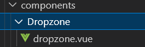

# 目录

[[toc]]

本项目为学习PanJiaChen大佬的[vue-element-admin](https://github.com/PanJiaChen/vue-element-admin)项目后，开发的简化版工具箱类项目。

大佬项目地址：https://github.com/PanJiaChen/vue-element-admin

本项目将多个文件内容尽可能的放在了一个文件中，减少了复杂的嵌套，并添加注释信息。

方便与我一样的小白进行学习、复制组件到自己的项目中使用。

像工具箱一样方便。

## 一、svg 图标使用

### （1）安装 svg 依赖
```bash
npm install svg-sprite-loader --save-dev
```
### （2）创建 icons/svg 文件夹存放 svg 图标

### （3）在 icons 文件夹创建 svg-config.js 导入所有 svg 图标

```javascript
const req = require.context('@/assets/icons/svg', false, /\.svg$/)
const requireAll = requireContext => {
    requireContext.keys().map(requireContext)
}
requireAll(req)
```
### （4）vue.config.js 中配置 svg 图片

```javascript
const { defineConfig } = require('@vue/cli-service')

const path = require('path')

function resolve(dir) {
  return path.join(__dirname, dir)
}

module.exports = defineConfig({
  transpileDependencies: true,
  lintOnSave: false,
  devServer: {
    port: 8000,
  },

  chainWebpack(config) {
    // 配置 svg
    config.module
      .rule('svg')
      .exclude.add(resolve('src/assets/icons/svg'))
      .end()

    config.module
      .rule('icons') // 定义一个名叫 icons 的规则
      .test(/\.svg$/) // 设置 icons 的匹配正则
      .include.add(resolve('src/assets/icons/svg')) // 设置当前规则的作用目录，只在当前目录下才执行当前规则
      .end()
      .use('svg-sprite-loader') // 指定一个名叫 svg-sprite 的 loader 配置
      .loader('svg-sprite-loader') // 该配置使用 svg-sprite-loader 作为处理 loader
      .options({
        // 该 svg-sprite-loader 的配置
        symbolId: 'icon-[name]',
      })
      .end()
  },
})
```
### （5）在 components/svg 文件夹下创建 SvgIcon 公用组件

```vue
<template>
  <svg class="svg-icon" aria-hidden="true" v-on="$listeners">
    <use :xlink:href="svgIconName" />
  </svg>
</template>


<script>
export default {
  name: 'svg-icon',
  props: {
    // svg图标名字
    svgName: {
      type: String,
      required: true
    }
  },
  computed: {
    // 拼接名字
    svgIconName() {
      return `#icon-${this.svgName}`
    }
  }
}
</script>


<style scoped>
.svg-icon {
  width: 1em;
  height: 1em;
  vertical-align: -0.15em;
  fill: currentColor;
  overflow: hidden;
}


.svg-external-icon {
  background-color: currentColor;
  mask-size: cover!important;
  display: inline-block;
}
</style>
```
### （6）在 main.js 中引入 svg-config.js 并全局注册 SvgIcon 组件

```javascript
import Vue from 'vue'
import SvgIcon from '@/components/svg/SvgIcon.vue';
import '@/assets/icons/svg-config'

Vue.component('svg-icon', SvgIcon)
```
### （7）使用 SvgIcon 组件

## 二、thinymce 富文本编辑器

### （1）安装 thinymce 依赖
```bash
npm install tinymce@5.1.0 -S
npm install @tinymce/tinymce-vue@3.0.1 -S
```
### （2）在 node_modules 里找到 thinymce

### （3）将需要的文件复制到 public 目录下（不知道需要啥就全都复制过去，skins 是必须的！！！）

### （4）自己创建一个组件 tinymce.vue （名字随意）
```vue
<!-- 富文本编辑器 -->
<template>
  <div class="components-container">
    <div>
      <tinymce-editor id="tinymceeditor" :init="initTinymce" v-model="content" />
    </div>
    

    <aside>效果展示</aside>
    <div class="editor-content" v-html="content" />
  </div>
</template>

<script>
// 您要使用的任何插件都必须导入
// 详细插件列表见 https://www.tinymce.com/docs/plugins/
// 自定义构建见 https://www.tinymce.com/download/custom-builds/

// 引入富文本编辑器组件
import TinymceEditor from '@tinymce/tinymce-vue'

export default {
  name: 'TinymceDemo',
  components: { TinymceEditor },
  data() {
    return {
      // 初始化
      initTinymce: {
        selector: '#tinymceeditor', // 要初始化的富文本，根据id指定
        height: 430, // 高度
        language_url: '/tinymce/zh_CN.js', // 汉化文件路径
        language: 'zh_CN', // 汉化
        // 插件列表
        plugins: [
          'advlist anchor autolink autosave code codesample colorpicker colorpicker contextmenu directionality emoticons fullscreen hr image imagetools insertdatetime link lists media nonbreaking noneditable pagebreak paste preview print save searchreplace spellchecker tabfocus table template textcolor textpattern visualblocks visualchars wordcount',
        ], 
        // 这是工具栏的列表
        toolbar: [
          'searchreplace bold italic underline strikethrough alignleft aligncenter alignright outdent indent  blockquote undo redo removeformat subscript superscript code codesample',
          'hr bullist numlist link image charmap preview anchor pagebreak insertdatetime media table emoticons forecolor backcolor fullscreen',
        ],
      },
      content: '', // 绑定的值
    }
  },
}
</script>

<style scoped>
.editor-content {
  margin-top: 20px;
}
</style>

```
### （5）下载中文包，放到 public/thinymce 文件夹下
下载地址：[https://www.tiny.cloud/get-tiny/language-packages/](https://www.tiny.cloud/get-tiny/language-packages/)
## 三、JSON编辑器

在其他项目使用时：

1. 安装依赖
2. 复制 json-editor 组件，自行添加 prop 属性
3. 自定义父组件，在父组件中引入 json-editor 组件（或在 main,js 中定义为全局组件）
### （1）安装依赖
```bash
npm install codemirror
npm install jsonlint  
```
### （2）封装组件
```vue
<!-- json编辑器 -->
<template>
  <div class="components-container">
    <el-button type="primary" @click="formatJSON">格式化JSON</el-button>

    <!-- 编辑器核心部分 start -->
    <div class="editor-container">
      <div class="json-editor">
        <textarea ref="textarea"/>
      </div>
    </div>
  </div>
</template>

<script>
import CodeMirror from 'codemirror' // 引入全局实例
import 'codemirror/addon/lint/lint.css'
import 'codemirror/lib/codemirror.css' // 核心样式
import 'codemirror/theme/rubyblue.css' // 引入主题后还需要在 options 中指定主题才会生效
require('script-loader!jsonlint')
import 'codemirror/mode/javascript/javascript'
import 'codemirror/addon/lint/lint'
import 'codemirror/addon/lint/json-lint'

const jsonData =
  '[{"items":[{"market_type":"forexdata","symbol":"XAUUSD"},{"market_type":"forexdata","symbol":"UKOIL"},{"market_type":"forexdata","symbol":"CORN"}],"name":""},{"items":[{"market_type":"forexdata","symbol":"XAUUSD"},{"market_type":"forexdata","symbol":"XAGUSD"},{"market_type":"forexdata","symbol":"AUTD"},{"market_type":"forexdata","symbol":"AGTD"}],"name":"贵金属"},{"items":[{"market_type":"forexdata","symbol":"CORN"},{"market_type":"forexdata","symbol":"WHEAT"},{"market_type":"forexdata","symbol":"SOYBEAN"},{"market_type":"forexdata","symbol":"SUGAR"}],"name":"农产品"},{"items":[{"market_type":"forexdata","symbol":"UKOIL"},{"market_type":"forexdata","symbol":"USOIL"},{"market_type":"forexdata","symbol":"NGAS"}],"name":"能源化工"}]'

export default {
  name: 'JsonEditorDemo',
  components: {},
  data() {
    return {
      value: JSON.parse(jsonData), // 编辑器初始值
      jsonEditor: null, // 编辑器实例
    }
  },
  mounted() {
    // 初始化配置 CodeMirror.fromTextArea() 中第一个参数是DOM元素，而且必须是textarea元素；第二个参数是可选配置项
    this.jsonEditor = CodeMirror.fromTextArea(this.$refs.textarea, {
      lineNumbers: true, // 编辑器左侧是否显示行号
      mode: 'application/json', // 设置编辑器语言模式为 JSON
      gutters: ['CodeMirror-lint-markers'],
      theme: 'rubyblue', // 设置编辑器主题
      lint: true, // 代码出错提醒
      indentUnit: 4, // 代码中默认的缩进单位-几个空格
      tabSize: 4, // tab字符的大小，默认为4，相当于4个空格的宽度
    })

    // 给编辑器赋值，并格式化
    this.jsonEditor.setValue(JSON.stringify(this.value, null, 2))
  },
  methods: {
    // 格式化 JSON
    formatJSON() {
        this.value = this.jsonEditor.getValue()
        if (typeof this.value === 'object') {
            this.jsonEditor.setValue(JSON.stringify(ni, null, 2))
        }
        if (typeof this.value === 'string') {
            const JsonObject = JSON.parse(this.value)
            this.jsonEditor.setValue(JSON.stringify(JsonObject, null, 2))
        }
    }
  },
}
</script>

<style scoped>
.editor-container {
  position: relative;
  height: 100%;
}
</style>
<style lang="scss" scoped>
.json-editor {
  height: 100%;
  position: relative;

  ::v-deep {
    .CodeMirror {
      height: auto;
      min-height: 300px;
    }

    .CodeMirror-scroll {
      min-height: 300px;
    }

    .cm-s-rubyblue span.cm-string {
      color: #f08047;
    }
  }
}
</style>

```
### （3）常用配置项
value：编辑器的初始值 string 
mode：编辑器语言的模式 string 
lineSeparator：换行分隔符 - [string | null] null的时候默认为\n
theme：编辑器主题 string 需要引入theme 目录下对应的样式文件
indentUnit：编辑器中缩进的大小 integer 单位：空格
smartIndent：是否使用mode提供的上下文的缩进 boolean 默认为true，设置为false，换行的时候上下文的缩进没有，从该行的首位开始
tabSize：tab字符的大小 integer 单位：空格
indentWithTabs：缩进的时候，是否把前面的N*tab大小的空间转化为N个tab字符，默认为false
electricChars：语言模式提供缩进的前提下，当输入的会引起缩进变化的时候，是否重新调整当前行的缩进，默认为true
lineWrapping：是否自动换行 boolean
lineNumbers：编辑器左侧是否显示行号 boolean
firstLineNumber：首行行号的设定，默认为1 integer
lineNumberFormatter： 左侧行号格式化方法 function(line: integer) → string
```javascript
// 左侧行号为2,4,6...
lineNumberFormatter: (line) => line * 2,
```
readOnly：编辑器是否只读 boolean | string 

- false - 默认，可编辑 
- true - 只读，但是可显示光标，可以获取焦点
- nocursor - 只读，不显示光标，不可获取焦点

showCursorWhenSelecting：选择内容的时候是否显示光标 boolean
lineWiseCopyCut：当没有选择内容时，进行复制或剪切操作，是否复制或剪切当前光标所在的整行内容 boolean
undoDepth：编辑器存储的最大撤销级别数, 这包括选择更改事件。默认为200 integer
historyEventDelay：输入或删除的时候，停顿一定时间后，会被认定为下一次操作。默认1250 integer 单位：毫秒
autofocus：初始化的时候是否自动获取焦点 boolean
dragDrop：是否启动拖拽，默认启用true boolean
allowDropFileTypes：允许可以向编辑器拖入的文件MIME类型 `array<string>`
```javascript
allowDropFileTypes: ['text/html'],  // 可以向编辑器中拖入html文件
// 但是此时 dragDrop 不能为false，否则该项不起作用
```
spellcheck：指定是否对输入启用拼写检查 boolean
autocorrect：指定是否对输入启用自动更正 boolean
autocapitalize：指定是否对输入启用自动大小写 boolean
## 四、SplitPane 拆分窗格
### （1）安装依赖
```bash
npm install vue-splitpane
```
### （2）使用
```vue
<!-- SplitPane -->
<template>
<div>
    <!-- 混合分割 -->
  <div class="components-container">
    <!-- vertical：垂直分割 -->
    <split-pane split="vertical" @resize="resize">
      <template slot="paneL">
        <div class="left-container" >在此编辑红色区域内容</div>
      </template>
      <template slot="paneR">
        <!-- horizontal：水平分割 -->
        <split-pane split="horizontal">
          <template slot="paneL">
            <div class="top-container" >在此编辑黄色区域内容</div>
          </template>
          <template slot="paneR">
            <div class="bottom-container" >在此编辑浅绿色区域内容</div>
          </template>
        </split-pane>
      </template>
    </split-pane>
  </div>
  <!-- 垂直分割 -->
  <div class="components-container">
    <aside>
        分割成两列
    </aside>
    <!-- vertical：垂直分割 -->
    <split-pane split="vertical" @resize="resizeB">
      <template slot="paneL">
        <div class="left-container" >在此编辑红色区域内容</div>
      </template>
      <template slot="paneR">
          <div class="bottom-container" >在此编辑浅绿色区域内容</div>
      </template>
    </split-pane>
  </div>
  <!-- 水平分割 -->
  <div class="components-container">
    <aside>
        分割成两行
    </aside>
     <!-- horizontal：水平分割 -->
    <split-pane split="horizontal" @resize="resizeC">
      <template slot="paneL">
        <div class="left-container" >在此编辑红色区域内容</div>
      </template>
      <template slot="paneR">
          <div class="bottom-container" >在此编辑浅绿色区域内容</div>
      </template>
    </split-pane>
  </div>
</div>
</template>

<script>
// 引入分割组件
import splitPane from 'vue-splitpane'

export default {
  name: 'SplitpaneDemo',
  components: { splitPane },
  methods: {
    // 混合分割尺寸变化时触发
    resize() {
      console.log('resize')
    },
    // 垂直分割尺寸变化时触发
    resizeB() {
      console.log('resizeB')
    },
    // 水平分割尺寸变化时触发
    resizeC() {
      console.log('resizeC')
    }
  }
}
</script>

<style  scoped>
  .components-container {
    position: relative;
    height: 100vh;
  }

  .left-container {
    background-color: #F38181;
    height: 100%;
  }

  .right-container {
    background-color: #FCE38A;
    height: 200px;
  }

  .top-container {
    background-color: #FCE38A;
    width: 100%;
    height: 100%;
  }

  .bottom-container {
    width: 100%;
    background-color: #95E1D3;
    height: 100%;
  }
</style>

```
## 五、avatar-upload 上传头像
### （1）将 @/components/uploadAvatar 文件夹复制到你的项目中

### （2）自定义父组件

- 使用头像组件则在父组件引入 show-avatar.vue 组件
- 使用上传组件则在父组件引入 show-upload-avatar.vue 组件


### （3）使用
```vue
<pan-thumb :image="image"> zhang-vue-element </pan-thumb>
```
```vue
<image-cropper
      v-show="imagecropperShow"
      :key="imagecropperKey"
      :width="300"
      :height="300"
      url="https://httpbin.org/post"
      @close="close"
      @crop-upload-success="cropSuccess"
    />
```
### （4）注意

- 引入时的名字，并根据需求给子组件传值
- 在父组件定义上传成功回调
### （5）全部代码
```vue
<!-- 头像上传 -->
<!-- 
  @crop-upload-success 上传成功时触发
  -->
<template>
  <div class="components-container">

    <!-- 显示头像组件 -->
    <pan-thumb :image="image"> zhang-vue-element </pan-thumb>

    <el-button type="primary" icon="el-icon-upload" style="position: absolute; bottom: 15px; margin-left: 40px" @click="imagecropperShow = true">
      上传头像
    </el-button>

    <!-- 点击 ‘上传头像’ 按钮弹窗组件 -->
    <image-cropper
      v-show="imagecropperShow"
      :key="imagecropperKey"
      :width="300"
      :height="300"
      url="https://httpbin.org/post"
      @close="close"
      @crop-upload-success="cropSuccess"
    />
  </div>
</template>

<script>
import ImageCropper from '@/components/uploadAvatar/show-upload-avatar.vue'
import PanThumb from '@/components/uploadAvatar/show-avatar.vue'

export default {
  name: 'AvatarUploadDemo',
  components: { ImageCropper, PanThumb },
  data() {
    return {
      imagecropperShow: false,
      imagecropperKey: 0,
      image: 'https://wpimg.wallstcn.com/577965b9-bb9e-4e02-9f0c-095b41417191',
    }
  },
  methods: {
    // 上传成功,更新图片地址
    cropSuccess(resData) {
      this.imagecropperShow = false
      this.imagecropperKey = this.imagecropperKey + 1
      this.image = resData.files.avatar
    },
    close() {
      this.imagecropperShow = false
    },
  },
}
</script>

<style scoped>
.avatar {
  width: 200px;
  height: 200px;
  border-radius: 50%;
}
</style>

```
## 六、DropZone 拖拽上传
中文文档：[http://wxb.github.io/dropzonejs.com.zh-CN/dropzonezh-CN/#](http://wxb.github.io/dropzonejs.com.zh-CN/dropzonezh-CN/#)
DropZone 高度可定制化，且中文文档很通俗易懂，没有写详细的注释
### （1）安装依赖
```bash
npm install dropzone 
```
### （2）复制 @/components/Dropzone 到你的项目中

### （3）自定义父组件，引入 dropzone.vue
```vue
<template>
  <div class="components-container">
    <div class="editor-container">
			<!-- dropzone -->
      <dropzone id="myVueDropzone" url="https://httpbin.org/post" @dropzone-removedFile="dropzoneR" @dropzone-success="dropzoneS" />
    </div>
  </div>
</template>


<script>
import Dropzone from '@/components/Dropzone/dropzone.vue'


export default {
  name: 'DropzoneDemo',
  components: { Dropzone },
  methods: {
    // 上传成功
    dropzoneS(file) {
      console.log(file)
      this.$message({ message: 'Upload success', type: 'success' })
    },
    // 删除成功
    dropzoneR(file) {
      console.log(file)
      this.$message({ message: 'Delete success', type: 'success' })
    }
  }
}
</script>
```
### （4）dropzone.vue
通过 prop 提供了很多可选配置，可以根据实际需要添加或删除
根据id获得对应dropzone实例，在 mounted 中进行了一些初始化配置，回调事件等，可根据实际需要进行增删
```vue
<!-- 可拖放上传组件 -->
<!-- 中文文档：http://wxb.github.io/dropzonejs.com.zh-CN/dropzonezh-CN/# -->
<!-- 所有内容都可在文档中找到 -->
<template>
  <div :id="id" :ref="id" :action="url" class="dropzone">
    <input type="file" name="file">
  </div>
</template>


<script>
import Dropzone from 'dropzone'
import 'dropzone/dist/dropzone.css'
// import { getToken } from 'api/qiniu';


// 禁止对所有元素的自动查找
Dropzone.autoDiscover = false


export default {
  props: {
    id: {
      type: String,
      required: true
    },
    url: {
      type: String,
      required: true
    },
    // dropzone 元素本身是否可点击
    clickable: {
      type: Boolean,
      default: true
    },
    defaultMsg: {
      type: String,
      default: '上传图片'
    },
    acceptedFiles: {
      type: String,
      default: ''
    },
    // 设置Height，配合下面的thumbnailWidth一起使用
    thumbnailHeight: {
      type: Number,
      default: 200
    },
    // 设置width，配合上面的thumbnailHeight一起使用
    thumbnailWidth: {
      type: Number,
      default: 200
    },
    showRemoveLink: {
      type: Boolean,
      default: true
    },
    maxFilesize: {
      type: Number,
      default: 2
    },
    maxFiles: {
      type: Number,
      default: 3
    },
    autoProcessQueue: {
      type: Boolean,
      default: true
    },
    useCustomDropzoneOptions: {
      type: Boolean,
      default: false
    },
    defaultImg: {
      default: '',
      type: [String, Array]
    },
    // 是否可粘贴
    couldPaste: {
      type: Boolean,
      default: false
    }
  },
  data() {
    return {
      dropzone: '',
      initOnce: true
    }
  },
  watch: {
    defaultImg(val) {
      if (val.length === 0) {
        this.initOnce = false
        return
      }
      if (!this.initOnce) return
      this.initImages(val)
      this.initOnce = false
    }
  },
  mounted() {
    const element = document.getElementById(this.id)
    const vm = this
    // 一些初始化配置,可访问 http://wxb.github.io/dropzonejs.com.zh-CN/dropzonezh-CN/#events 查看
    this.dropzone = new Dropzone(element, {
      clickable: this.clickable, // dropzone 元素本身是否可点击
      thumbnailWidth: this.thumbnailWidth, // 设置width
      thumbnailHeight: this.thumbnailHeight, // 设置Height
      maxFiles: this.maxFiles, // 设置 Dropzone 最多可以处理多少文件. 如果超过这个限制, maxfilesexceeded 事件将被调用
      maxFilesize: this.maxFilesize, // 以MB为单位,上传文件的大小限制
      dictRemoveFile: 'Remove', // 如果addRemoveLinks为 true，这段文本用来设置删除文件显示文本.
      addRemoveLinks: this.showRemoveLink,
      acceptedFiles: this.acceptedFiles,
      autoProcessQueue: this.autoProcessQueue,
      dictDefaultMessage: '<i style="margin-top: 3em;display: inline-block" class="material-icons">' + this.defaultMsg + '</i><br>Drop files here to upload',
      dictMaxFilesExceeded: '只能一个图',
      previewTemplate: '<div class="dz-preview dz-file-preview">  <div class="dz-image" style="width:' + this.thumbnailWidth + 'px;height:' + this.thumbnailHeight + 'px" ></div>  <div class="dz-details"><div class="dz-size"><span data-dz-size></span></div> <div class="dz-progress"><span class="dz-upload" data-dz-uploadprogress></span></div>  <div class="dz-error-message"><span data-dz-errormessage></span></div>  <div class="dz-success-mark"> <i class="material-icons">done</i> </div>  <div class="dz-error-mark"><i class="material-icons">error</i></div></div>',
      init() {
        const val = vm.defaultImg
        if (!val) return
        if (Array.isArray(val)) {
          if (val.length === 0) return
          val.map((v, i) => {
            const mockFile = { name: 'name' + i, size: 12345, url: v }
            this.options.addedfile.call(this, mockFile)
            this.options.thumbnail.call(this, mockFile, v)
            mockFile.previewElement.classList.add('dz-success')
            mockFile.previewElement.classList.add('dz-complete')
            vm.initOnce = false
            return true
          })
        } else {
          const mockFile = { name: 'name', size: 12345, url: val }
          this.options.addedfile.call(this, mockFile)
          this.options.thumbnail.call(this, mockFile, val)
          mockFile.previewElement.classList.add('dz-success')
          mockFile.previewElement.classList.add('dz-complete')
          vm.initOnce = false
        }
      },
      accept: (file, done) => {
        /* 七牛*/
        // const token = this.$store.getters.token;
        // getToken(token).then(response => {
        //   file.token = response.data.qiniu_token;
        //   file.key = response.data.qiniu_key;
        //   file.url = response.data.qiniu_url;
        //   done();
        // })
        done()
      },
      sending: (file, xhr, formData) => {
        // formData.append('token', file.token);
        // formData.append('key', file.key);
        vm.initOnce = false
      }
    })


    // 若可以粘贴，添加一个粘贴监听
    if (this.couldPaste) {
      document.addEventListener('paste', this.pasteImg)
    }


    // 很多的回调事件给父组件，官方文档都有说明，中文的很好理解
    this.dropzone.on('success', file => {
      vm.$emit('dropzone-success', file, vm.dropzone.element)
    })
    this.dropzone.on('addedfile', file => {
      vm.$emit('dropzone-fileAdded', file)
    })
    this.dropzone.on('removedfile', file => {
      vm.$emit('dropzone-removedFile', file)
    })
    this.dropzone.on('error', (file, error, xhr) => {
      vm.$emit('dropzone-error', file, error, xhr)
    })
    this.dropzone.on('successmultiple', (file, error, xhr) => {
      vm.$emit('dropzone-successmultiple', file, error, xhr)
    })
  },
  // 销毁掉监听器和组件
  destroyed() {
    document.removeEventListener('paste', this.pasteImg)
    this.dropzone.destroy()
  },
  methods: {
    // 删除所有文件
    removeAllFiles() {
      this.dropzone.removeAllFiles(true)
    },
    processQueue() {
      this.dropzone.processQueue()
    },
    pasteImg(event) {
      const items = (event.clipboardData || event.originalEvent.clipboardData).items
      if (items[0].kind === 'file') {
        this.dropzone.addFile(items[0].getAsFile())
      }
    },
    initImages(val) {
      if (!val) return
      if (Array.isArray(val)) {
        val.map((v, i) => {
          const mockFile = { name: 'name' + i, size: 12345, url: v }
          this.dropzone.options.addedfile.call(this.dropzone, mockFile)
          this.dropzone.options.thumbnail.call(this.dropzone, mockFile, v)
          mockFile.previewElement.classList.add('dz-success')
          mockFile.previewElement.classList.add('dz-complete')
          return true
        })
      } else {
        const mockFile = { name: 'name', size: 12345, url: val }
        this.dropzone.options.addedfile.call(this.dropzone, mockFile)
        this.dropzone.options.thumbnail.call(this.dropzone, mockFile, val)
        mockFile.previewElement.classList.add('dz-success')
        mockFile.previewElement.classList.add('dz-complete')
      }
    }


  }
}
</script>


<style scoped>
    .dropzone {
        border: 2px solid #E5E5E5;
        font-family: 'Roboto', sans-serif;
        color: #777;
        transition: background-color .2s linear;
        padding: 5px;
    }


    .dropzone:hover {
        background-color: #F6F6F6;
    }


    i {
        color: #CCC;
    }


    .dropzone .dz-image img {
        width: 100%;
        height: 100%;
    }


    .dropzone input[name='file'] {
        display: none;
    }


    .dropzone .dz-preview .dz-image {
        border-radius: 0px;
    }


    .dropzone .dz-preview:hover .dz-image img {
        transform: none;
        filter: none;
        width: 100%;
        height: 100%;
    }


    .dropzone .dz-preview .dz-details {
        bottom: 0px;
        top: 0px;
        color: white;
        background-color: rgba(33, 150, 243, 0.8);
        transition: opacity .2s linear;
        text-align: left;
    }


    .dropzone .dz-preview .dz-details .dz-filename span, .dropzone .dz-preview .dz-details .dz-size span {
        background-color: transparent;
    }


    .dropzone .dz-preview .dz-details .dz-filename:not(:hover) span {
        border: none;
    }


    .dropzone .dz-preview .dz-details .dz-filename:hover span {
        background-color: transparent;
        border: none;
    }


    .dropzone .dz-preview .dz-remove {
        position: absolute;
        z-index: 30;
        color: white;
        margin-left: 15px;
        padding: 10px;
        top: inherit;
        bottom: 15px;
        border: 2px white solid;
        text-decoration: none;
        text-transform: uppercase;
        font-size: 0.8rem;
        font-weight: 800;
        letter-spacing: 1.1px;
        opacity: 0;
    }


    .dropzone .dz-preview:hover .dz-remove {
        opacity: 1;
    }


    .dropzone .dz-preview .dz-success-mark, .dropzone .dz-preview .dz-error-mark {
        margin-left: -40px;
        margin-top: -50px;
    }


    .dropzone .dz-preview .dz-success-mark i, .dropzone .dz-preview .dz-error-mark i {
        color: white;
        font-size: 5rem;
    }
</style>
```
## 七、吸附在指定位置 sticky
通过 stickyTop 指定要吸附在窗口上方的位置
通过 zIndex 控制滚动时，哪个元素覆盖在上方显示
[Element.getBoundingClientRect()文档](https://developer.mozilla.org/zh-CN/docs/Web/API/Element/getBoundingClientRect)
[z-index文档](https://developer.mozilla.org/zh-CN/docs/Web/CSS/z-index)
在自己项目中使用
### （1）复制组件
将 @/components/Sticky 复制到自己的项目中


### （2）自定义父组件
在父组件中引入 sticky.vue 组件，通过 stickyTop 与 zIndex 属性即可控制吸附位置与覆盖显示


## 八、count-To 滚动计数
只需要设置指定的参数即可使用，可以自行添加prop封装可重用组件
[count-to文档](https://github.com/PanJiaChen/vue-countTo) 很全面
### （1）安装依赖
```vue
npm install vue-count-to
```
### （2）将 @/views/components/count-to.vue 组件复制到自己的项目，给定初始值即可使用

## 九、一些小组件
### button组件

鼠标放上去会有不同的效果

按钮使用的是 router-link 通过 css 的方式实现按钮样式
主要的 css 样式 pan-btn，后面的是控制颜色

```css
.pan-btn {
  font-size: 14px;
  color: #fff;
  padding: 14px 36px;
  border-radius: 8px;
  border: none;
  outline: none;
  transition: 600ms ease all;
  position: relative;
  display: inline-block;

  &:hover {
    background: #fff;

    &:before,
    &:after {
      width: 100%;
      transition: 600ms ease all;
    }
  }

  &:before,
  &:after {
    content: '';
    position: absolute;
    top: 0;
    right: 0;
    height: 2px;
    width: 0;
    transition: 400ms ease all;
  }

  &::after {
    right: inherit;
    top: inherit;
    left: 0;
    bottom: 0;
  }
}
```
### md-input组件

跟不同的input差不多，点击的时候会有动画，在左上角显示slot插槽内容

组件内部是很多的 input 利用 v-if 判断传入的 type 显示对应的 input，有一个插槽用于显示在左上角
组件内部可以接收很多的 prop 可根据需求自定义


### 图片 hover 效果

组件传入一个图片地址，内部有一个 slot 插槽显示在图片后面，精髓在于 CSS


### 水波纹效果
再点击时会有一个水波纹的效果
截图看不出来

在组件上添加自定义的指令即可

这个指令是引入的，并且注册到了vue
直接将 @/components/waves 复制到自己的项目，在组件中引入即可


### hover text

用到了  Mallki.vue 组件
使用的时候传入 text 属性即可，主要也是 CSS 控制实现


### Share
点击会弹出很多内容，抽屉的效果


title 为开启抽屉的按钮
items 为抽屉内容，接收一个数组

通过点击顶部按钮，切换 isActive 的状态，来控制 CSS 特效
通过遍历传入的 items 来生成抽屉的内容

## 十、back-to-top 返回顶部
组件：@/components/BackToTop/back-to-top.vue

接收自定义的样式，和按钮出现的高度，大佬的这个就很不错，没必要改（不会改）直接用就好啦
组件内部主要是添加滚动监听器，回到顶部的方法（看的不是很懂，用的时候直接抄）

