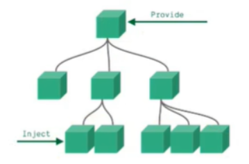

# 目录

[[toc]]

# 基本语法

使用`Vue3`需要你对`Vue2`有一定的了解

**重要**：在Vue3中，所有的东西都要写在 setup 中，并要对外共享！！！！！！

## 非响应式
```vue
<template>
  <h1>名字：{{name}}</h1>

  <h1>用户名字：{{ userInfo.name }}</h1>
  <h1>用户年龄：{{ userInfo.age }}</h1>

  <button @click="changeName">点我更改</button>
</template>

<script>
  export default {//对外共享
    name: 'App',
    setup(){
      //以下方式所定义的变量，是非响应式的，即变化后页面不会发生改变  

      // 定义变量
      let name = '张三'

      //定义对象
      let userInfo = {
        name: "徐凤年",
        age: 18
      }

      //定义函数(方法)
      function changeName(){
        name = "王五"
        userInfo.name = "青鸟"
      }

      //返回对象，只有在对象中返回的信息，模板中才可使用  
      return {
        name,
        userInfo,
        changeName
      }
    }
  }
</script>
```
## 响应式
```vue
<template>
  <!-- 使用无变化 -->	
  <h1>名字：{{ name }}</h1>
  <h1>年龄：{{ age }}</h1>

  <h1>用户名字：{{ userInfo.name }}</h1>
  <h1>用户年龄：{{ userInfo.age }}</h1>

  <h1>爱好：{{ hobby }}</h1>

  <button @click="changeName">点我更改</button>
</template>

<script>
 // 注意这里的引入
import {ref,reactive} from 'vue'
export default {
  name: 'App',
  setup(){
    //以下方式所定义的变量，是响应式的，即变化后页面会发生改变  
    // 定义响应式变量
    let name = ref("红薯")
    let age = ref(18)
    
    //定义响应式对象
    let userInfo = reactive({
        name: "李淳罡",
        age: 22
    })
    
    //定义响应式数组
    let hobby = reactive([
        "黄三甲","吴素","徐脂虎"
    ])
    
    //定义函数(方法)
    function changeName(){
        //非响应式的数据修改方式
        name = "徐龙象"
        age = 26
        
        //响应式的数据修改方式
        name.value = "王五"
        userInfo.name = "青鸟"
        hobby[0] = "邓太阿"
    }
	
    //返回对象，只有在对象中返回的信息，模板中才可使用  
    return {
      name,
      age,
      userInfo,
      hobby,
      changeName
    }
  }
}
</script>
```
## ref函数

- 作用: 定义一个响应式的数据
- 语法: let xxx = ref(initValue)
   - 创建一个包含响应式数据的**引用对象（reference对象，简称ref对象）**
   - JS中操作数据： xxx.value
   - 模板中读取数据: 不需要 .value，直接：`<div>`{{xxx}}`</div>`
- 备注：
   - 接收的数据可以是：基本类型、也可以是对象类型
   - 基本类型的数据：响应式依然是靠`Object.defineProperty()`的`get`与`set`完成的
   - 对象类型的数据：内部 _**“ 求助 ”**_ 了`Vue3.0`中的一个新函数—— `reactive`函数
## reactive函数

- 作用: 定义一个**对象类型或数组类型**的响应式数据（基本类型不要用它，要用`ref`函数）
- 语法：const 代理对象 = reactive(源对象)接收一个对象（或数组）
  - 返回一个**代理对象（Proxy的实例对象，简称proxy对象）**
- reactive定义的响应式数据是“深层次的”
- 内部基于 ES6 的 Proxy 实现，通过代理对象操作源对象内部数据进行操作
```vue
<template>	
  <h1>名字：{{ person.name }}</h1>
  <h1>年龄：{{ person.age }}</h1>

  <h1>用户名字：{{ person.userInfo.name }}</h1>
  <h1>用户年龄：{{ person.userInfo.age }}</h1>

  <h1>爱好：{{ person.hobby }}</h1>

  <button @click="changeName">点我更改</button>
</template>

<script>
import {ref,reactive} from 'vue'
export default {
  name: 'App',
  setup(){
    let person = reactive({
      name: "红薯",
      age: 22,
      userInfo: {
        name: "李淳罡",
        age: 44
      },
      hobby: [
      "黄三甲","吴素","徐脂虎"
      ]
    })
	
    function changeName(){
        person.name = "1"
        person.age = 333
        person.userInfo.name = "2"
        person.userInfo.age = 555
        person.hobby[0] = "3"
    }
    
      
    return {
      person,
      changeName
    }
  }
}
</script>
```
**reactive对比ref**

- 从定义数据角度对比：
   - `ref`用来定义：**基本类型数据**。
   - `reactive`用来定义：**对象（或数组）类型数据**。
   
   > 备注：`ref`也可以用来定义**对象（或数组）类型数据**, 它内部会自动通过`reactive`转为**代理对象**。
   
- 从原理角度对比：
   - `ref`通过`Object.defineProperty()`的`get`与`set`来实现响应式（数据劫持）。
   - `reactive`通过使用**`Proxy`**来实现响应式（数据劫持）, 并通过**`Reflect`**操作**`源对象`**内部的数据。
   
- 从使用角度对比：
   - `ref`定义的数据：操作数据**需要 **`.value`，读取数据时模板中直接读取**不需要**`.value`
   - `reactive`定义的数据：操作数据与读取数据：**均不需要**`.value`
## setup函数

- `setup`执行的时机
   - 在`beforeCreate`之前执行一次，`this`是`undefined`。
- `setup`的参数
   - `props`：值为对象，包含：组件外部传递过来，且组件内部声明接收了的属性。
   - `context`：上下文对象
      - `attrs`: 值为对象，包含：组件外部传递过来，但没有在props配置中声明的属性, 相当于 this.$attrs。
      - `slots`: 收到的插槽内容, 相当于 this.$slots。
      - `emit`: 分发自定义事件的函数, 相当于 this.$emit

> 可以使用 context.emit('事件名',参数) 触发事件

## computed计算属性
```vue
<template>
  <h1>姓：{{ person.firstName }}</h1>
  名：<input v-model="person.lastName" />
  <h1>全名： {{ fullName }}</h1>
</template>

<script>
import {computed, reactive} from 'vue'

export default {
  name: 'App',
  setup(){
    let person = reactive({
      firstName:"张",
      lastName: "san"
    })
	
    //简写形式(没有考虑到计算属性被修改的情况)
    let fullName = computed(() => {
      return person.firstName + "-" + person.lastName
    })
    
    /*简写形式(没有考虑到计算属性被修改的情况)
      在 person 中追加 fullName 属性
    person.fullName = computed(() => {
      return person.firstName + "-" + person.lastName
    }) */
    
    //完整形式(计算属性可以被修改)
    /* let fullName = computed({
        get(){
            return person.firstName + '-' + person.lastName
        },
        set(value){
            const nameArr = value.split('-')
            person.firstName = nameArr[0]
            person.lastName = nameArr[1]
        }
    }) */

    return {
      person,
      fullName
    }
  }
}
</script>
```
## watch 监视属性

- 与`Vue2.x`中`watch`配置功能一致
- 两个小“坑”：
   - 监视`reactive`定义的响应式数据时：`oldValue`无法正确获取、强制开启了深度监视（deep配置失效）。
   - 监视`reactive`定义的响应式数据中某个属性时：`deep`配置有效
```javascript
//情况一：监视ref定义的响应式数据
watch(sum,(newValue,oldValue)=>{
  console.log('sum变化了',newValue,oldValue)
},{immediate:true})

//情况二：监视多个ref定义的响应式数据
watch([sum,msg],(newValue,oldValue)=>{
  console.log('sum或msg变化了',newValue,oldValue)
}) 

/* 情况三：监视reactive定义的响应式数据
			若watch监视的是reactive定义的响应式数据，则无法正确获得oldValue！！
			若watch监视的是reactive定义的响应式数据，则强制开启了深度监视 
*/
watch(person,(newValue,oldValue)=>{
  console.log('person变化了',newValue,oldValue)
},{immediate:true,deep:false}) //此处的deep配置不再奏效

//情况四：监视reactive定义的响应式数据中的某个属性
watch(()=>person.job,(newValue,oldValue)=>{
  console.log('person的job变化了',newValue,oldValue)
},{immediate:true,deep:true}) 

//情况五：监视reactive定义的响应式数据中的某些属性
watch([()=>person.job,()=>person.name],(newValue,oldValue)=>{
  console.log('person的job变化了',newValue,oldValue)
},{immediate:true,deep:true})

//特殊情况
watch(()=>person.job,(newValue,oldValue)=>{
  console.log('person的job变化了',newValue,oldValue)
},{deep:true}) //此处由于监视的是reactive素定义的对象中的某个属性，所以deep配置有效
```
## watchEffect函数

- watch的套路是：既要指明监视的属性，也要指明监视的回调。
- watchEffect的套路是：不用指明监视哪个属性，监视的回调中用到哪个属性，那就监视哪个属性。
- watchEffect有点像computed：
   - 但computed注重的计算出来的值（回调函数的返回值），所以必须要写返回值。
   - 而watchEffect更注重的是过程（回调函数的函数体），所以不用写返回值
```javascript
// watchEffect所指定的回调中用到的数据只要发生变化，则直接重新执行回调。
watchEffect(()=>{
    const x1 = sum.value
    const x2 = person.age
    console.log('watchEffect配置的回调执行了')
})
```
## toRef、toRefs函数

- 作用：创建一个 ref 对象，其value值指向另一个对象中的某个属性。
- 语法：const name = toRef(person,'name')
- 应用: 要将响应式对象中的某个属性单独提供给外部使用时。
- 扩展：toRefs 与toRef功能一致，但可以批量创建多个 ref 对象，语法：toRefs(person)

**toRef**
```vue
<template>
  <h1>姓名：{{ name }}</h1>
  <h1>年龄：{{ age }}</h1>
  <h1>薪水： {{ salary }}</h1>
  <button @click="name+='!'">姓名</button>
  <button @click="age++">年龄</button>
  <button @click="salary++">薪水</button>
</template>

<script>
import {reactive, toRef} from 'vue'

export default {
  name: 'App',
  setup(){
    console.log("--------setup--------")
    let person = reactive({
      name:"张",
      age: 33,
      job: {
        j1: {
          salary: 20
        }
      }
    })
	
    return {
        	//第一个参数：接收一个对象
        	//第二个参数：要转换对象中哪个属性
      name: toRef(person,'name'),
      age: toRef(person,'age'),
      salary: toRef(person.job.j1,'salary')
    }
  }
}
</script>
```
**toRefs**
```vue
<template>
  <h1>姓名：{{ name }}</h1>
  <h1>年龄：{{ age }}</h1>
  <h1>薪水： {{ job.j1.salary }}</h1>//这里有所不同
  <button @click="name+='!'">姓名</button>
  <button @click="age++">年龄</button>
  <button @click="job.j1.salary++">薪水</button>
</template>

<script>
import {reactive, toRefs} from 'vue'

export default {
  name: 'App',
  setup(){
    console.log("--------setup--------")
    let person = reactive({
      name:"张",
      age: 33,
      job: {
        j1: {
          salary: 20
        }
      }
    })
	
    //这里有所不同
    return {
        //toRefs可以批量创建多个ref对象
        // ... 将他们展开，但是只能展开第一层，所以模板中使用时需要自己 . 后面要用的属性
      ...toRefs(person)
    }
  }
}
</script>
```
## shallowReactive 与 shallowRef

- `shallowReactive`：只处理对象最外层属性的响应式（浅响应式）。
- `shallowRef`：只处理基本数据类型的响应式, 不进行对象的响应式处理。
- 什么时候使用?
   - 如果有一个对象数据，结构比较深, 但变化时只是外层属性变化 ===> `shallowReactive`。
   - 如果有一个对象数据，后续功能不会修改该对象中的属性，而是生新的对象来替换 ===> `shallowRef`

**shallowReactive**

使用 `shallowReactive` 定义的响应式对象，只有对象的第一层具有响应式功能，其他不具备

```vue
<template>
  <h1>姓名：{{ person.name }}</h1>
  <h1>年龄：{{ person.age }}</h1>
  <h1>薪水： {{ person.job.j1.salary }}</h1>
  <button @click="person.name+='!'">姓名</button> //点击后页面中的 姓名 会发生变化
  <button @click="person.age++">年龄</button> //点击后页面中的 年龄 会发生变化
  <button @click="person.job.j1.salary++">薪水</button>//点击后页面中的 薪水 不会发生变化
</template>

<script>
import {shallowReactive} from 'vue'

export default {
  name: 'App',
  setup(){
    console.log("--------setup--------")

    let person = shallowReactive({
      name:"张",
      age: 33,
      job: {
        j1: {
          salary: 20
        }
      }
    })
	
    return {
      person
    }
  }
}
</script>
```
**shallowRef**

使用 `shallowRef` 定义的基本类型，具备响应式功能

使用 `shallowRef` 定义的对象类型，不具备响应式功能

```vue
<template>
  <h1>x:{{ x }}</h1>
  <h1>y: {{ y.x }}</h1>
  <button @click="x++">x++</button>//会变
  <button @click="y.x++">y.x++</button> //不会变，但是点击完 再去点击 x的 则会替换原有的值
</template>

<script>
import {shallowRef} from 'vue'

export default {
  name: 'App',
  setup(){
    let x = shallowRef(0)
    let y = shallowRef({
        x:5
    })
    return {
      x,y
    }
  }
}
</script>
```
## readonly 与 shallowReadonly

- `readonly`: 让一个响应式数据变为只读的（深只读）。
- `shallowReadonly`：让一个响应式数据变为只读的（浅只读）。
- 应用场景: 不希望数据被修改时

**readonly**
```vue
<template>
  <h1>姓名：{{ person.name }}</h1>
  <h1>年龄：{{ person.age }}</h1>
  <h1>薪水： {{ person.job.j1.salary }}</h1>
  <button @click="person.name+='!'">姓名</button>
  <button @click="person.age++">年龄</button>
  <button @click="person.job.j1.salary++">薪水</button>
  <h1>sum:{{ sum }}</h1>
  <button @click="sum++">sum++</button>
</template>

<script>
import {readonly, ref,reactive} from 'vue'

export default {
  name: 'App',
  setup(){
    let sum = ref(5)
    let person = reactive({
      name:"张",
      age: 33,
      job: {
        j1: {
          salary: 20
        }
      }
    })

    person = readonly(person)//将 person 变为只读的
    sum = readonly(sum)//将 sum 变为只读的

    return {
      person,
      sum
    }
  }
}
</script>
```
**shallowReadonly**
```vue
<template>
  <h1>姓名：{{ person.name }}</h1>
  <h1>年龄：{{ person.age }}</h1>
  <h1>薪水： {{ person.job.j1.salary }}</h1>
  <button @click="person.name+='!'">姓名</button>
  <button @click="person.age++">年龄</button>
  <button @click="person.job.j1.salary++">薪水</button>
  <h1>sum:{{ sum }}</h1>
  <button @click="sum++">sum++</button>
</template>

<script>
import {ref,reactive, shallowReadonly} from 'vue'

export default {
  name: 'App',
  setup(){
    let sum = ref(5)
    let person = reactive({
      name:"张",
      age: 33,
      job: {
        j1: {
          salary: 20
        }
      }
    })

    person = shallowReadonly(person)//将 person 的第一层变为只读的，更深层次的依然是响应式的
    sum = shallowReadonly(sum)//将 sum 的第一次变为只读的，但基本数据类型只有一层，与 readonly 效果一样

    return {
      person,
      sum
    }
  }
}
</script>
```
## toRaw 与 markRaw

- `toRaw`：
   - 作用：将一个由reactive生成的**响应式对象**转为**普通对象**。
   - 使用场景：用于读取响应式对象对应的普通对象，对这个普通对象的所有操作，不会引起页面更新。
- `markRaw`：
   - 作用：标记一个对象，使其永远不会再成为响应式对象。
   - 应用场景:
      1. 有些值不应被设置为响应式的，例如复杂的第三方类库等。
      2. 当渲染具有不可变数据源的大列表时，跳过响应式转换可以提高性能。

**toRaw**
```vue
<template>
  <h1>姓名：{{ person.name }}</h1>
  <h1>年龄：{{ person.age }}</h1>
  <h1>薪水： {{ person.job.j1.salary }}</h1>
  <button @click="person.name+='!'">姓名</button>
  <button @click="person.age++">年龄</button>
  <button @click="person.job.j1.salary++">薪水</button>
  <h1>sum:{{ sum }}</h1>
  <button @click="sum++">sum++</button>
</template>

<script>
import { ref,reactive, markRaw} from 'vue'

export default {
  name: 'App',
  setup(){
    let sum = ref(5)
    let person = reactive({
      name:"张",
      age: 33,
      job: {
        j1: {
          salary: 20
        }
      }
    })

     person = toRaw(person)//将 person 变成普通对象

    return {
      person,
      sum
    }
  }
}
</script>
```
**markRaw**
```vue
<template>
  <h1>姓名：{{ person.name }}</h1>
  <h1>年龄：{{ person.age }}</h1>
  <h1>薪水： {{ person.job.j1.salary }}</h1>
  <h1>汽车信息 {{ person.car }}</h1>
  <button @click="person.name+='!'">姓名</button>
  <button @click="person.age++">年龄</button>
  <button @click="person.job.j1.salary++">薪水</button>
  <h1>sum:{{ sum }}</h1>
  <button @click="sum++">sum++</button>
  <button @click="change">点我为person追加car属性</button>
  <button @click="person.car.price++">price++</button>

</template>

<script>
import { ref,reactive, markRaw} from 'vue'

export default {
  name: 'App',
  setup(){
    let sum = ref(5)
    let person = reactive({
      name:"张",
      age: 33,
      job: {
        j1: {
          salary: 20
        }
      }
    })

    function change(){
      let car = {
        name:'benchi',
        price:333
      }
      person.car = markRaw(car)//
    }
    
    return {
      person,
      sum,change
    }
  }
}
</script>
```
## customRef

- 作用：创建一个自定义的 `ref`，并对其依赖项跟踪和更新触发进行显式控制。
- 两个参数：
   - `track`：追踪
   - `trigger`：告诉`Vue`去更新界面
- 实现防抖效果
```vue
<template>
	<input type="text" v-model="keyword">
	<h3>{{keyword}}</h3>
</template>

<script>
	import {ref,customRef} from 'vue'
	export default {
		name:'Demo',
		setup(){
			// let keyword = ref('hello') //使用Vue准备好的内置ref
			//自定义一个myRef
			function myRef(value,delay){
				let timer//定时器
				//通过customRef去实现自定义
				return customRef((track,trigger)=>{
					return{
						get(){
							track() //告诉Vue这个value值是需要被“追踪”的
							return value
						},
						set(newValue){
							clearTimeout(timer)
							timer = setTimeout(()=>{
								value = newValue
								trigger() //告诉Vue去更新界面
							},delay)
						}
					}
				})
			}
			let keyword = myRef('hello',500) //使用程序员自定义的ref
			return {
				keyword
			}
		}
	}
</script>
```
## provide 与 inject


- 作用：实现**祖与后代组件间**通信
- 套路：父组件有一个 `provide` 选项来提供数据，后代组件有一个 `inject` 选项来开始使用这些数据
- 具体写法：

**祖组件中**
```javascript
setup(){
	......
    let car = reactive({name:'奔驰',price:'40万'})
    provide('car',car)
    ......
}
```
**后代组件中**
```javascript
setup(props,context){
	......
    const car = inject('car')
    return {car}
	......
}
```
## 应式数据的判断

- `isRef`: 检查一个值是否为一个 `ref` 对象
- `isReactive`: 检查一个对象是否是由 `reactive` 创建的响应式代理
- `isReadonly`: 检查一个对象是否是由 `readonly` 创建的只读代理
- `isProxy`: 检查一个对象是否是由 `reactive` 或者 `readonly` 方法创建的代理
```js
import { ref, reactive, toRefs, readonly, isRef, isReactive, isReadonly, isProxy } from 'vue'
export default {
	name: 'App',
	setup(){
		let car = reactive({ name: '奔驰', price:'40W'})
		let sum = ref(0)
		let car2 = readlony(car)

		console.log(isRef(sum)) //true
		console.log(isReactive(car)) //true
		console.log(isReadonly(car2)) //true
		console.log(isProxy(car)) //true
		
		return {...toRefs(car)}
	}
}
```
