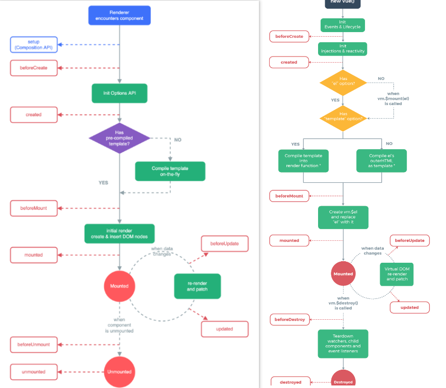

# 目录

[[toc]]

# 声命周期

​                                                       **Vue3										                                       Vue2**



- `Vue3.0`中可以继续使用`Vue2.x`中的生命周期钩子，但有有两个被更名：
   - `beforeDestroy`改名为 `beforeUnmount`
   - `destroyed`改名为 `unmounted`
- `Vue3.0`也提供了 `Composition API` 形式的生命周期钩子，`与Vue2.x`中钩子对应关系如下：
   - `beforeCreate`===>`setup()`
   - `created`=======>`setup()`
   - `beforeMount` ===>`onBeforeMount`
   - `mounted`=======>`onMounted`
   - `beforeUpdate`===>`onBeforeUpdate`
   - `updated` =======>`onUpdated`
   - `beforeUnmount` ==>`onBeforeUnmount`
   - `unmounted` =====>`onUnmounted`
## 配置项方式使用生命周期函数

```javascript
  setup(){
      //...
  },
  beforeCreate(){
    console.log('-------beforeCreate--------')
  },
  created(){
    console.log('--------created-------')
  },
  beforeMount(){
    console.log('-------beforeMount--------')
  },
  mounted(){
    console.log('--------mounted-------')
  },
  beforeUpdate(){
    console.log('-------beforeUpdate--------')
  },
  updated(){
    console.log('-----updated----------')
  },
  beforeUnmount(){
    console.log('-------beforeUnmount--------')
  },
  unmounted(){
    console.log('-----unmounted----------')
  }
```
## 组合式Api方式使用生命周期函数
```javascript
import {computed, onBeforeMount, onBeforeUnmount, onBeforeUpdate, onMounted, onUnmounted, onUpdated, reactive} from 'vue'
onBeforeMount(() => {
      console.log("--------onBeforeMount-----------")
    }),
    onMounted(() => {
      console.log("--------onMounted-----------")
    }),
    onBeforeUpdate(() => {
      console.log("---------onBeforeUpdate----------")
    }),
    onUpdated(() => {
      console.log("---------onUpdated----------")
    }),
    onBeforeUnmount(() => {
      console.log("---------onBeforeUnmount----------")
    }),
    onUnmounted(() => {
      console.log("-------onUnmounted------------")
    })
```
