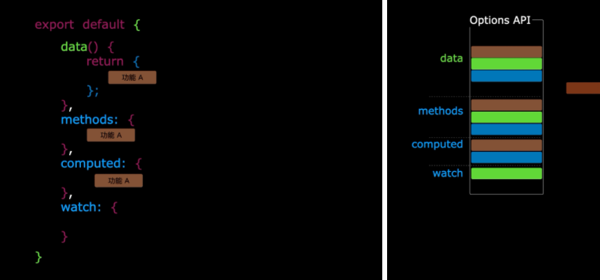
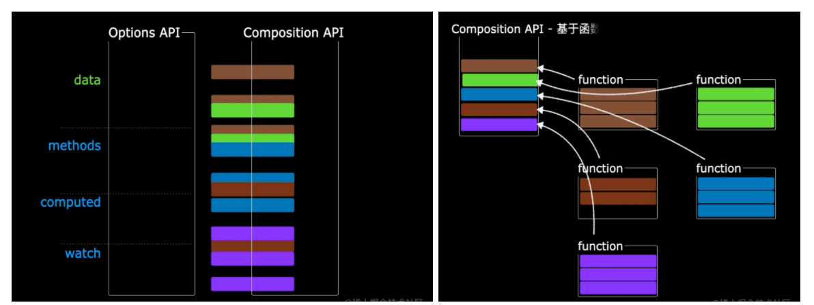

# 目录

[[toc]]

# hook函数

- 什么是`hook`？—— 本质是一个函数，把`setup`函数中使用的`Composition API`进行了封装。
- 类似于`vue2.x`中的`mixin`。
- 自定义`hook`的优势: 复用代码, 让`setup`中的逻辑更清楚易懂
- 可以配合现有的组件库使用，如 `vueuse` 、`vueRequest` 等
# vueuse组件库
官方文档：[https://vueuse.org/guide/](https://vueuse.org/guide/)

安装

```bash
npm install @vueuse/core
```
一些函数的用法
```vue
<template>
  <h3>X: {{x}}</h3>
  <h3>Y: {{y}}</h3>

  <h3>{{count}}</h3>
  <input type="button" @click="inc()" value="+">
  <input type="button" @click="dec()" value="-">

  <input type="text" v-model="name">
</template>
<script setup lang="ts">
import { useMouse, useCounter, useStorage } from '@vueuse/core'

const {x, y} = useMouse()

const {count, inc, dec} = useCounter()

const name = useStorage("name", "")
</script>
```
# useRequest请求库
响应式的 axios 封装，官网地址 [一个 Vue 请求库 | VueRequest (attojs.org)](https://next.cn.attojs.org/)

安装

```bash
npm install vue-request@next
```
```vue
<template>
  <h3 v-if="students.length === 0">暂无数据</h3>
  <ul v-else>
    <li v-for="s of students" :key="s.id">
      <span>{{s.name}}</span>
      <span>{{s.sex}}</span>
      <span>{{s.age}}</span>
    </li>
  </ul>
</template>
<script setup lang="ts">
import axios from "../api/request"
import { useRequest } from 'vue-request'
import { computed } from 'vue'
import { AxiosRespList, Student } from '../model/Model8080'

// data 代表就是 axios 的响应对象
const { data } = useRequest<AxiosRespList<Student>>(() => axios.get('/api/students'))

const students = computed(()=>{
  return data?.value?.data.data || []
})
</script>
```

- data.value 的取值一开始是 undefined，随着响应返回变成 axios 的响应对象
- 用 computed 进行适配
# Composition API 的优势（组合式API）
想要让 Composition API 发挥优势，需要灵活的使用 hook 函数
## Options API 存在的问题
使用传统OptionsAPI中，新增或者修改一个需求，就需要分别在data，methods，computed里修改



## Composition API 的优势
我们可以更加优雅的组织我们的代码，函数。让相关功能的代码更加有序的组织在一起



# 新的组件
## Fragment

- 在Vue2中: 组件必须有一个根标签
- 在Vue3中: 组件可以没有根标签, 内部会将多个标签包含在一个Fragment虚拟元素中
- 好处: 减少标签层级, 减小内存占用
## Teleport

- 什么是Teleport？—— Teleport 是一种能够将我们的**组件html结构**移动到指定位置的技术。
```vue
<teleport to="移动位置"> // to后面可以写 html 元素和 css 选择器 如：body、#zhang
	<div v-if="isShow" class="mask">
		<div class="dialog">
			<h3>我是一个弹窗</h3>
			<button @click="isShow = false">关闭弹窗</button>
		</div>
	</div>
</teleport>
```
## Suspense
静态引入：只要你引入的组件，有一个没有加载完毕，那么整个组件都不显示

动态引入：不管你引入的组件有没有加载完毕，都会显示（哪个加载完毕就显示哪个） 

- 等待异步组件时渲染一些额外内容，让应用有更好的用户体验
- 使用步骤：
   - 异步引入组件
```javascript
import Child from './components/Child' //静态引入

import {defineAsyncComponent} from 'vue'
const Child = defineAsyncComponent(()=>import('./components/Child.vue')) //动态引入（异步引入）
```

   - 使用Suspense包裹组件，并配置好default 与 fallback
```vue
<template>
	<div class="app">
		<h3>我是App组件</h3>
		<Suspense>
			<template v-slot:default>
				<Child/>
			</template>
			<template v-slot:fallback>
				<h3>加载中.....</h3>
			</template>
		</Suspense>
	</div>
</template>
 
```
